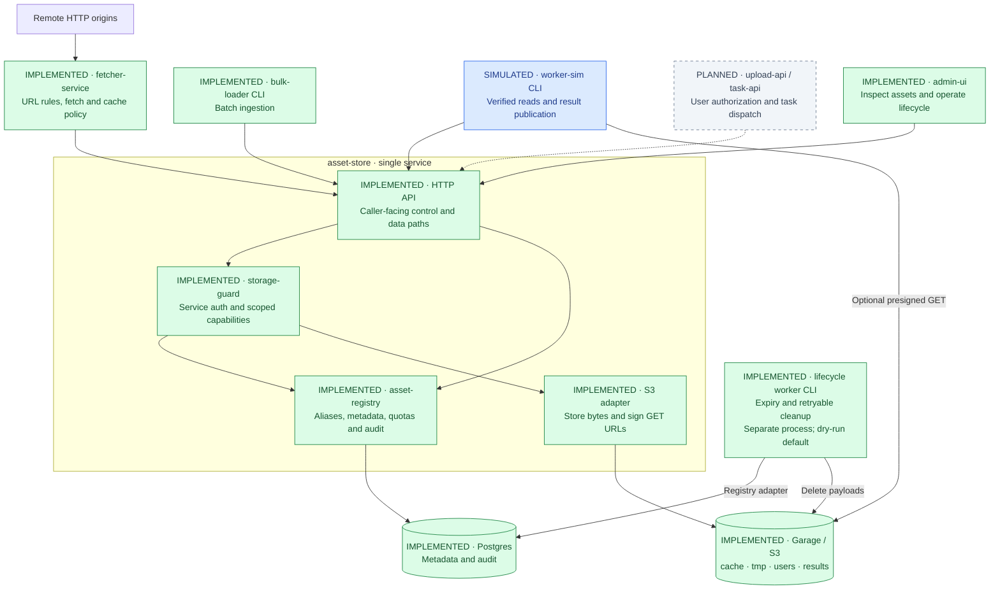
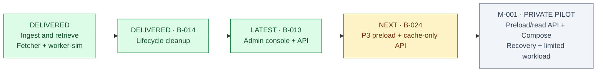

# asset-store — architecture & progress

> **Checkpoint: 2026-10-01 · SEC-02/05 implemented · P3 API/local evidence complete · Local v3/WebP pilot running · Next: remaining acceptance/recovery**
>
> **Current goal: [M-001 private Gallica IIIF cache pilot](milestones/PRIVATE_CACHE_PILOT.md)** — one host, trusted testers, existing fetcher over asset-store. Security gates remain open.

**Purpose:** a shared repository for remote content, user uploads and worker results.
Callers use stable **aliases**; asset-store owns metadata, access capabilities and
lifecycle, while existing S3 software stores the bytes.

**Legend:** 🟢 **Implemented** = working and tested in the prototype · 🟡 **Partial** = gaps remain
· 🔵 **Simulated** = test substitute · ⚪ **Planned** = not delivered here.
Status words accompany colors. Gallica preload/cache-only reads and local HTTPS
origin/smoke checks are implemented; private deployment acceptance remains open.

## Architecture at a glance

Solid arrows show implemented connections; dashed arrows show planned integration.
The service box is **one FastAPI process**, not three microservices.

**Current byte paths:** writes are proxied through the guard (reserve → PUT → commit);
reads use the proxy or a presigned S3 GET. **Direct presigned PUT is not implemented.**
Fetcher is a separate service: asset-store itself never fetches remote URLs.
Future IIIF server / image-mirror consumers sit outside this module and are not implemented here.

## Delivery map

| Component / concern | State | Delivered → remaining |
|---|---|---|
| **Registry + HTTP API** · B-009 | 🟢 Implemented core | Durable aliases, lifecycle, quotas, audit, migrations → complete admin surface below |
| **Storage-guard** · B-010 | 🟡 Partial target | Service authentication, scoped proxy tokens, presigned GET → tokens remain process-local; direct PUT and security hardening remain |
| **Storage backends** · B-005/008 | 🟡 Partial certification | Real Garage integration including multipart → OVH S3 validation and remaining backend spikes |
| **Fetcher** · B-020 | 🟢 Implemented MVP | Real HTTP, URL→alias rules, cache/tmp routing, refetch checksum conflict detection → production security review |
| **Bulk-loader** · B-011 | 🟢 Implemented CLI | Batch ingestion through guarded HTTP → 10k-asset acceptance/load evidence remains B-015 |
| **Worker-sim** · B-012 | 🔵 Simulation, implemented | Real reads/writes, checksum verification, manifest published last → actual workers and task engine are external |
| **Lifecycle worker** · B-014 | 🟢 Implemented | TTL, orphan cleanup, quota/capacity eviction, deletion retries, metrics → deploy/schedule explicitly; migration 0002 required |
| **Admin path** · B-013 | 🟢 Implemented; visual QA pending | Console, authenticated admin API, cursor listing, inspect/audit, TTL restoration, aliases, quotas, bounded bulk expiry → browser acceptance check |
| **Observability + CI** · B-003/004 | 🟡 Partial | Metrics, JSON logs, correlation IDs, sample lifecycle alerts; lint/types/tests CI → tracing, dashboards, alert wiring, image build/scan |
| **Deployment + recovery** · B-016/017/019 | 🟡 Partial | Local Compose and Dockerfile → Swarm, chaos tests, backup/restore drill, pilot/rollback |
| **Security + scale** · B-018/015 | 🟡 Reviewed; remediation open | [B-018 checkpoint](security/B018_CLOSEOUT.md): authenticated control plane, bounded hardening and [pooled transactions](security/SEC02_TRANSACTION_ISOLATION.md) implemented; connection-bound DNS validation implemented; resource cleanup and pilot origin policy remain |

**Pilot API:** preload explicitly; read cached images at
`cache-host/gallica.bnf.fr/<origin-path>` (404 on miss).

**Pilot product debt:** explicit preload + cache-only reads for M-001;
read-through fetching on a miss is tracked as **B-025**, to revisit after the pilot.

**Test substitutes:** `InMemoryAssetRegistry` and `LocalObjectStore` replace Postgres
and S3 for infrastructure-free tests; `LocalObjectStore` is an in-memory dictionary.
The durable adapters are real implementations, not mocks. Upstream upload/task
services are planned integrations, not implemented merely because their service identities exist.

## What the four spaces hold

| `cache` | `tmp` | `users` | `results` |
|---|---|---|---|
| Remote mirrors | Temporary inputs | User uploads | Worker artifacts |
| Partition: mirror | Partition: temporary session | Partition: user | Partition: user (`anon` allowed); task in alias |
| No default TTL | Default 24 h; max 7 d | No default TTL | Default/max 365 d, configurable |
| Quota/pressure eviction | Quota/pressure eviction | No automatic capacity eviction | No automatic capacity eviction |

TTL applies when set; eviction exemptions protect against quota/pressure sweeps,
not expiry. Deadlines are currently shared by all aliases of an asset.

## Steering checkpoint

**Evidence:** last code validation recorded **448 passing tests**, none skipped,
with Garage/Postgres enabled, including cleanup, aggregate admission, cancellation,
migrations, pending-byte concurrency, issuance rates and Postgres HTTP contracts. Lint, formatting and strict typing passed. Backend
tests are environment-gated in ordinary runs. Browser visual/interaction QA remains
pending (no browser available in the implementation session). This is not load or deployment certification.

**Architect attention:** upstream services still own user→prefix authorization
(R-012); local token storage is bounded (ADR-026), while atomic single-use
consumption and replica/restart behavior remain constrained; legacy control-plane bypasses and shared-connection rollback are fixed (SEC-01/02).
SEC-05, failed-upload cleanup (ADR-027) and aggregate work admission (ADR-028)
and durable byte reservations (ADR-029) plus issuance rate admission (ADR-030)
are implemented. The next slice is the Gallica facade with shared origin policy.
Per-alias deadlines and content deduplication remain deferred; several foundational
ADRs/spikes still await formal close-out despite working code.

---

**Navigate:** [Architecture & decisions](spec/03_ARCHITECTURE.md) ·
[Workplan](WORKPLAN.md) · [Implementation evidence & limitations](IMPLEMENTATION_NOTES.md) ·
[Backlog & risks](spec/05_BACKLOG_AND_OPEN_QUESTIONS.md) ·
[Lifecycle runbook](services/lifecycle-worker.md) · [Security review](security/B018_REVIEW.md)

*This page is a status map, not a replacement for the specs. At each milestone,
refresh the checkpoint, diagram labels, table and validation evidence together.*
