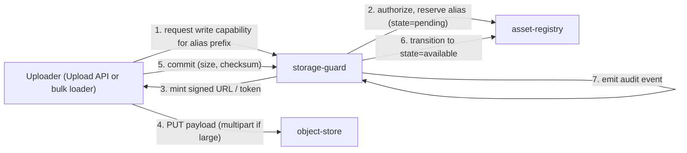
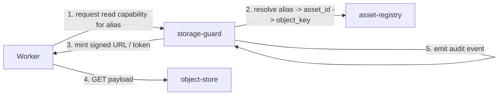

# Project Architecture

## Scope Of This Module

The `asset-store` module (repo: `prototype_cache`, to be renamed at code time) provides durable, multi-tenant asset ingestion and retrieval for asynchronous workers and user-facing services. It does **not** run image processing itself, does **not** fetch remote URLs, does **not** serve IIIF, does **not** compose IIIF manifests or host editable descriptive metadata (that is the future `manifest-service`'s job), and does **not** manage end-user authentication. These are downstream or future modules.

For terminology see the glossary in [`spec/README.md`](spec/README.md).

## Internal Layers

1. **`object-store`** (layer 1)
   - S3-compatible distributed blob store. Vendored OSS (candidates surveyed in [`spec/06_OSS_SURVEY.md`](spec/06_OSS_SURVEY.md)).
   - Provides: PUT/GET object, multipart upload, presigned URLs, lifecycle on prefixes, bucket-level isolation, checksum verification.
2. **`asset-registry`** (layer 2)
   - Maps `asset_id <-> object_key` and tracks one-or-more **aliases** per asset.
   - Stores per-asset metadata (MIME, size, checksum, owner space, created/updated/expires timestamps, custom key/value annotations).
   - Owns the lifecycle state machine: `pending -> available -> expired -> deleted`.
   - Exposes the asset/alias REST API (create asset with aliases, resolve alias, add/remove alias, update metadata, list, expire, delete).
3. **`storage-guard`** (layer 3)
   - Capability broker. Validates incoming service identities, mints prefix-scoped, time-bounded capabilities (S3 presigned URLs or server-issued tokens) for upload services, workers, and admins.
   - Emits the append-only audit log for capability issuance, alias mutations, lifecycle transitions, and admin actions.
   - Quota and rate-limit enforcement at the space/prefix level.

## Tooling Shipped With The Module

- **`admin-ui`** - minimal web interface to list, inspect, expire, and delete assets; create aliases; inspect audit entries.
- **`bulk-loader`** - command-line tool to ingest pre-known image batches at volume. Also serves as the integration smoke test for the ingestion path.
- **`worker-sim`** - command-line tool that simulates a worker: requests a read capability, fetches assets, then optionally writes a result artifact bundle.

## Suggested Repository Layout

```text
prototype_cache/
  docs/
    PROJECT_ARCHITECTURE.md
    WORKPLAN.md
    NOTES.md (archived in _archive/)
    spec/
      README.md
      00A_SCENARIOS.md
      01_SCOPE.md
      02_REQUIREMENTS.md
      03_ARCHITECTURE_AND_DECISIONS.md
      04_OPERATIONS_AND_READINESS.md
      05_BACKLOG_AND_OPEN_QUESTIONS.md
      06_OSS_SURVEY.md
      _archive/
        README.md
        00_DISCOVERY_QA.md
        00A_USE_CASES_AND_SCENARIOS.md
    _archive/
      README.md
      NOTES.md
  services/
    asset-registry/
    storage-guard/
  tools/
    bulk-loader/
    worker-sim/
    admin-ui/
  deploy/
    compose/
    swarm/
  AGENTS.md
  .cursor/
    rules/
      project-context.mdc
      docs-spec-quality.mdc
```

The `services/`, `tools/`, and `deploy/` folders are placeholders for code that will land in Phase 1 (foundations). The repo currently contains only docs.

## Core Data Flow (write)



## Core Data Flow (read)



## Non-Functional Targets (Baseline)

Targets are stated as concrete numbers in [`spec/02_REQUIREMENTS.md`](spec/02_REQUIREMENTS.md). Summary:

- **Capacity** - 1 TB total, ~1000 requests/day, 30 concurrent worker readers, 10 concurrent users, growth ~10 GB/month year one.
- **Latency** - p95 read of objects up to 5 MB under 200 ms in-cluster.
- **Durability** - no silent data loss; checksum on write and on read.
- **Availability** - read-path SLO >= 99.9% over a 30-day window.
- **Security** - HTTPS in transit; encryption at rest deferred (tracked as a risk); least-privilege capabilities by default.
- **Operability** - deployable to Docker Swarm; single-node dev via Docker Compose; dashboards + alerts before any pilot.
