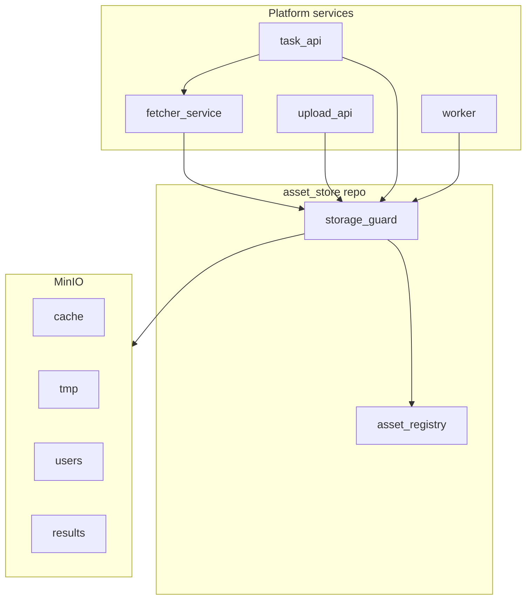
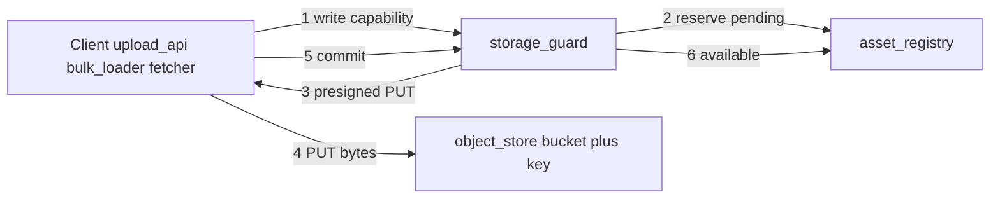
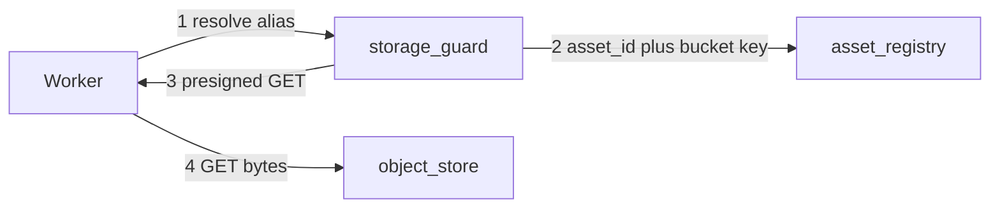

# Project Architecture

## Platform overview



| Concern | Module |
|---------|--------|
| Bytes, aliases, lifecycle | **asset-store** (this repo) |
| Remote URL → cache/tmp | **fetcher-service** ([`spec/07_FETCHER_SERVICE.md`](spec/07_FETCHER_SERVICE.md)) |
| User files | upload-api → `users` |
| Task outputs | worker → `results` |

## Scope Of This Module

The `asset-store` module (repo: `prototype_cache`, to be renamed at code time) provides durable, multi-tenant asset ingestion and retrieval. It does **not** run image processing, **does not fetch remote URLs** ([`ADR-008`](spec/03_ARCHITECTURE_AND_DECISIONS.md)), does **not** serve IIIF, and does **not** manage end-user authentication.

Storage layout: [`spec/03_ARCHITECTURE_AND_DECISIONS.md`](spec/03_ARCHITECTURE_AND_DECISIONS.md) (buckets `cache`, `tmp`, `users`, `results`). Terms and acronyms: [`spec/00B_GLOSSARY_AND_ACRONYMS.md`](spec/00B_GLOSSARY_AND_ACRONYMS.md).

## Internal Layers

1. **`object-store`** (layer 1) — MinIO; four buckets; keys `{partition_id}/assets/{asset_id}`.
2. **`asset-registry`** (layer 2) — `asset_id`, aliases, `space`, `partition_id`, lifecycle.
3. **`storage-guard`** (layer 3) — capabilities, service auth, bucket allowlists ([`FR-015`](spec/02_REQUIREMENTS.md)), audit.

## Tooling Shipped With The Module

- **`admin-ui`**, **`bulk-loader`**, **`worker-sim`** — see [`spec/00A_SCENARIOS.md`](spec/00A_SCENARIOS.md).

## Suggested Repository Layout

```text
prototype_cache/
  docs/
    PROJECT_ARCHITECTURE.md
    spec/
      README.md
      00B_GLOSSARY_AND_ACRONYMS.md
      01_SCOPE.md
      07_FETCHER_SERVICE.md
      00A_SCENARIOS.md
      ...
  services/
    asset-registry/
    storage-guard/
  tools/
    bulk-loader/
    worker-sim/
```

Fetcher may live in a separate repo later; contract is in `spec/07_FETCHER_SERVICE.md`.

## Core Data Flow (write)



## Core Data Flow (read)



## Remote URL flow (fetcher, not asset-store)

See sequence diagram in [`spec/07_FETCHER_SERVICE.md`](spec/07_FETCHER_SERVICE.md).

## Non-Functional Targets (Baseline)

See [`spec/02_REQUIREMENTS.md`](spec/02_REQUIREMENTS.md): capacity, read latency, durability, deployability.
