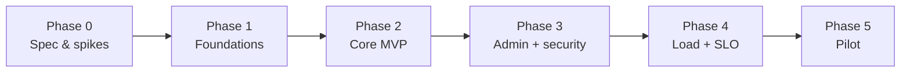

# Global Workplan

## Objective

Deliver a deployable, testable, monitored prototype of the **`asset-store`** module along the "compose" architecture recommended in [`spec/A_OSS_SURVEY.md`](spec/A_OSS_SURVEY.md), with a clear path from prototype to production.

The plan below is aligned with `ADR-001 = OVH S3 (hosted) + Garage (self-hosted), MinIO disqualified`, `ADR-002 = compose`, `ADR-003 = hybrid capability mode` (all provisional pending Phase 0 spikes). If a spike reverses one of these ADRs, the Phase 1+ tasks adapt but the phase boundaries do not.

Each phase has explicit exit criteria mapped to `FR-*`/`NFR-*`/`S-*` IDs from [`spec/01_SCOPE.md`](spec/01_SCOPE.md) and [`spec/02_REQUIREMENTS.md`](spec/02_REQUIREMENTS.md). Backlog IDs (`B-*`) come from [`spec/05_BACKLOG_AND_OPEN_QUESTIONS.md`](spec/05_BACKLOG_AND_OPEN_QUESTIONS.md).

## Current state (as of 2026-06-30)

Ahead of the phase order below, a **pure domain core** already exists and is the
foundation everything else wraps:

- [`src/asset_store_core/`](../src/asset_store_core/) - in-memory registry, alias
  model, path/bucket normalization, object-key layout, prefix-scoped capabilities,
  and the FR-015 service-to-bucket allowlist. No HTTP, Postgres, or object store.
- [`tests/`](../tests/) - 32 unit tests, all green, covering FR-001..008, FR-012,
  FR-013, FR-015, and FR-022 invariants.
- `services/`, `tools/`, `deploy/` - placeholders only.

Run the suite: `PYTHONPATH=src python -m unittest discover -s tests` (or
`uv run pytest` once the dev-tooling task below lands).

This is a "domain-core-first" head start on Phase 2, built before the Phase 1
scaffold. It does **not** move the phase boundaries; it means Phase 2's registry
work (B-009) extends an existing, tested core rather than starting from zero.

**Core gaps already known** (carry into B-009 so they are not lost):

- FR-003: an asset reaching zero aliases is not yet auto-marked for garbage collection.
- FR-008: the `alias.rebind` audit event does not yet carry both `before`/`after` asset ids.
- `eviction_policy`, `PartitionQuota`, `BucketQuota` (FR-063..069, ADR-009) are not in
  the in-memory model yet; the spec requires them from the registry MVP.

## Engineering quality bar

Non-negotiable for every PR, in service of a simple, clean, stable, well-tested
prototype:

- **Deeply tested:** every behaviour change ships with unit tests; every new
  control-plane path ships with an integration test. Keep the domain core
  infrastructure-free so it stays fast to test.
- **Simple:** prefer the smallest design that satisfies the linked `FR-*`/`NFR-*`.
  No speculative abstractions; one obvious way to do each operation.
- **Documented:** public functions and endpoints carry docstrings linking the
  requirement id; [`docs/IMPLEMENTATION_NOTES.md`](IMPLEMENTATION_NOTES.md) tracks
  code-vs-spec status.
- **Clean + stable:** `ruff`, `mypy --strict`, and the full test suite must pass
  locally and in CI before merge; no skipped tests on the base branch.

## Phase 0 - Spec & survey close-out

**Goal:** lock unknowns blocking the build; validate `ADR-001`/`ADR-002`/`ADR-003` via time-boxed spikes.

**Work items:**

- B-001 - assign owners/dates to Q-001..017; resolve Q-001/Q-002/Q-009/Q-013/Q-016.
- B-005 - Spike S-001: object-store baseline on Garage / OVH S3 (PUT/GET/multipart/presigned URLs/lifecycle).
- B-006 - Spike S-002: minimal `asset-registry` against the object store (Garage); SCN-001 dry-run with 1k assets.
- B-007 - Spike S-003: InvenioRDM compare; confirm compose path is the right choice for our requirements.
- B-008 - Spike S-004: Garage certified as the self-hosted backend.

**Exit criteria:**

- All `Q-*` rows have owner + due date.
- Q-001, Q-002, Q-009, Q-013, Q-016 marked Resolved.
- ADR-001, ADR-002, ADR-003 status changed from Proposed to Accepted (or revised) in `spec/03_ARCHITECTURE.md`.
- Spike notes appended to `spec/A_OSS_SURVEY.md` section 7.

## Phase 1 - Foundations

**Goal:** create a minimal but production-shaped service skeleton matching the chosen architecture.

**Work items:**

- B-002 - Repository scaffold:
  - `services/asset-store/` (single Python/FastAPI deployable; internal `registry`, `capabilities`, `storage` modules; async, alembic migrations) per ADR-002.
  - `tools/bulk-loader/` (Python click CLI).
  - `tools/worker-sim/` (Python click CLI).
  - `tools/admin-ui/` (static SPA or HTMX; final pick at code time).
  - `deploy/compose/` (dev stack: object store (Garage) + Postgres + asset-store + admin-ui + observability sidecars).
  - `deploy/swarm/` (target Swarm stack file; mirrors compose with replica counts and Swarm secrets).
- B-003 - CI baseline (ruff, mypy, pytest, build, trivy image scan).
- B-004 - Observability skeleton (structured JSON logs, OpenTelemetry, Prometheus `/metrics`, sample Grafana dashboard).

**Exit criteria:**

- Green CI on the base branch.
- `docker compose up` in `deploy/compose/` brings up the local stack in under 2 minutes (target FR-072 / NFR-011); all services pass `/healthz` and `/readyz`.
- A no-op request can be traced end-to-end (logs, metric, trace span) in the local stack.

## Phase 2 - Core ingestion + retrieval (MVP write/read happy path)

**Goal:** deliver the end-to-end happy path for SCN-001, SCN-002, SCN-003 against the local stack.

**Work items:**

- B-009 - `asset-registry` MVP: extend the existing [`src/asset_store_core/`](../src/asset_store_core/) domain core with a Postgres-backed adapter + Alembic migrations + endpoints implementing FR-001..007; add the `eviction_policy`, `PartitionQuota`, and `BucketQuota` entities (FR-063..069) and close the known core gaps listed under "Current state".
- B-010 - `storage-guard` MVP: service-identity auth + FR-010..014 + audit log + presigned URL minting.
- B-011 - `bulk-loader` CLI implementing SCN-001 against 10k assets.
- B-012 - `worker-sim` CLI implementing SCN-002 (read path) and SCN-005 (write path).
- B-014 - Lifecycle worker: sweep `pending` orphans; `expired -> deleted` after grace.

**Exit criteria:**

- SCN-001, SCN-002, SCN-003, SCN-005 acceptance tests green in CI on every PR.
- Capability scoping test suite (S-4) green - no cross-prefix access possible.
- Audit log entries present for all expected events (FR-050..052 acceptance).
- Read path returns p95 latency under 200 ms in-cluster on the local stack with one worker (NFR-002 sample).

## Phase 3 - Admin path, reliability, security

**Goal:** make the prototype operationally credible and safe.

**Work items:**

- B-013 - `admin-ui` covering SCN-004 (list, inspect, expire/delete, audit view).
- B-018 - Security review pass: STRIDE on `storage-guard`; secrets handling audit; HTTPS posture; capability TTL / scoping fuzzing.
- Lifecycle hardening: rate limits on capability issuance per service identity; idempotency-key replay protection across services.
- Backup hook for Postgres + a second S3 target (B-017) - design and basic implementation.
- Resolve Q-003, Q-005, Q-006, Q-010, Q-014, Q-017 (the Phase 2/3 batch of open questions).

**Exit criteria:**

- SCN-004 acceptance test green.
- All P0 alerts in `spec/04_OPERATIONS.md` configured against the local stack and firing on synthetic faults.
- Security-review findings either fixed or accepted with a `R-*` risk row.
- Backup of Postgres + object-store snapshot exercised; restore drill documented.

## Phase 4 - Load test, capacity, SLO baseline

**Goal:** measure against the non-functional targets and prove the SLO is achievable.

**Work items:**

- B-015 - Locust/k6 load tests for S-2 (30 concurrent readers) and S-3 (10k assets ingest).
- B-016 - Chaos suite: kill-one of each service; kill one object-store node.
- Capacity baseline run: ingest 100k assets to ~1 TB; measure read latencies, registry query times, object-store disk usage.

**Exit criteria:**

- SLO dashboard exists; error-budget burn-rate alerts configured.
- NFR-001 (capacity), NFR-002 (read latency p95), NFR-003 (mint latency p95), NFR-004 (concurrency), NFR-005 (durability canary) measured and within targets.
- Chaos suite passes: zero failed user-visible requests after retry.

## Phase 5 - Pilot readiness

**Goal:** validate the prototype in a controlled real workflow.

**Work items:**

- B-019 - Pilot plan + rollback rehearsal; success metrics defined.
- Documentation pass: runbooks `RUNBOOK-001..006` finalised in `docs/runbooks/`.
- Cost and performance report based on Phase 4 numbers.
- Go-live checklist sweep (from `spec/04_OPERATIONS.md`).

**Exit criteria:**

- Pilot sign-off checklist complete.
- Go/No-Go decision documented; remaining risks accepted in writing.

## Cadence And Governance

- Weekly architecture review: ADR changes, open questions, risk register.
- Twice-weekly delivery sync: backlog progress, blockers, risks.
- Single source of truth: `docs/spec/` and the ADR table.

## Immediate next actions (revised 2026-06-30)

The earlier "next 7 tasks" were spec close-out and spike-scheduling items written
when no code existed. The domain core is now in place and ADR-001/002 are
effectively settled (MinIO disqualified; compose chosen), so the next actions are
reordered to **lock quality first, then grow the core into a running service**.

1. **Lock the test + tooling baseline (B-003, brought forward).** `pytest` is
   configured in [`pyproject.toml`](../pyproject.toml) but is not a declared dev
   dependency, so `uv run pytest` currently fails and tests only run via
   `PYTHONPATH=src ... unittest`. Add `pytest` to the dev extra, wire `ruff` +
   `mypy --strict`, add pre-commit, and a minimal CI job running all three.
   *Done = one command runs lint, types, and tests green on a clean checkout.*
2. **Close the known core gaps** (FR-003 zero-alias GC mark; FR-008 rebind
   `before`/`after` audit ids) with tests, while the core is still small and
   infrastructure-free.
3. **Add the storage adapter seam.** Define the `storage` backend interface plus a
   local/in-memory implementation; defer Garage/OVH wiring. Cover
   reserve -> PUT -> commit -> resolve with integration tests against the fake backend.
4. **Add the guard facade.** One place that composes `service_policy` (FR-015) +
   capability checks (FR-010..013) + registry calls, so auth is never spread across
   callers. Re-run the S-4 scoping suite through it.
5. **Stand up the FastAPI app (B-002/B-010 slice).** Expose reserve/commit/resolve
   and capability mint over HTTP with `/healthz` and `/readyz`; contract-test the
   RFC 7807 error model. One process per ADR-002.
6. **Observability skeleton (B-004).** Structured logs + `/metrics` from the first
   endpoint, so every later PR is observable end to end.
7. **Resume deferred spikes as needed:** S-001 object-store baseline and S-004
   Garage certification (B-005, B-008) before real-backend wiring; S-003 InvenioRDM
   compare (B-007) is now low priority since ADR-002 is effectively settled.

Parallel doc hygiene (non-blocking): assign owners/dates to the remaining open
`Q-*` rows (B-001) and flip ADR-001/002/003 from *Proposed* to *Accepted* in
[`spec/03_ARCHITECTURE.md`](spec/03_ARCHITECTURE.md) once S-001/S-004 confirm them.

## Phase Dependency Diagram

