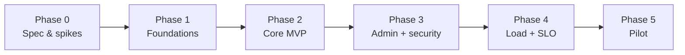

# Global Workplan

## Objective

Deliver a deployable, testable, monitored prototype of the **`asset-store`** module along the "compose" architecture recommended in [`spec/A_OSS_SURVEY.md`](spec/A_OSS_SURVEY.md), with a clear path from prototype to production.

The plan below is aligned with `ADR-001 = OVH S3 (hosted) + Garage (self-hosted), MinIO disqualified`, `ADR-002 = compose`, `ADR-003 = hybrid capability mode` (all provisional pending Phase 0 spikes). If a spike reverses one of these ADRs, the Phase 1+ tasks adapt but the phase boundaries do not.

Each phase has explicit exit criteria mapped to `FR-*`/`NFR-*`/`S-*` IDs from [`spec/01_SCOPE.md`](spec/01_SCOPE.md) and [`spec/02_REQUIREMENTS.md`](spec/02_REQUIREMENTS.md). Backlog IDs (`B-*`) come from [`spec/05_BACKLOG_AND_OPEN_QUESTIONS.md`](spec/05_BACKLOG_AND_OPEN_QUESTIONS.md).

## Current milestone — M-001 private Gallica IIIF cache pilot

The current delivery goal is a **Gallica IIIF image cache on asset-store, deployed privately
on one host with one process per application service**. Follow the
[practical pilot plan](milestones/PRIVATE_CACHE_PILOT.md): SEC-05 → resource bounds
→ preload/read cache API → private Compose deployment → recovery/operations → pilot
acceptance. Existing core implementations are reused. This sequence takes priority
over the broad phases below for this milestone; their production requirements
remain on the backlog. Full Swarm/HA and full-scale load certification are deferred,
not marked complete. Separate preload/cache-only reads are confirmed; read-through
on a miss is explicitly deferred as **B-025**. P1 / SEC-05 is implemented and reviewed. P2 implementation is complete. P3 implementation and local origin/smoke evidence are complete. Next: P4 local deployment is running; remaining acceptance and P5 operations are next.

## Current state (2026-10-01)

- B-009/B-010: durable Postgres registry, migrations, authenticated capabilities,
  guarded uploads and presigned reads are implemented, with Garage/S3 storage.
- B-011: bulk-loader CLI is implemented.
- B-020: fetcher MVP is complete: real HTTP with SSRF checks, TOML alias rules,
  cache/tmp ingestion, and forced-refetch checksum detection. Matching bytes reuse
  the asset; mismatches return 409 without changing stored data. A Prometheus
  counter and structured warning expose mismatches (ADR-018, R-011, FR-022).
- `tests/test_fetcher_garage.py` exercises a real local HTTP origin, Garage bytes,
  and an isolated Postgres schema through the HTTP app contracts. It checks cache
  hits, equal/changed refetches, origin failure, quota/audit preservation and a
  reopened registry. HTTP app calls use TestClient; this is not a deployment test.
- Quality tooling and CI are configured; backend tests remain environment-gated.
- B-012: worker-sim is complete; verified reads, result copies and manifest-last
  publication pass against both in-memory and Garage/Postgres adapters (ADR-019).
- B-014: lifecycle sweeps, TTL defaults/hints, access tracking and physical-capacity
  gating are implemented. Dry-run is the default; explicit apply uses deletion
  fencing and retryable payload cleanup (ADR-020, migration 0002).
- B-013: admin console and authenticated API are implemented (ADR-021);
  browser acceptance found a disconnect cleanup defect, now fixed and verified in
  the workspace preview (2026-10-05). The owner approved this commit; pilot image update/recheck
  remain. See [acceptance evidence](acceptance/ADMIN_UI_LOCAL.md).
- B-018: [security review performed](security/B018_REVIEW.md); confirmed blockers
  and [bounded fixes completed](security/B018_CLOSEOUT.md), with remaining work
  tracked in the closeout backlog. SEC-01 / R-014 and SEC-02 / R-015 are closed
  for the reviewed defects. No risk acceptance or release sign-off.
- SEC-02: [pooled transaction isolation](security/SEC02_TRANSACTION_ISOLATION.md)
  implemented (ADR-023); 354 tests pass with Garage/Postgres, including concurrent
  HTTP rollback, quota, saturation and shutdown tests.
- SEC-05: [validated outbound transport](security/SEC05_OUTBOUND_CONNECTIONS.md)
  implemented (ADR-025); full baseline 366 tests plus three additional focused
  transport regressions accepted.
- ADR-026: bounded local capability storage, expiry retirement, retryable overload
  and audit-before-publication are implemented. Atomic single-use consumption
  remains open; issuance rate admission is delivered by ADR-030.
- ADR-031 / B-024: authenticated Gallica preload and cache-only reads are implemented,
  with exact-rendition aliases, redirect policy, scoped read-token renewal and telemetry.
  Local HTTPS origin tests cover Garage/Postgres and reopened applications; the
  HTTP smoke script verifies hashes and repeated preload reuse over a real socket.
- Current combined checkpoint: **519 tests pass**, none skipped, with Garage/Postgres;
  lint, formatting and strict typing checks pass.
- ADR-032: separate private Compose package and protected configuration preflight
  are implemented. The owner selected this machine. ADR-033 immutable local-image
  support and ADR-034 BnF v3/WebP are implemented; live HTTP smoke, container
  persistence and capability renewal pass. ADR-035 maps the owner-approved legacy
  full-image form to the current v3 canonical JPEG resource; other renditions stay
  independent. Local downloaded files differ slightly, so byte equivalence is not
  claimed. The [quickstart](PILOT_QUICKSTART.md) task/result example passed against
  deployed APIs with a scoped worker identity and 64 MiB local results budget.
  The owner assisted browser acceptance on 2026-10-05; the disconnect fix awaits
  pilot image update/recheck after this approved commit. Scheduled cleanup is disabled; admin,
  scanning, host disk controls and recovery/soak acceptance remain open.
  See [local deployment evidence](../deploy/pilot/LOCAL_DEPLOYMENT.md).
- **Next: M-001/P4 remaining acceptance and P5 operational recovery.** Swarm,
  operational dashboards, security hardening and load certification remain open.

### P2 incremental checkpoint (2026-10-01)

Failed proxy-upload cleanup is implemented (ADR-027): commit a deletion fence
before reclaiming bytes, preserve successful assets, and retry cleanup failures
through the existing lifecycle worker. Aggregate upload/fetch job admission is
implemented (ADR-028), with no-wait overload responses and cancellation-safe
worker completion. Durable exact-size upload reservations are implemented
(ADR-029, migration 0003), including retained physical estimates on failed cleanup.
Capability issuance rate admission is implemented (ADR-030), with bounded
per-identity token buckets and 429/refill responses. P2 engineering slices are
complete; P4/P5 resource/ingress configuration and pilot acceptance remain.

## Engineering quality bar

Non-negotiable for every PR, in service of a simple, clean, stable, well-tested
prototype:

- **Deeply tested:** every behaviour change ships with unit tests; every new
  control-plane path ships with an integration test. Keep the domain core
  infrastructure-free so it stays fast to test.
- **Simple:** prefer the smallest design that satisfies the linked `FR-*`/`NFR-*`.
  No speculative abstractions; one obvious way to do each operation.
- **Documented:** public functions and endpoints carry docstrings linking the
  requirement id; [`docs/IMPLEMENTATION_NOTES.md`](IMPLEMENTATION_NOTES.md) tracks
  code-vs-spec status.
- **Clean + stable:** `ruff`, `mypy --strict`, and the full test suite must pass
  locally and in CI before merge; no skipped tests on the base branch.

## Phase 0 - Spec & survey close-out

**Goal:** lock unknowns blocking the build; validate `ADR-001`/`ADR-002`/`ADR-003` via time-boxed spikes.

**Work items:**

- B-001 - assign owners/dates to Q-001..017; resolve Q-001/Q-002/Q-009/Q-013/Q-016.
- B-005 - Spike S-001: object-store baseline on Garage / OVH S3 (PUT/GET/multipart/presigned URLs/lifecycle). **In progress:** `S3ObjectStore` certified on Garage for PUT/GET/stat/delete + server-side `sha256` on PUT + transparent multipart upload (>= threshold, abort-on-failure) + presigned-GET; backend-native lifecycle still to exercise; OVH S3 tier pending real credentials.
- B-006 - Spike S-002: minimal `asset-registry` against the object store (Garage); SCN-001 dry-run with 1k assets. **Done (registry seam):** `PostgresAssetRegistry` (psycopg 3) now implements the full lifecycle/quota port at parity with the in-memory registry and is certified on Postgres 16 (cross-connection + across app restart). SCN-001 1k-asset dry-run remains.
- B-007 - Spike S-003: InvenioRDM compare; confirm compose path is the right choice for our requirements.
- B-008 - Spike S-004: Garage certified as the self-hosted backend. **In progress:** Garage v1.0.1 dev stack stood up and the `S3ObjectStore` adapter + full guarded HTTP data plane pass against it (`tests/test_s3_garage_integration.py`).

**Exit criteria:**

- All `Q-*` rows have owner + due date.
- Q-001, Q-002, Q-009, Q-013, Q-016 marked Resolved.
- ADR-001, ADR-002, ADR-003 status changed from Proposed to Accepted (or revised) in `spec/03_ARCHITECTURE.md`.
- Spike notes appended to `spec/A_OSS_SURVEY.md` section 7.

## Phase 1 - Foundations

**Goal:** create a minimal but production-shaped service skeleton matching the chosen architecture.

**Work items:**

- B-002 - Repository scaffold:
  - `services/asset-store/` (single Python/FastAPI deployable; internal `registry`, `capabilities`, `storage` modules; async, alembic migrations) per ADR-002.
  - `tools/bulk-loader/` (Python click CLI).
  - `tools/worker-sim/` (Python click CLI).
  - `tools/admin-ui/` (static SPA or HTMX; final pick at code time).
  - `deploy/compose/` (dev stack: object store (Garage) + Postgres + asset-store + admin-ui + observability sidecars).
  - `deploy/swarm/` (target Swarm stack file; mirrors compose with replica counts and Swarm secrets).
- B-003 - CI baseline (ruff, mypy, pytest, build, trivy image scan).
- B-004 - Observability skeleton (structured JSON logs, OpenTelemetry, Prometheus `/metrics`, sample Grafana dashboard).

**Exit criteria:**

- Green CI on the base branch.
- `docker compose up` in `deploy/compose/` brings up the local stack in under 2 minutes (target FR-072 / NFR-011); all services pass `/healthz` and `/readyz`.
- A no-op request can be traced end-to-end (logs, metric, trace span) in the local stack.

## Phase 2 - Core ingestion + retrieval (MVP write/read happy path)

**Goal:** deliver the end-to-end happy path for SCN-001, SCN-002, SCN-003 against the local stack.

**Work items:**

- B-009 - `asset-registry` MVP: extend the existing [`src/asset_store_core/`](../src/asset_store_core/) domain core with a Postgres-backed adapter + Alembic migrations + endpoints implementing FR-001..007; add the `eviction_policy`, `PartitionQuota`, and `BucketQuota` entities (FR-063..069) and close the known core gaps listed under "Current state". **Mostly done:** the durable `PostgresAssetRegistry` implements the full seam (reserve/commit/resolve, lifecycle, alias detach/rebind, two-tier quotas, eviction policy, audit) at parity with the in-memory registry, wired into the app factory via `ASSET_STORE_PG_DSN` and proven durable across an app restart on the compose stack. Schema is owned by an Alembic migration history under [`migrations/`](../migrations/) (`alembic upgrade head`), with runtime `CREATE TABLE IF NOT EXISTS` retained only as a dev/test convenience. Remaining (optional): SQLAlchemy ORM models — deliberately deferred, as the registry's explicit `FOR UPDATE`/upsert SQL is intentionally hand-written for concurrency correctness.
- B-010 - `storage-guard` MVP: service-identity auth + FR-010..014 + audit log + presigned URL minting. **Complete:** the capability broker now authenticates the calling service before minting (FR-014) via an `Authorization: Service <id>:<secret>` header backed by a `ServiceCredentialStore` (`ASSET_STORE_SERVICE_CREDENTIALS`; dev defaults require explicit `ASSET_STORE_DEV_MODE=1`, ADR-022), derives `caller_service_id` from that identity instead of the request body, and audits every issuance decision (`capability.issue`, granted/denied) in both registry backends (FR-050). Bucket allowlist (FR-015) and capability-guarded data plane (FR-010..013) already ship from B-002. **Presigned mode delivered (ADR-003):** `GET /objects/{alias}?mode=presign[&expires_in=…]` mints a short-lived presigned GET URL via `StorageGuard.presign_read` — TTL is capped by `min(request, 1h, capability remaining)`, single-use capabilities are refused (a presigned URL cannot be single-use), and the in-memory `LocalObjectStore` returns `PresignNotSupportedError → 501` (presign requires an S3 backend, certified on Garage). B-010 is complete.
- B-011 - `bulk-loader` CLI implementing SCN-001 against 10k assets. **Done:** a `click` CLI (`tools/bulk-loader/`) that authenticates as the `bulk-loader` service, mints one **write** capability scoped to `cache/{mirror_id}` (the capability model requires a bucket plus at least one segment, so a bare-bucket `cache/` scope is not representable; per-mirror still covers a whole run and FR-015 confines the service to `cache`), and streams each manifest row (`alias,mime,path` CSV) through the guarded `PUT /objects/{alias}` (server-side reserve->PUT->commit). Batch semantics are **best-effort per row** (Q-001 resolved): good rows commit and become resolvable, failed rows are reported (`alias,path,error`) with a non-zero exit; `--fail-fast` opts into stop-on-first-failure. The alias is the stable citation name `cache/{mirror_id}/{row-alias}` with **no batch-id in the path** (a per-run batch-id is only a correlation label, so re-runs resolve identically). Deviates from the SCN-001 sketch, which scoped the capability to `cache/{mirror}/{batch-id}/` — that prefix would not cover `cache/{mirror}/...` aliases. Covered by in-memory unit/contract tests plus a Garage-gated end-to-end test (bytes land in S3 and read back). Future admin/user attribution on top of the service identity is tracked as Q-030.
- **B-020 - `fetcher-service` (cache service) MVP** (SCN-007) — **Done (2026-09-25)**; previously prioritized ahead of B-012. `ensure_url`: given a remote URL, apply the URL->alias rewrite-rule set / cache allowlist (ADR-014, Q-021/Q-022), resolve the canonical `cache/{mirror_id}/…` alias if already present, otherwise fetch and ingest into `cache` (via the same write-capability + guarded data-plane path as the bulk-loader), and return the stable alias. Uses `tmp` for staging where needed. See [`services/fetcher-service.md`](services/fetcher-service.md). **Phasing (Q-023) resolved: in-repo service, HTTP+JSON to asset-store (ADR-017).** Delivered in two steps:
  - **Step 1 — fetcher stub (Done, 2026-07-09):** `ensure_url` control flow (normalize → rewrite rules incl. IIIF dedup → cache lookup → store), the `POST /v1/ensure-url` FastAPI app, and a no-network `SyntheticFetcher` (deterministic URL-derived JSON). `cache` hit/miss idempotency and `tmp` staging over the guarded proxy PUT. Code in [`src/fetcher_service/`](../src/fetcher_service/); tests in [`tests/test_fetcher_service.py`](../tests/test_fetcher_service.py).
  - **Step 2 — the cache (Done, 2026-09-25):** a **declarative rule-config language** (TOML `[[rule]]` array → `RuleSet`; `type` ∈ `iiif`/`passthrough`/`regex`, with a **safe-regex subset** — anchored named-group match/extract only, no backreferences/lookaround; semantic normalization stays in code) — **Done (2026-07-09)**, loaded via `FETCHER_RULES_FILE`. A real **`HttpFetcher`** (connect/read timeouts, max-body cap, redirect limit with per-hop SSRF re-validation, default-deny of private/loopback/reserved addresses; env-overridable via `FETCHER_HTTP_*` / `FETCHER_ALLOW_PRIVATE_HOSTS`; `FETCHER_SYNTHETIC` selects the stub) tested against a threaded loopback origin — **Done (2026-07-09)**. Delivered: checksum-mismatch **correctness detector** (R-011, ADR-018; fresh vs stored `sha256` on `no_cache`), and a Garage/Postgres-gated e2e. Background audit scheduling remains outside this slice. **Content-addressed (byte-identity) storage dedup dropped** — dedup is by canonical alias (name), so it adds little on top; full blob-level dedup is deferred, per-space opt-in (`Q-035`). **Multi-alias attachment dropped** — cross-URL dedup is achieved by canonical normalization to a **single** alias (ADR-014 amendment 2026-07-09); multi-alias binding deferred to the access-control use case (`Q-034`).
- B-012 - **Done (2026-09-25):** `worker-sim` Click CLI with JSON tasks, worker-scoped capabilities, SHA-256 verified proxy reads, deterministic result copies and manifest-last publication. Structured events and JSON counters/timing share a correlation id with asset-store. Failure tests cover partial outputs, missing/expired/denied reads, quotas, conflicting attempts, checksum/transport errors and manifest failure. See [`services/worker-sim.md`](services/worker-sim.md), ADR-019, and `tests/test_worker_sim.py`. Full suite: 272 passed with Garage/Postgres enabled; lint, format and strict typing pass. TTL enforcement is now delivered by B-014; performance certification remains B-015.
- B-014 - **Done (2026-09-26):** dry-run-first lifecycle CLI; pending-orphan fencing, TTL expiry, grace-period deletion, admin-deleted payload cleanup, quota/pressure sweeps using size-times-age scoring, exempt/user/results protections, metrics and audit. Asset TTL hints/defaults and bounded presigned URLs are implemented; expired/deleted reads return 410/404. Migration 0002 adds lifecycle/access metadata and repairs legacy orphan quota accounting. See [`services/lifecycle-worker.md`](services/lifecycle-worker.md), ADR-020, and `tests/test_lifecycle_worker.py`. Validation: 303 tests passed with Garage/Postgres, none skipped; lint/format and strict mypy pass. Admin TTL extension and bulk-expire-by-prefix are delivered by B-013; per-partition tmp TTL overrides remain a separate policy follow-up (Q-036), and independent alias deadlines remain deferred.

**Exit criteria:**

- SCN-001, SCN-002, SCN-003, SCN-005 acceptance tests green in CI on every PR.
- Capability scoping test suite (S-4) green - no cross-prefix access possible.
- Audit log entries present for all expected events (FR-050..052 acceptance).
- Read path returns p95 latency under 200 ms in-cluster on the local stack with one worker (NFR-002 sample).

## Phase 3 - Admin path, reliability, security

**Goal:** make the prototype operationally credible and safe.

**Work items:**

- B-013 - **Implemented; browser-tested 2026-10-05, fix awaiting deployment:** console at `/admin`,
  authenticated cursor listings/inspection/audit, revision-checked lifecycle and
  TTL restoration, aliases, annotations, quotas and bounded bulk expiry. Both
  registry adapters are covered. See [admin contract](services/admin-ui.md), ADR-021.
- B-018 - **Review performed (2026-09-26), remediation open:** STRIDE, isolated
  exploit probes, 3,600 generated capability/path checks and runtime dependency audit.
  SEC-01 and bounded hardening are complete (2026-09-27); SEC-02 pooled
  transaction isolation is complete (2026-09-28, ADR-023). See [closeout and follow-ups](security/B018_CLOSEOUT.md);
  readiness exit criteria remain open.
- Lifecycle hardening: capability issuance admission rate limits delivered (ADR-030); idempotency-key replay protection across services remains open.
- Backup hook for Postgres + a second S3 target (B-017) - design and basic implementation.
- Resolve Q-003, Q-005, Q-006, Q-010, Q-014, Q-017 (the Phase 2/3 batch of open questions).

**Exit criteria:**

- SCN-004 acceptance test green.
- All P0 alerts in `spec/04_OPERATIONS.md` configured against the local stack and firing on synthetic faults.
- Security-review findings either fixed or accepted with a `R-*` risk row.
- Backup of Postgres + object-store snapshot exercised; restore drill documented.

## Phase 4 - Load test, capacity, SLO baseline

**Goal:** measure against the non-functional targets and prove the SLO is achievable.

**Work items:**

- B-015 - Locust/k6 load tests for S-2 (30 concurrent readers) and S-3 (10k assets ingest).
- B-016 - Chaos suite: kill-one of each service; kill one object-store node.
- Capacity baseline run: ingest 100k assets to ~1 TB; measure read latencies, registry query times, object-store disk usage.

**Exit criteria:**

- SLO dashboard exists; error-budget burn-rate alerts configured.
- NFR-001 (capacity), NFR-002 (read latency p95), NFR-003 (mint latency p95), NFR-004 (concurrency), NFR-005 (durability canary) measured and within targets.
- Chaos suite passes: zero failed user-visible requests after retry.

## Phase 5 - Pilot readiness

**Goal:** validate the prototype in a controlled real workflow.

**Work items:**

- B-019 - Pilot plan + rollback rehearsal; success metrics defined.
- Documentation pass: runbooks `RUNBOOK-001..006` finalised in `docs/runbooks/`.
- Cost and performance report based on Phase 4 numbers.
- Go-live checklist sweep (from `spec/04_OPERATIONS.md`).

**Exit criteria:**

- Pilot sign-off checklist complete.
- Go/No-Go decision documented; remaining risks accepted in writing.

## Cadence And Governance

- Weekly architecture review: ADR changes, open questions, risk register.
- Twice-weekly delivery sync: backlog progress, blockers, risks.
- Single source of truth: `docs/spec/` and the ADR table.

## Owner-requested sequential acceptance work

Work one task at a time; commit and pause for owner resume between tasks.
For desktop/session reset, start with [the handoff](SESSION_HANDOFF.md).
Task 1: [browser acceptance and disconnect fix](acceptance/ADMIN_UI_LOCAL.md)
have been verified against the dedicated disposable fixture. The corrected UI was
verified in a temporary workspace preview against the pilot API; the running pilot
image remains unchanged. The owner approved this commit; deploy/recheck the
reviewed fix before closing task 1. No push; backup/restore has not started.

## Backup/restore follow-up (2026-10-05)

Owner resumed task 2; coherent cold backup and isolated restore passed (ADR-037).
All seven tables and six retained payloads match baseline; restored/original HTTP
cache-hit smoke passed. Original pilot is healthy; restore stack is stopped,
backup and restore volumes retained. See [evidence](BACKUP_RESTORE_REHEARSAL.md).
Daily/off-host backup operation, retention, rollback and browser recheck remain
open. Owner approved the evidence commit and requested a pause on 2026-10-06;
do not start task 3 until explicitly resumed.

## CLI deployment follow-up (2026-10-05)

The approved B-013 fix (`4bf46ba`) is now deployed through an immutable image
update. Preflight/migration/readiness, source identity, 10 Node regressions on
HTTP-downloaded client code and authenticated cache-hit smoke passed. See
[deployment evidence](../deploy/pilot/LOCAL_DEPLOYMENT.md#cli-image-update--2026-10-05).
The browser disconnect recheck remains pending; task 1 remains open. Pause before
backup/restore until explicit owner resume. Earlier undeployed status describes
the checkpoint before this update. Evidence changes are uncommitted; no push.

## Immediate next actions (2026-10-05)

1. **B-013 acceptance follow-up:** the owner approved committing the tested disconnect
   cleanup fix and browser evidence; apply via immutable pilot image update and
   recheck disconnect. Pause before task 2 until explicitly resumed by the owner.
2. **M-001/P4–P5:** review scans and remaining UI/operating controls, then rehearse
   backup/restore and rollback on the running local
   [Compose package](../deploy/pilot/README.md); follow
   the [closeout backlog](security/B018_CLOSEOUT.md) for deployment, DNS/egress,
   resource cleanup and capability concurrency work.
3. Operational deployment, alert wiring and B-015 performance certification remain;
   completed prototype milestones do not imply production readiness.

## Phase Dependency Diagram

```mermaid
flowchart LR
    P0[Phase 0<br/>Spec & spikes]
    P1[Phase 1<br/>Foundations]
    P2[Phase 2<br/>Core MVP]
    P3[Phase 3<br/>Admin + security]
    P4[Phase 4<br/>Load + SLO]
    P5[Phase 5<br/>Pilot]

    P0 --> P1
    P1 --> P2
    P2 --> P3
    P3 --> P4
    P4 --> P5
```

## Task 3 CLI follow-up — 2026-10-06

Owner resumed monitoring/retention/cleanup in CLI, leaving browser recheck pending.
Live dry-run found zero candidates/errors; existing lifecycle schedule enabled.
Private minute CLI health monitor and conservative retention policy implemented
(ADR-038). See [task 3 operations/evidence](TASK3_OPERATIONS.md). Docker filesystem
is near 10% free-space warning; disk, off-host backup and remote-alert gates remain
open. No audit/backup purge. Review/commit this task, then pause before task 4;
no push.

## Task 4 CLI follow-up — 2026-10-06

Owner resumed task 4. Deployed/current/prior image scans reviewed (Trivy 0.75.0),
exact app-runtime pip-audit performed, application-only rollback/return rehearsal
passed (ADR-039). All six retained payloads and stable metadata match; backend
containers/schema unchanged, lifecycle resumed and monitor healthy. See [task 4](TASK4_SECURITY_ROLLBACK.md).
High/Critical findings and Garage build-inventory coverage remain security gates;
no dependency/backend upgrades or risk acceptance inferred. No commit/push yet.
Pause before task 5; explicit owner approval required.

## Task 5 started — 2026-10-06

Task 4 committed as ab9b251; owner resumed task 5 and selected the three previous
URLs (two unique resources). [Initial evidence and procedure](TASK5_PILOT_ACCEPTANCE.md)
record 60/60 verified burst reads, one retried explicit overload, no origin calls,
and scheduled tmp expiry. True 24-hour minute soak started 20:41:37 UTC; deadline
2026-10-07 20:41:37 UTC. It remains in progress, not a passed acceptance claim.
Review final bounded private samples and fixture reclamation after deadline;
remove only the soak cron entry after review. No release approval or push.

## Current disposition — stopped incomplete (2026-10-06)

Owner approved ending the uninterrupted soak in favor of a future accelerated
run and daytime observation. Only the task-5 cron entry was removed at
21:11:11 UTC; monitoring and lifecycle schedules were preserved. Original state
was not rewritten or restarted. A byte-identical mode-600 snapshot is retained
as `deploy/pilot/private/task5-soak-incomplete.json`; original cron is retained
privately for recovery. The original state still says `running`, but no soak
schedule remains: that value is historical, not evidence of an active run.

[Stopped-run summary](TASK5_INCOMPLETE_EVIDENCE.json): 30 samples, 90 successful
reads, 30 explicit retried 503 responses, no read errors or recorded issues.
Roughly 30 minutes of observation is **not a passed 24-hour soak**. Normal
expiry/deletion grace is unchanged; fixture reclamation acceptance is pending.
The workload's startup burst remains separate from these scheduled totals.

Next checkpoint: prepare and test a paced 15-minute accelerated workload,
commit, and pause for owner approval before execution. Before any integration
into the real processing pipeline, **implement observability and documentation**
and validate them as their own checkpoint. This must cover input retrieval,
processing/result publication, job correlation, timings, failures/retries,
overload, resource measurements and credential-safe operator guidance. Confirm
the pipeline contract before selecting concrete instrumentation. Existing
monitoring is a baseline, not completion of that integration prerequisite.
Daytime observations must report cumulative active time, suspension gaps and
resume recovery; they cannot claim an uninterrupted 24-hour soak.

## Accelerated tooling checkpoint — 2026-10-06

ADR-041 provides a separate 15-minute foreground runner targeting 4,320 cached
reads with three persistent clients. Backpressure skips slots; it never changes
limits or forces catch-up. Every outcome/missed slot and minute/final resource
signals remain available for review. The incomplete soak stays preserved and
its schedule disabled. See [operator instructions](../tools/cache-pilot/README.md).
Owner approved preparation only; commit and pause before live execution. Real
pipeline integration remains gated on implemented observability and documentation.

## Accelerated execution reviewed — 2026-10-06

Owner approved live execution after preparation commit `c6f58ab`.
[Reviewed evidence](TASK5_ACCELERATED_EVIDENCE.json) records 21:15:01–21:30:01 UTC,
900.01 seconds of workload. All three clients completed their 1,440 slots:
**4,320/4,320 successful size/SHA-256/ETag/MIME-verified reads**, 3,076,954,560
bytes, zero missed/unstarted slots and no read failures. All launches occurred
before the deadline. **720 explicit 503 attempts** recovered through existing
bounded retries; no limits were raised. Whole-run p95 including retries was
1,084.29 ms, maximum 1,154.03 ms. This does **not** establish the 200 ms latency
target or full-scale concurrency certification; overload latency remains visible.

Sixteen resource observations including final capture; largest scheduled sample
gap 64.45 seconds. No new origin connections, monitoring alerts, container
recreation or registered-content changes. Application/backend health passed
again. Audit grew 64→66 rows: two granted `capability.issue` events. Database
size grew by 8,192 bytes. Active capabilities peaked at one; registry waiters
at zero. Docker disk free-space ratio stayed at least 16.82%. Sampled memory:
asset-store 15.76–15.83%, fetcher 9.54–9.88%, Postgres 3.63–4.03%, Garage
1.10–1.16%, lifecycle 24.98–25.02%; these are sampled values, not proof against
slow leaks or short peaks. Original incomplete soak and its private snapshot
remain unchanged; no cron was installed for this foreground run.

Outcome: accelerated integrity/volume and observed stability checks passed;
latency/overload and coverage limits retained. This is two unique cached resources,
not the real pipeline or a 24-hour soak. Normal fixture cleanup grace remains
unchanged and reclamation acceptance is still pending. Security/browser/backup/
release gates remain open. Pipeline integration requires implemented observability
and documentation first. Commit evidence and pause for owner approval before
starting that prerequisite work. Last code validation remains 542 tests passed;
this checkpoint changes evidence/docs only. Private full report is mode 600 with
checksum recorded in the public summary.

## Fetcher fault-injection acceptance prerequisite — 2026-10-06

Owner explicitly requested randomized client/origin HTTP errors, unexpected
failures and network failures. Include this in the observability/documentation
prerequisite, then implement a bounded isolated fault harness and pause for
approval before live fault injection or pipeline integration. Existing accelerated
cache-only success does not exercise origin failure handling.

Required scenarios: client invalid/unauthorized requests and disconnect/cancel;
origin 404/429/500/502/503 and recovery; DNS/connect refusal/reset, connect/read
timeout, TLS failure, truncated/slow response bodies; unexpected internal/backend
exceptions. Define expected outcomes from the existing fetcher contract before
implementation (upstream HTTP/transport failures → 502, upstream timeout → 504;
client and admission errors retain their documented status). No new automatic
retry policy is implied by origin 429/503. Use seeded random sequences plus
forced deterministic coverage, recording seed, injected fault counts, observed
statuses, latency, recovery and failed attempts so rare cases cannot be missed.

Verify no corrupt or partially published available assets, preserved prior cached
bytes after failed refetch, released admission slots/connections, bounded state,
no credential/URL leakage in logs, and correctly correlated metrics/logs/audit.
Follow failed requests with successful requests to prove recovery. Keep fault
origins and backend failures isolated from real BnF and retained pilot content;
do not disable SSRF/TLS controls in the running pilot. Service restarts or host
network disruption require a separately reviewed scope.

Coverage baseline: `tests/test_fetcher_service.py` already covers origin 404,
502/504 mapping, slow-read timeout, redirect/body caps; `test_fetcher_refetch.py`
covers failed-refetch preservation; `test_fetcher_garage.py` covers a real origin
503; `test_fetcher_transport.py` covers connection deadlines, validated address
fallback, TLS and connection release. This is existing partial coverage, not
completion of the new randomized end-to-end failure matrix. Identify remaining
gaps when implementing the harness and observability. No injection performed.

## Current owner pause — 2026-10-06 21:34 UTC

Owner requested a committed consistent state before suspending the computer.
**Pause now; do not start any workload, restart the soak, inject faults or begin
implementation until the owner resumes.** No 24-hour soak is active: cron absence
was reverified; normal monitoring cron remains installed and lifecycle remains
enabled. Those jobs cannot observe the host during suspension. On resume,
verify pilot readiness, monitor freshness, lifecycle recovery and expected expiry
before interpreting measurements; record suspension gaps explicitly. Normal
wall-clock TTL/grace may elapse overnight; do not shorten them or reset state.

Completed checkpoints: `9a3daf1` original soak tooling; `aeacb85` preserved
incomplete soak (30 samples/90 reads); `c6f58ab` accelerated tooling; `eb724ee`
reviewed 15-minute results (4,320 verified reads, 720 retried 503s, p95 1.084 s);
`d57a225` fetcher fault acceptance requirements. Full implementation validation:
542 tests passed, none skipped; Ruff lint/format, strict mypy and client checks
passed. Subsequent changes are docs/evidence only. No pushes. Owner-downloaded
`tmp/native.jpg` and `tmp/default.jpg` remain untracked and must be preserved;
protected runtime/report/backup files stay ignored, never expose credentials.

Next authorized discussion on resume: observability and documentation
prerequisites for real pipeline integration, including a seeded randomized and
deterministic fetcher failure matrix. Implementation and fault execution have
not started. Determine the pipeline's input/output/job-correlation contract;
prepare bounded instrumentation and operator guidance with tests, commit and
pause for approval before advancing. Daytime active-hour/suspend-resume
observation is separate from uninterrupted 24-hour acceptance. Security findings,
Garage inventory coverage, browser recheck, off-host backup/disk controls, tmp
reclamation acceptance and release sign-off remain open.

## Current checkpoint — new suspend/resume observation running

Owner explicitly resumed observation on 2026-10-06, then authorized committing
this checkpoint before suspension; **owner will push, agent must not push**. Earlier
pause instructions and disabled-soak status below are historical. No further
implementation or fault injection authorized by this observation request.

New state: `deploy/pilot/private/task5-resume-soak.json` (private, mode 600).
Start **2026-10-06 21:37:26 UTC / 23:37:26 Paris**; 24-hour wall-clock boundary
**2026-10-07 21:37:26 UTC / 23:37:26 Paris**. Minute tick from
`deploy/pilot/soak.cron` is installed; original monitoring entries preserved.
Crontab backup: `deploy/pilot/private/task5-crontab-before-resume.txt`.
[Startup summary](TASK5_RESUME_SOAK_START.json): 60/60 verified burst reads,
one retried 503, p95 84.45 ms, zero origin-counter change. First scheduled sample
had zero issues. Same three approved URLs/two cached resources; no new preloads,
quota changes, cleanup commands, code edits or backend restarts.

Preserve original `task5-soak.json`, `task5-soak-incomplete.json` and accelerated
report; do not rerun `start` or overwrite any existing state. Original expired
32-byte fixture `caa51e80-8874-4eb3-a102-45168c90660b` is reused read-only; bytes
still present initially. Normal grace ends near 2026-10-07 20:40 UTC and scheduled
cleanup may occur after resume; verify registry deletion plus S3 HEAD absence.

Acceptance is **suspension-aware observation**, not uninterrupted availability.
Existing runner records gaps over 180 seconds as `schedule_gap_or_clock_change`;
retain them and correlate with owner-provided suspend/resume times. Compute
active sampling coverage separately from elapsed wall time; never fill missing
samples. It will not make up missed reads. At/after deadline it records final
resources and stops workload; cron then remains installed as a no-op until review
and removal of only this entry. If resume happens after the deadline, no new
reads are launched: final resources alone do not prove read recovery. A separately
approved recovery smoke/new window may be needed. A second day is not automatic.

On session reset: read this handoff first, inspect the new state and timestamps,
verify pilot readiness, monitoring freshness, lifecycle health, expired capability
renewal and expected cleanup. Preserve transient resume errors, resource/origin
changes and missing evidence. Review before removing soak cron; leave monitoring
and lifecycle intact. Do not run full tests against pilot DB. Last code suite:
542 tests passed with separate dev Garage/Postgres; this checkpoint only changes
schedule/docs/evidence. Pipeline observability/documentation and seeded randomized
plus deterministic fetcher fault acceptance remain prerequisites, not implemented.
Security/browser/off-host backup/disk/release gates remain open.

## Current checkpoint — observation reviewed and closed, paused (2026-10-07)

Owner resumed final review after the deadline. The fresh observation finished
2026-10-07 21:38:01 UTC (23:38 Paris), 24 hours 35.53 seconds after start.
[Final evidence](TASK5_RESUME_SOAK_FINAL.json): **2,895/2,895 scheduled reads
verified**, 965 recovered 503 attempts, no read failures; initial 60-read burst
is separate. 965 scheduled rounds; 963 complete resource rounds plus final capture.
One 7h57m39s overnight gap and two unavailable resource captures remain recorded.
Reads succeeded at suspension/resume boundary captures; complete resource
observations resumed on the following minute. Missing-capture cause is unproven
because exception details are intentionally redacted. This closes the bounded
suspension-aware observation, **not uninterrupted 24-hour certification**.

Cleanup check **closed**: existing 32-byte disposable fixture reached deleted
state and physical HEAD absence at 2026-10-07 20:40:49 UTC. Registered assets/
aliases unchanged; retained bytes dropped exactly 32. No observed new origin
connections or monitoring alerts. Container identities unchanged; post-review
application/backend health passed, lifecycle running. Audit grew by 186 rows:
184 granted capabilities, one logical delete and one payload delete. Database
grew 122,880 bytes. Active capabilities peaked at one, registry waiters zero;
disk free ratio stayed above 16.42%. Memory remained within limits but final
lifecycle memory rose 25.02→26.26%, so do not infer absence of slow leaks.
Per-round latency summaries cannot establish a whole-run p95; existing accelerated
p95 1.084 s and overload limits remain material acceptance qualifications.

Removed **only** the `task5-resume-soak.json` cron entry; every other cron entry
preserved. Normal monitoring and lifecycle continue. `deploy/pilot/soak.cron`
is now a retained template, not an installed workload. Protected crontab backup:
`deploy/pilot/private/task5-crontab-before-close.txt`. All original/incomplete/
accelerated/new reports preserved; final private report checksum is recorded in
the public summary. No application/config/image changes, faults or full tests
against pilot data. Latest code suite remains 542 passed; this checkpoint is
reviewed operational evidence/docs only. Commit locally, no push, then **pause**.

Next step requires owner resume: implemented observability and documentation
before real pipeline integration, plus deterministic/seeded randomized fetcher
client/origin/network/internal failure acceptance. No such implementation or
injection has started. Task 5's selected corpus, accelerated workload and
suspension-aware observation steps are closed with coverage/latency limitations;
full-scale/continuous-service certification, representative pipeline workload,
security remediation, Garage inventory, browser recheck, off-host backup/disk
controls and release sign-off remain open. Preserve untracked owner images.
