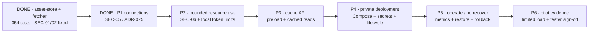

# M-001 — private Gallica IIIF cache pilot

**Current delivery goal · planned 2026-09-28 · implementation baseline `18d738e`.**
Deliver a local cache of Gallica IIIF image resources on top of asset-store to trusted testers,
on one host with one process per application service. This milestone narrows the
next delivery; it does not replace the wider asset-store specification or certify
production readiness. Deployment has not happened yet.

## What the tester gets

A tester can preload content by URL, then request the cached bytes of a URL from
an allowlisted domain through an authenticated API. Cached reads survive origin
outages and do not require the caller to know asset-store aliases or capabilities.
Stored content survives service restarts. An operator can inspect content, usage
and errors, expire an asset and run cleanup.

Fetcher-service already implements URL normalization, cache lookup and ingestion.
Asset-store already implements storage, aliases, scoped reads, quotas, lifecycle
and the admin console. Add a thin cache API to fetcher-service, using asset-store
internally; do not add another storage engine or deployable service.

**API-first and the host-prefixed read URL are confirmed by the product owner.**
The preload route below is proposed; finalize its request/response schema in P3:

| Operation | Route shape | Result |
|---|---|---|
| Preload one URL | `POST /v1/cache/preload` with JSON `url` | Validate allowlist, reuse existing content or fetch/store via ensure-url; return alias, asset id and hit/miss metadata |
| Read cached content | `GET /{origin_host}/{origin_path}` | Validate allowlist, derive the same canonical alias and return bytes with content type; callers do not manage capability tokens |

**Miss behavior is confirmed:** reads are cache-only. Missing/expired content
returns 404 with a structured cache-miss error and no origin request; preload is
explicit. **B-025 tracks the intentionally deferred read-through behavior**
(fetch/cache on a read miss), including latency, concurrency and origin-load policy.
Either operation rejects non-allowlisted URLs (403), rather than
falling back to tmp. Preload preserves existing immutable-content behavior;
changed forced refetches return a conflict, not silent replacement.

**Confirmed read URL mapping:**

```text
https://cache.mymirror.tld/gallica.bnf.fr/iiif/ark:/12148/<id>/f1/full/800,/0/default.jpg
                         ↓ cache key for
https://gallica.bnf.fr/iiif/ark:/12148/<id>/f1/full/800,/0/default.jpg
```

`cache.mymirror.tld` illustrates the pilot hostname; it is not a provisioned host.
The first path segment selects an **exact allowlisted origin hostname**, initially
`gallica.bnf.fr`; the upstream scheme is fixed to HTTPS. Reject credentials,
explicit ports and non-allowlisted/subdomain lookalikes. Preserve the origin path
and supported query semantics without double-decoding; reject ambiguous encodings.
Apply the same mapping to preload and reads so their canonical keys agree. This
is the narrow host-prefixed image-mirror interface selected under B-021; it does
not promise a complete IIIF server or rewriting of `info.json`/manifests.

Use existing service authentication for trusted callers; do not expose privileged
asset-store secrets or raw object keys. Bound bytes and concurrency across both
proxy hops, and omit credentials/source query strings from logs. OpenAPI examples
and an HTTP smoke script are sufficient for the pilot; no new CLI or browser cache
UI is required. A preload script can loop over a small reviewed URL manifest;
asynchronous jobs, scheduled refresh and a bulk-job management API are deferred.
The existing admin console still receives browser acceptance testing.

## Existing design carried forward

The URL shape comes from the [original cache sketch](../_archive/NOTES.md#caching-of-distant-iiif-resources):
`{mirrored domain}/{remote resource-related url part}`. Active
[SCN-010](../spec/01_SCOPE.md#scn-010---user-reads-a-cached-image-instead-of-the-authoritative-source)
already specifies the image-mirror workflow; ADR-014 specifies internal canonical
cache aliases. Public URL spelling and internal storage aliases are separate layers.

M-001 implements a narrow SCN-010 subset inside the existing fetcher deployment:
private service-authenticated access, proxy byte reads and explicit preloading.
The original scenario's fetch-on-miss step remains planned as B-025; its separate
end-user-facing mirror service is not required for this pilot. Archived notes are
historical and remain unchanged.

## Gallica-specific acceptance

Gallica IIIF image resources are the confirmed first source. Use the
[BnF IIIF API documentation](https://api.bnf.fr/fr/api-iiif-de-recuperation-des-images-de-gallica)
to select representative image URLs. Start with a small corpus; reuse local
recorded/test-origin fixtures for repeated automated tests, and keep live-origin
requests limited, rate-bounded and respectful of retry/backoff responses.

- Cache the exact requested region/size/rotation/quality/format response; a cached
  full image does not imply that arbitrary crops or sizes can be generated locally.
- Validate the existing IIIF canonicalization rules against selected Gallica URLs.
  Merge spellings/version variants only when byte equivalence is demonstrated;
  different renditions need separate cache entries.
- Restrict the pilot to image bytes. `info.json` and Presentation manifests are
  not included unless explicitly added to the contract; no manifest rewriting.
- Interface choice is confirmed: prefix the complete origin path with its host
  on the local cache domain. B-021 is narrowed to this image-byte mirror facade;
  no derivative generation or full IIIF compliance claim.
- The pilot host is still unspecified: “local cache” defines the desired use,
  not whether deployment is on a workstation or private server.

## Pilot boundary

| Concern | Milestone scope |
|---|---|
| Audience | Named trusted testers/operators; no public registration or anonymous access |
| Content | Public, reconstructible Gallica IIIF image responses; exact approved Gallica host/path policy, no confidential uploads |
| Cache semantics | Existing canonical-alias cache; a hit reuses stored bytes. Forced refetch detects changed content and returns conflict; automatic freshness/replacement is not promised |
| Deployment | One host, Docker Compose, one asset-store process and one fetcher process, Postgres and Garage with persistent volumes; scheduled lifecycle worker |
| Access | Private network/VPN or SSH tunnel; service credentials required. TLS for access outside the host/tunnel. No public Postgres or Garage admin endpoints |
| Data path | Guarded proxy upload/download; default 50 MiB object cap. Align fetcher and asset-store limits |
| Initial operating envelope | Proposed acceptance fixture: 100 URLs, up to 1 GiB total, 3 concurrent clients; final origins and disk budget selected before deployment |
| Availability | Planned downtime is acceptable; no HA or production SLO promise. Restart invalidates capabilities; API remints them |
| Authorization | Service identities for trusted testers; end-user/multi-tenant product flows are excluded. R-012 remains open for future upstream services |

The cacheability rule set is **not** a network egress allowlist: unmatched URLs
currently enter `tmp`. Configure the pilot entry point to reject out-of-corpus
origins, including redirects, while independently fixing SEC-05 for every outbound
connection. Do not enable `FETCHER_ALLOW_PRIVATE_HOSTS` on the pilot host.

## Delivery sequence



Each row is a reviewable work package, potentially split into smaller commits.
P3 can be exercised locally while hardening proceeds; P4 configuration can be
prepared early, but inviting testers is gated on P1–P5. No deployment is performed
as part of preparing this plan.

| Order | Deliverable and existing work reused | Completion evidence |
|---|---|---|
| **P1 — protect outbound connections** | B-018 / SEC-05 / R-017: bind validated DNS answers to the actual connected address and every redirect, preserving HTTPS hostname verification; disable proxy bypasses. Use the existing HttpFetcher | Negative tests for rebinding, mixed public/private answers, metadata/private destinations and redirects; positive HTTPS and approved-origin tests |
| **P2 — bound pilot resource use** | B-018 / SEC-06, selected SEC-10: reclaim/fence failed writes, account for pending bytes or reserve capacity, bound concurrent fetch/upload work and capability issuance/storage; retire expired token state. Preserve lifecycle deletion fencing from B-014 | Quota rejection and interrupted-write tests leave no permanently unaccounted payloads; cleanup cannot delete a successful write. Repeated failures/issuance remain within configured disk, queue and token bounds; overload is explicit and recoverable |
| **P3 — deliver the cache API** | B-020 + new B-024 thin API in fetcher-service. Add preload and cached-byte retrieval, caller authentication, one shared canonicalization/allowlist policy, OpenAPI examples and an approved-origin fixture | Preload fetches once; repeated cached reads and repeated preload make zero additional origin GETs; returned hashes match. Cache-only miss returns 404 without fetching. Non-allowlisted URLs reject without tmp writes. Concurrent preload either shares a result or retries a documented conflict without alias corruption. Origin failure, oversize, changed refetch and internal capability remint paths have actionable errors |
| **P4 — package the private stack** | B-002/B-003/B-014/B-019: separate pilot Compose profile including real fetcher, asset-store, Postgres, Garage and scheduled cleanup; locked images, explicit secrets, private ingress, migration/init commands, bounded volumes/resources | Fresh-host instructions work; no dev credentials or synthetic fetcher; services reach ready state; real network smoke test covers preload → cached API read → byte download; restart preserves assets; admin browser acceptance completes B-013's pending check |
| **P5 — make it operable and recoverable** | Minimum B-004/B-017/B-019, plus restart subset of B-016: hit/miss, origin failures, ingest bytes, pool/queue pressure, disk and lifecycle signals; daily backup procedure and one restore test; deploy/rollback runbook | Operator can distinguish a hit, origin failure and local saturation. Restore metadata and matching objects/config into an isolated stack and verify checksums/aliases. Roll back a pinned application image with migration compatibility checked. Credentials stay out of logs and repository; image scan findings reviewed |
| **P6 — run the pilot acceptance** | Pilot-sized B-015 + B-019, distinct from full S-2/S-3 certification | Exercise agreed corpus and concurrency, record hit/miss latency, errors, bytes and disk growth; run a 24-hour soak with repeated hits and scheduled cleanup; produce a dated go/no-go record listing residual risks, operator and recovery steps |

**P1 / SEC-05 is implemented and reviewed (2026-09-29). P2 is partially implemented:**
capability storage is bounded and expired token state is retired (ADR-026).
Failed-upload cleanup is implemented (ADR-027), with immediate fencing/reclamation
and lifecycle retries. Pending-byte accounting, aggregate admission limits and
capability issuance rate bounds remain open.
See [connection validation evidence](../security/SEC05_OUTBOUND_CONNECTIONS.md).
SEC-01 and SEC-02 are complete;
do not reopen them as prerequisites unless a regression is found.

## Go/no-go checklist

- [ ] Approved origins, representative corpus, host, tester access and operator recorded.
- [ ] P1 and P2 negative security/resource regressions pass; runtime and image scans reviewed.
- [ ] Fresh deployment uses durable backends and real HTTP origins; no synthetic/in-memory substitutions.
- [ ] Preload and repeated cached reads return identical verified bytes; reads and repeated preload make no additional origin request.
- [ ] Absent content returns the agreed cache-miss response; non-allowlisted requests cannot fetch or write tmp. Concurrent preload, origin outage and oversized content behave predictably.
- [ ] Restart preserves committed data; the API remints internal expired/lost capabilities.
- [ ] Quota exhaustion, expiry and scheduled cleanup are observed and recoverable.
- [ ] Admin console visually checked; minimal metrics and operator instructions usable.
- [ ] Backup/restore and application rollback demonstrated on the pilot stack.
- [ ] Agreed sample workload and 24-hour soak completed with no unexplained errors, checksum mismatches or unbounded retained-state growth; latency measurements recorded without claiming full SLO compliance.
- [ ] Product owner records a limited pilot go/no-go and residual-risk disposition. No risks are accepted by this plan itself.

## Explicitly deferred work

| Existing work | Treatment for M-001 |
|---|---|
| **B-025 read-through reads** | Explicit product deferral: after this pilot, consider fetching/cache population on a read miss; define latency, miss coalescing, retries and origin limits before enabling it |
| Swarm, replicas, HA; full B-016 chaos programme | Defer; Compose on one host plus restart/recovery checks is sufficient for this pilot |
| B-015: 10k-asset ingestion, 30 readers, full SLO/capacity certification | Defer full scale; run the pilot-sized acceptance above |
| SEC-10 distributed capability state | Defer distribution; keep one process, remint after restart, bound local state in P2. Pilot uses reusable short-lived capabilities and makes no single-use guarantee; any single-use-dependent workflow requires the atomic-consumption fix first |
| R-012 end-user identity propagation; OIDC; per-human audit | Defer product integration; only trusted service identities and public test content in this milestone |
| SEC-08 strict revocation of existing presigned URLs | Pilot API uses guarded proxy reads; previously issued signed URLs retain their documented limitations |
| Full B-017 second-S3-target automation | Defer backend automation; a coherent backup/restore rehearsal remains required in P5 |
| OVH certification, extra backend comparisons, full tracing/dashboards | Defer; Garage, essential metrics and logs cover the initial pilot |
| Full IIIF server/compliance beyond the B-021 host-prefixed image facade, derivatives, content dedup, large resumable uploads, new cache UI | Outside this milestone |
| B-022 quota reconciliation, B-023 legal hold | Keep on the wider backlog; no pilot legal-retention or production durability promise |

Private access reduces exposure; it does not remove the SSRF, resource cleanup
or same-process concurrency requirements. Full security release sign-off and the
production go-live checklist remain open after a successful pilot.

## Inputs and decisions

Planning can proceed without these, but deployment needs a named owner and answers:

1. **Product owner:** supply a representative set of Gallica IIIF image URLs.
   Gallica, the host-prefixed read URL and separate preload/cache-only reads are confirmed.
2. **Operator/product owner:** identify the host, private access route and available
   RAM/disk; approve a concrete cache budget and backup destination.
3. **Pilot owner:** identify testers and an operator, select the evaluation window,
   and record the go/no-go criteria against the proposed workload above.

No deadline is claimed yet: P1 and P2 contain the main engineering uncertainty;
host provisioning is an external dependency. Re-estimate after their acceptance
checks and host selection rather than treating these six packages as equal effort.

## Delegation trial (2026-09-29)

The trial ended at the product owner's request after an interrupted session.
One GPT-6 Sol subagent added three accepted SEC-05 transport regressions, then
drafted the ADR-026 capability store and tests. The lead recovered the shared
files, reviewed security/admission invariants, repaired the expired-token fixture
and metric-label assertions, corrected a mock targeting a slotted instance,
and completed validation and documentation directly. The final full suite passes
379 tests with Postgres/Garage, with lint, formatting and strict typing checks green.
No measured cost or throughput savings are claimed. Future work is direct unless
delegation is explicitly requested again.
