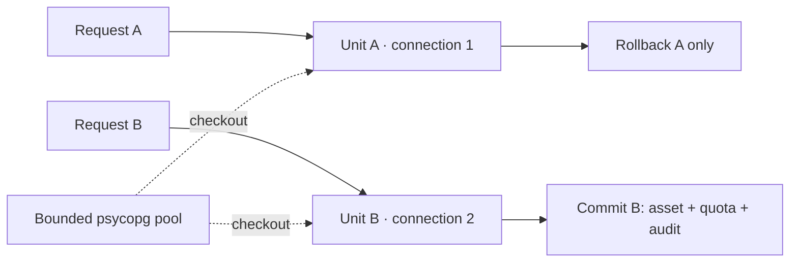

# SEC-02 / R-015 — Postgres transaction isolation

**Implemented 2026-09-28 · ADR-023 · FR-022, FR-050..052, FR-066..068.**
The shared-connection rollback defect is closed. Other B-018 security findings
remain tracked in the [security checkpoint](B018_CLOSEOUT.md).

## Connection and transaction ownership

`PostgresAssetRegistry.connect()` creates a bounded psycopg pool. Every public
registry database operation enters a synchronous unit of work and commits or
rolls back before returning. `asset_lock()` holds a connection and transaction
through its whole context, including nested registry calls. Existing inner SQL
transactions remain savepoints on that unit's connection. Private SQL access
outside a unit fails immediately.

Connection ownership is thread-local because all registry operations are
synchronous. **A unit of work must not cross threads or span an `await`.** No
FastAPI dependency carries an open connection between dependency and handler
threads. Async upload handlers finish reading the request before invoking the
synchronous write operation; no registry transaction spans body reception.
This does not make the whole HTTP request or the object store transactionally
atomic: failed-upload cleanup remains SEC-06. In-memory adapters remain for tests
and local development; distributed capability concurrency remains SEC-10.

The environment app factory validates credentials before opening a pool, closes
it if app construction fails, and owns shutdown via ASGI lifespan. Injected
registries stay caller-owned. CLI callers retain the registry context manager /
`close()` contract. Startup waits for the minimum pool connections and fails if
that cannot complete within the configured timeout. No schema migration is needed.

The implementation uses the official
[psycopg connection pool](https://www.psycopg.org/psycopg3/docs/advanced/pool.html),
with connection validation on checkout. The `pg` extra and development lock now
include `psycopg-pool` 3.3.3; the existing SQL and row locks are retained.

## Configuration and operations

| Environment variable | Default | Constraint |
|---|---:|---|
| `ASSET_STORE_PG_POOL_MIN` | 1 | At least 1 |
| `ASSET_STORE_PG_POOL_MAX` | 8 | At least the minimum |
| `ASSET_STORE_PG_POOL_TIMEOUT` | 5 seconds | Positive finite value |
| `ASSET_STORE_PG_POOL_MAX_WAITING` | 32 | At least 1 queued caller |

These limits apply **per registry pool**, normally one per service process or CLI
invocation. Budget aggregate database connections across replicas/workers before
increasing them. The timeout bounds pool acquisition, not SQL execution or lock
wait time. Pool exhaustion, queue rejection or use after pool closure produces
`RegistryUnavailableError`: HTTP 503, `Retry-After: 1`, and a generic message with
no DSN. Transactions are not automatically replayed.

Metrics exposed through the asset-store `/metrics` endpoint:

- `asset_store_registry_transactions_total{outcome="committed|rolled_back"}`
- `asset_store_registry_checkout_seconds` (histogram)
- `asset_store_registry_unavailable_total`
- `asset_store_registry_pool_size`, `asset_store_registry_pool_available`,
  `asset_store_registry_requests_waiting`

Structured events `registry.rollback` and `registry.pool_unavailable` carry no
SQL, credentials or DSN. Investigate sustained waiting/unavailability before
raising pool limits; check long-running transactions and database capacity first.
No load/SLO certification is implied by these defaults.

## Acceptance evidence

`tests/test_pg_concurrency.py` uses isolated Postgres schemas and event/barrier
coordination. The decisive HTTP regression holds A after a mutation, lets B
successfully commit another asset, then forces A to roll back. A separate pool
verifies B's asset, partition/bucket accounting and audit event persist while A's
mutation disappears. This proves independent progress, not global serialization.

Further checks cover nested asset locks with a one-connection pool, rollback of
asset/quota/audit together, connection reuse after failure, concurrent quota
ceilings, bounded waiting queues, retryable HTTP checkout timeout and recovery,
app-owned shutdown, injected ownership, failed construction cleanup and invalid
configuration. Existing lifecycle/admin/worker/backend tests remain green.

Validation: **354 tests passed, none skipped**, with Postgres and Garage enabled;
Ruff lint/format and strict mypy (69 source files) pass. The locked container builds
on Python 3.12. Runtime `pip-audit` including the new pool dependency reports no
known vulnerabilities on 2026-09-28 (local Python 3.13 marker selection; not an OS
image scan). The two pre-existing upstream deprecation warnings remain.
