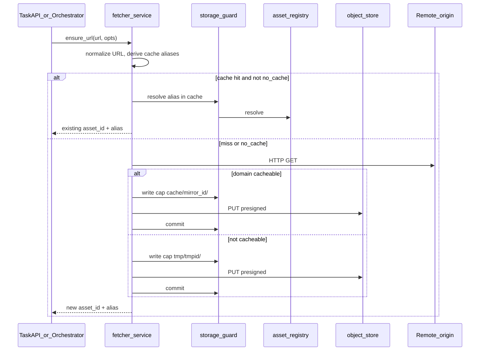

# Fetcher Service

> Terms and acronyms: [`../spec/README.md` glossary](../spec/README.md#glossary-and-acronyms)

## At a glance

The **fetcher-service** materializes remote URLs into `asset-store`. It performs outbound HTTP, decides **cache hit vs miss**, and writes bytes to the correct object-store bucket (`cache` or `tmp`). **asset-store never fetches remote URLs** ([`../spec/01_SCOPE.md`](../spec/01_SCOPE.md), [`ADR-008`](../spec/03_ARCHITECTURE.md)).

| Step | What happens |
|------|----------------|
| 1. Cache lookup | Normalize URL → derive cache alias candidates → resolve via storage-guard |
| 2. On hit | Return existing `asset_id` + alias (unless caller sets `no_cache`) |
| 3. On miss | HTTP GET remote origin |
| 4. Store | Cacheable domain → `cache/{remote_mirror_id}/…`; else → `tmp/{tmpid}/…` |
| 5. Return | `{ asset_id, qualified_alias, cache_hit, bucket, partition_id }` |



**Callers:** task-api, task orchestrator, and (indirectly) workers that receive aliases in task definitions. **Not** asset-store, **not** workers talking to heritage sites directly.

> The sequence diagram shows `PUT presigned` as the eventual data path. In the prototype the fetcher uses the **guarded proxy upload** (`PUT /objects/{alias}`) instead — see *Transport & data plane* below.

---

## Transport & data plane ([`ADR-017`](../spec/03_ARCHITECTURE.md))

Both the **control plane** (capability mint, `resolve`, `reserve`, `commit`) and the **data plane** (payload bytes) run over **HTTP+JSON** to asset-store in the prototype. The fetcher uploads via the **guarded proxy** (`PUT /objects/{alias}`), so every byte is audited at the guard and no long-lived signed URL is handed out.

If a hot path ever needs throughput, the performance lever is **presigned upload/download (direct fetcher↔S3)** per [`ADR-003`](../spec/03_ARCHITECTURE.md) — **not** a second RPC protocol such as gRPC. gRPC would add a toolchain for low-volume control calls without helping byte movement; presigned URLs remove the proxy hop, which is where the cost actually is. Server-side presigned **PUT** is not implemented yet and needs an explicit hands-off/commit signal to prevent double-write; this is tracked as [`R-013`](../spec/05_BACKLOG_AND_OPEN_QUESTIONS.md). Until then, proxy upload is the safe, simple default.

---

## Scope

### In scope (fetcher module)

- `ensure_url` API (name provisional) for idempotent URL materialization.
- URL normalization and cache-alias derivation via a **declarative URL→alias rewrite-rule set** ([`ADR-014`](../spec/03_ARCHITECTURE.md), [`Q-021`](../spec/05_BACKLOG_AND_OPEN_QUESTIONS.md)).
- Domain allowlist policy: the rewrite-rule set **is** the cache allowlist — a URL matching no allow rule is not cacheable ([`ADR-014`](../spec/03_ARCHITECTURE.md), [`Q-022`](../spec/05_BACKLOG_AND_OPEN_QUESTIONS.md)).
- HTTP client: timeouts, max body size, redirect limit, SSRF controls.
- Integration with asset-store only: reserve → PUT → commit via storage-guard, attaching **all** aliases a rule yields to one `asset_id`.
- Observability: cache hit rate, fetch errors, bytes ingested.

### Out of scope

- Image processing, IIIF tile generation, manifest editing.
- User authentication (delegated to upstream APIs).
- Virus scanning (caller's responsibility before or after fetch; contract in [`../spec/01_SCOPE.md`](../spec/01_SCOPE.md)).
- **`iiif_server_cache`** bucket — managed directly by the IIIF server, not via this service ([`../spec/03_ARCHITECTURE.md`](../spec/03_ARCHITECTURE.md)).

---

## API (draft)

### `POST /v1/ensure-url`

**Request (JSON)**

| Field | Required | Description |
|-------|----------|-------------|
| `url` | yes | Remote URL to materialize |
| `mirror_id` | yes for cache path | Partition under `cache` (e.g. `gallica`, `bnf`) |
| `no_cache` | no | If `true`, skip cache lookup and force refetch |
| `tmp_id` | no | Partition under `tmp` when not cacheable; server may assign |
| `preferred_alias_suffix` | no | Hint for alias tail under partition |
| `ttl_seconds` | no | Hint for asset TTL (esp. `tmp`) |

**Response (JSON)**

| Field | Description |
|-------|-------------|
| `asset_id` | Opaque id from asset-store |
| `qualified_alias` | e.g. `cache/gallica/bnf/ark-…/default.jpg` |
| `cache_hit` | `true` if served from existing cache alias |
| `bucket` | `cache` or `tmp` |
| `partition_id` | Mirror id or tmp id |

**Errors:** `400` invalid URL; `403` policy denied; `502` upstream fetch failed; `504` upstream timeout.

---

## Cache vs tmp decision

| Condition | Bucket | Partition | Typical TTL |
|-----------|--------|-----------|-------------|
| Origin domain ∈ cache allowlist | `cache` | `{remote_mirror_id}` | Long / infinite |
| Otherwise | `tmp` | `{tmpid}` | Short ([`Q-020`](../spec/05_BACKLOG_AND_OPEN_QUESTIONS.md)) |
| Caller `no_cache: true` | Same as policy after fetch | — | — |

Examples of **tmp** use ([`../spec/01_SCOPE.md`](../spec/01_SCOPE.md)):

- Task input URL on a non-cacheable domain.
- One-shot remote resource not promoted to cache.
- Inline/base64-equivalent payloads staged by task-api (may skip HTTP; still uses `tmp` bucket).

---

## URL→alias rewrite rules ([`ADR-014`](../spec/03_ARCHITECTURE.md))

Cache mapping and cache allowlisting are a **single declarative artifact**: an ordered list of rewrite rules, keyed by origin. The same rule set is evaluated identically by the fetcher and by any cache client (e.g. `iiif-image-mirror`), so the allowlist decision and the canonical alias never drift apart.

The **canonical alias is the cache key**: `ensure_url` resolves (and, on a miss, writes) the asset under exactly that alias, so lookup and storage share one name and equivalent URL variants collide on it by construction.

Each rule matches an origin URL (host + path/query pattern) and produces:

1. an **allow/deny** decision, and
2. the **canonical cache alias** under `cache/{mirror_id}/…`.

### Rule config format (TOML)

Rules are authored as an ordered TOML `[[rule]]` array and loaded via `FETCHER_RULES_FILE` (falling back to the built-in default set). Three `type`s are supported:

- `iiif` — IIIF Image API origin; fields `host`, `mirror_id`, optional `path_prefix` (default `["iiif"]`). Rotation/quality canonicalization and the `native`→`default` dedup are done in code, not config.
- `passthrough` — cache every path on a host verbatim; fields `host`, `mirror_id`.
- `regex` — generic host with an anchored, **named-group** regex that **matches and extracts only**; fields `host`, `mirror_id`, `path_match`, `alias_template`. The regex is a **safe subset** — backreferences and lookaround are rejected at load time, and every `{group}` in `alias_template` must be a capture group — so a rule set stays predictable and exhaustively unit-testable offline.

```toml
[[rule]]
type = "iiif"
host = "gallica.bnf.fr"
mirror_id = "gallica"

[[rule]]
type = "regex"
host = "images.example.org"
mirror_id = "example"
path_match = '^img/(?P<id>[^/]+)\.(?P<fmt>jpg|png)$'
alias_template = "img/{id}.{fmt}"
```

**Dedup by normalization (single alias):** byte-identical URL variants normalize to the **same** canonical alias rather than binding several distinct aliases to one asset ([`ADR-014` amendment](../spec/03_ARCHITECTURE.md)); multi-alias-per-asset is deferred to the access-control use case ([`Q-034`](../spec/05_BACKLOG_AND_OPEN_QUESTIONS.md)).

### Allowlist semantics (default-deny)

- A URL matching **no allow rule** is **not cacheable**.
- The general fetcher may still fetch a non-cacheable URL into `tmp` (task-input staging).
- A dedicated cache client such as `iiif-image-mirror` treats a non-match as **rejected** (`403`) — it must not fetch outside the allowlist.

### Deduplication: name-dedup now, byte-identity deferred

**Primary dedup is by the canonical alias (the cache key).** Equivalent URLs normalize to the *same* alias and collide on lookup, so a second equivalent request is a cache **hit that never re-fetches**. This alone delivers the caching win with **zero extra machinery** — no content hashing, no blob sharing.

**Byte-identity (content-addressed) storage dedup** — storing identical bytes *once* and pointing several *different* aliases at one blob — is a **separate, additive** layer that is **deferred** ([`Q-035`](../spec/05_BACKLOG_AND_OPEN_QUESTIONS.md)). Why it is not needed at first:

1. **The alias already does the dedup that matters.** With alias-as-cache-key, content dedup only helps when two *different* aliases carry identical bytes. And because a second equivalent URL is a name-level cache hit, we usually **never fetch the duplicate bytes** to compare in the first place — so the marginal saving is small.
2. **The transfer-saving variant needs a proxied upload.** Only a proxy sees the bytes *before* they are stored, so only a proxy can skip the store to avoid the transfer. With presigned direct-to-S3 you cannot avoid the transfer without trusting a spoofable client-declared hash. The transport-agnostic alternative — post-upload "control-then-merge" (let the object land, read its server-side checksum, then merge duplicates) — saves **storage, not transfer**, and adds blob **refcounting**, a merge mutation with concurrency hazards, a transient duplicate, and **ambiguous quota attribution** (whose bytes are the shared ones?).
3. **Cost scales with item size**, so if ever enabled it must be a **per-space (cache-only), partition-scoped** knob — never cross-partition in `users` (instant dedup / quota deltas become an *existence oracle* leaking that another user holds a file), pointless in `results` (download-once unique outputs, cf. ADR-009 LFU exclusion) and `tmp` (ephemeral).

We already record a trustworthy server-side `sha256` on every write (`object-store` computes it, the registry stores it), so the one slice we keep now is a cheap **correctness detector** for [`R-011`](../spec/05_BACKLOG_AND_OPEN_QUESTIONS.md): when we deliberately refetch (`no_cache`) or run an audit, compare the fresh checksum against the stored one for the same alias and alert on mismatch — no merge, no schema change.

For byte-identical variants that address the *same* resource with the *same* normalized parameters (different IIIF API revisions, host, or scheme), the point is moot anyway: they **normalize to one alias**. Any change to region, size, rotation, quality, or format yields **different bytes** and therefore a **distinct** alias.


### IIIF Image API alias scheme

For IIIF Image API origins the canonical alias tail is:

```
cache/{mirror_id}/iiif/{resource_id}/{region}/{size}/{rotation}/{quality}.{format}
```

- `{resource_id}` — the ARK when the origin exposes one (e.g. Gallica `ark:/12148/…`), otherwise the origin's stable id. **ARK is not assumed** ([`Q-011`](../spec/05_BACKLOG_AND_OPEN_QUESTIONS.md)).
- `{region}/{size}/{rotation}/{quality}.{format}` — the **normalized** IIIF Image API parameters (canonical spelling, e.g. `full`→`full`, default rotation `0`, lowercased format).

Example — these two Gallica IIIF API-version URLs of the same region+size normalize to the **same** canonical alias and thus one `asset_id`:

```
https://gallica.bnf.fr/iiif/ark:/12148/btv1b8447236h/f1/full/max/0/default.jpg
https://gallica.bnf.fr/iiif/2/ark:/12148/btv1b8447236h/f1/full/max/0/default.jpg
  → cache/gallica/iiif/ark:/12148/btv1b8447236h/f1/full/max/0/default.jpg
```

whereas `full/1000,/0/default.jpg` is a **different** alias (different bytes).

### Correctness risk ([`R-011`](../spec/05_BACKLOG_AND_OPEN_QUESTIONS.md))

An over-broad equivalence rule can bind non-identical resources to one alias (the cache key) and serve wrong bytes. Mitigations: keep equivalence rules conservative (only known byte-identical variants), and version/test the rule set per mirror. As a cheap runtime detector, when the fetcher deliberately refetches (`no_cache`) or an audit job re-fetches, compare the fresh server-side `sha256` against the checksum already stored for that alias and alert on mismatch (a rule bound non-identical resources). Full content-hash-based dedup/verification on every fetch is deferred with content-addressed storage dedup ([`Q-035`](../spec/05_BACKLOG_AND_OPEN_QUESTIONS.md)).

### Manifests excluded

Rewrite rules apply to **image bytes only**. IIIF **Presentation manifests are not cached** — a manifest embeds absolute origin URLs that would be wrong when served from a mirror (see [`../spec/01_SCOPE.md`](../spec/01_SCOPE.md) SCN-010 scope note).

---

## Service identity and asset-store permissions

Fetcher authenticates to storage-guard as `fetcher`. See service matrix in [`../spec/03_ARCHITECTURE.md`](../spec/03_ARCHITECTURE.md).

| Operation | Allowed buckets |
|-----------|-----------------|
| Read (resolve) | `cache`, `tmp` |
| Write (reserve/commit) | `cache`, `tmp` |

Fetcher must **not** write `users` or `results`.

---

## Relationship to the IIIF server and the IIIF mirror/proxy

The archived discovery docs described an "IIIF proxy" prefetching remote images. That concept has since split into **two distinct future modules** with different responsibilities. Fetcher-service is the general URL-materialization layer that both will rely on.

| Aspect | IIIF server (`iiif-server`) | IIIF image mirror (`iiif-image-mirror`) |
|--------|-----------------------------|-----------------------------|
| **Role** | Serve stored assets via IIIF Image API | Relay heritage IIIF Image API requests; cache responses |
| **Reads from asset-store** | `cache`, `users` (via presigned GET) | `cache` only (via presigned GET) |
| **Writes to asset-store** | None — writes only to its own `iiif_server_cache` tile bucket | None directly — all cache writes delegated to fetcher-service |
| **Fetches remote URLs** | No | Via fetcher-service (`cache/{mirror_id}/…`) |
| **IIIF Presentation manifests** | May read; does not compose | Must **not** rewrite manifests to point at itself |
| **IIIF Image API** | Serves from stored assets | Relays and caches from authoritative heritage endpoints |
| **Client awareness** | Transparent to client | Client must actively point at mirror; no impersonation |
| **In scope for asset-store MVP** | Surveyed for later | No (future separate module) |

### IIIF server

The IIIF server's goal is to serve content already stored in asset-store in a IIIF Image API-compatible format (other efficient distribution protocols may be studied in the future). It is a **reader** of asset-store, not a fetcher and not a mirror. It owns and manages `iiif_server_cache` independently for derived tile storage; that bucket is not provisioned or written by asset-store.

### IIIF image mirror

The IIIF image mirror (`iiif-image-mirror`) is a **separate future module** whose goal is reliable, user-accessible caching of heritage images served by national libraries and similar authoritative repositories via the IIIF Image API.

Key characteristics:

- **IIIF Image API only** — no Presentation API, no manifest relay, no manifest rewriting.
- **End-user facing** — it has its own access-control layer for end users (outside asset-store’s service-identity model); asset-store only sees the module’s service identity (`iiif-image-mirror`).
- **Cache backend** — uses fetcher-service and the asset-store `cache` bucket; all ingestion follows the standard reserve → PUT → commit flow.
- **Reads from asset-store** — `cache` only, via presigned GET from storage-guard.
- **No writes to asset-store** — cache population is delegated entirely to fetcher-service.
- **Separate service** — distinct codebase and deployment from `iiif-server`.
- **Client awareness** — clients must explicitly point requests at the mirror; the mirror does not impersonate the upstream repository.

**Open question — derivative generation ([`Q-026`](../spec/05_BACKLOG_AND_OPEN_QUESTIONS.md)):** Full IIIF Image API compliance (beyond level 0) requires serving arbitrary region/size/rotation combinations, which typically means generating image derivatives rather than proxying verbatim responses. Generating derivatives internally risks subtle divergence from the upstream server’s rendering. The advantage (full Image API compliance, reduced upstream load) must be weighed against this risk before a decision is made. If derivatives are stored, a dedicated tile bucket (separate from the asset-store `cache` bucket) is the preferred approach, mirroring the `iiif_server_cache` pattern used by `iiif-server`.

Whether this module is needed at all is tracked as [`B-021`](../spec/05_BACKLOG_AND_OPEN_QUESTIONS.md).

---

## Scenario

See **SCN-007** in [`../spec/01_SCOPE.md`](../spec/01_SCOPE.md).

---

## Open questions

| ID | Topic |
|----|--------|
| Q-021 | Cache alias derivation — **Resolved**: declarative URL→alias rewrite rules ([`ADR-014`](../spec/03_ARCHITECTURE.md)) |
| Q-022 | Domain allowlist — **Resolved**: the rewrite-rule set is the implicit cache allowlist ([`ADR-014`](../spec/03_ARCHITECTURE.md)); storage medium (file/DB/admin UI) deferred to Phase 2 |
| Q-023 | Fetcher MVP phase relative to asset-store Phase 2 |
| Q-020 | Default `tmp` TTL and GC ([`05_BACKLOG_AND_OPEN_QUESTIONS.md`](../spec/05_BACKLOG_AND_OPEN_QUESTIONS.md)) |

---

## Requirements trace (informal)

Fetcher implements platform behavior referenced by task flows; asset-store requirements **FR-010**–**FR-015**, **FR-020**–**FR-022** apply to the guard/registry calls fetcher makes. Dedicated `FR-F*` rows may be added when fetcher is implemented in its own repo.
