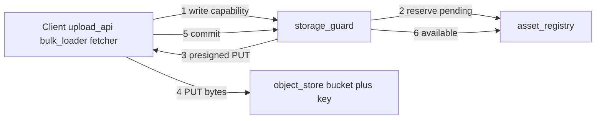
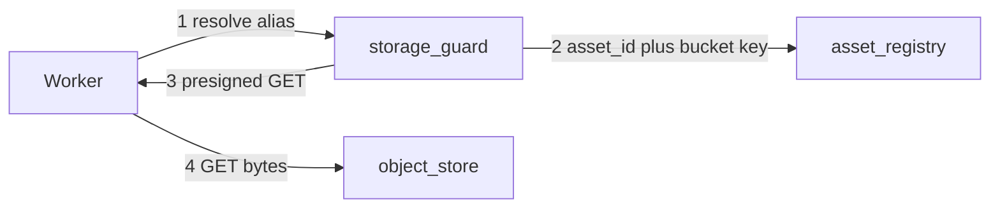

# 03 - Architecture

This is the canonical architecture specification for the `asset-store` module.

> Terms and acronyms: [`README.md` glossary](README.md#glossary-and-acronyms)

## At a glance — storage layout

Physical bytes live in **four object-store buckets**. Logical names are **aliases**. The registry stores both.

```mermaid
flowchart TB
  subgraph logical [Logical layer]
    Alias["Qualified alias: users/42/uploads/photo.jpg"]
    AssetRow["Asset: space=users, partition_id=42, storage_key=42/assets/{asset_id}"]
  end
  subgraph physical [Physical layer (object store)]
    BucketUsers["bucket: users"]
    Key["object key: 42/assets/{asset_id}"]
  end
  Alias --> AssetRow
  AssetRow --> BucketUsers
  AssetRow --> Key
```

| Bucket (`space`) | Partition | Example alias | Writers |
|------------------|-----------|---------------|---------|
| `cache` | `{remote_mirror_id}` | `cache/gallica/bnf/ark-…/default.jpg` | fetcher, bulk-loader |
| `tmp` | `{tmpid}` | `tmp/task-abc/input.png` | fetcher, upload-api, task-api |
| `users` | `{userid}` | `users/42/uploads/{suffix}` | upload-api |
| `results` | `{userid}` | `results/42/987/attempt-1/out.zip` | worker |

**Partition notes:** `results` uses `{userid}` as `partition_id`; the task identity lives in the alias path. Anonymous tasks use the reserved value `partition_id = anon`. **Quota:** two-tier enforcement — per `(space, partition_id)` via `PartitionQuota` and per-bucket via `BucketQuota` (FR-066..068, ADR-009); **object-store** bucket totals for ops/cost only.

**Legacy alias migration** (old docs → new):

| Old | New |
|-----|-----|
| `u-42/…` | `users/42/…` |
| `results-task-987/…` | `results/42/987/…` |
| `cache/…` (flat) | `cache/{mirror_id}/…` |

---

## Architecture principles

Five principles govern the whole design (see ADR log for rationale and rejected alternatives):

1. **One service, conceptual layers** ([`ADR-002`](#adr-log)). `asset-store` ships as a single Python/FastAPI service with three internal modules — `registry` (assets/aliases/lifecycle), `capabilities` (the guard/broker), `storage` (backend adapter). The `object-store` / `asset-registry` / `storage-guard` layering is conceptual, not a deployment boundary; the guard may be split into its own deployable later if the hot path needs independent scaling.
2. **Aliases are the core access primitive** ([`ADR-010`](#adr-log)). Every caller-facing read or write names an **alias** (or alias prefix) in some space — never a raw object key. This is what lets cache, tmp, users and results share one contract instead of each consumer building its own naming + permission store.
3. **Asset layer is authoritative; the backend is dumb** ([`ADR-011`](#adr-log)). The S3 backend stores opaque durable bytes plus presign/multipart. Lifecycle, deletion, quota, eviction and retention truth live in the registry. Backend-native lifecycle (where it exists) is only a safety net.
4. **Single pluggable backend behind an adapter seam** ([`ADR-001`](#adr-log), [`ADR-012`](#adr-log)). MVP runs one active S3-compatible backend: **OVH S3** (hosted) first and **Garage** (self-hosted) to certify; MinIO is disqualified on licensing. The seam preserves a clean path to multiple backends later; the word *region* is dropped.
5. **Tenancy is partition-based; billing ownership is out of scope** ([`ADR-012`](#adr-log)). Multi-tenant isolation is expressed via `partition_id`; the notion of a project/team that *pays* for storage is deferred.

## Proposed Architecture

The `asset-store` module is a single service composed of off-the-shelf object storage (accessed through a backend adapter) and a thin custom Python/FastAPI process that hosts the `registry`, `capabilities`, and `storage` modules over a shared Postgres database for metadata and audit. Data-plane payloads transit directly between caller and the object store via short-lived presigned URLs whenever possible; object payloads live exclusively in the object store. Internal module calls are in-process; the only network protocol on the control plane is HTTP+JSON over TLS between callers and the service.

This architecture is the "compose" finalist recommended by [`A_OSS_SURVEY.md`](A_OSS_SURVEY.md), collapsed from two services into one deployable for the prototype. The "adopt InvenioRDM" alternative remains documented and can be revisited if a future requirement justifies it.

## Component Responsibilities

The table below is a summary; per-component contracts are documented in [`02_REQUIREMENTS.md`](02_REQUIREMENTS.md). `asset-registry` and `storage-guard` are **internal modules of the single `asset-store` service** ([`ADR-002`](#adr-log)), not separately-deployed processes; they are listed separately to describe responsibilities.

| Component | Responsibility | Inputs | Outputs |
|---|---|---|---|
| `object-store` (Garage / OVH S3) | Durable storage of binary payloads; multipart; lifecycle on prefixes; checksum on PUT/GET | Payloads via signed URLs; lifecycle policy | Stored objects; STS / presigned URLs; storage metrics |
| `asset-registry` (custom Python/FastAPI) | Aliases, metadata, lifecycle, admin API; one row per asset, one row per alias | Create/commit/expire/delete RPCs from `storage-guard` and admin; SQL queries from `admin-ui` | Asset/alias state in Postgres; API responses; metrics; lifecycle audit events |
| `storage-guard` (custom Python/FastAPI) | Capability broker; authenticates service identities; mints presigned URLs and opaque tokens; emits audit log | Service credential + capability request | Capability (signed URL or token); audit log entries |
| `admin-ui` (custom static SPA or HTMX) | Operator surface for list/inspect/lifecycle/audit | Operator clicks/forms | Admin-API calls; rendered views |
| `bulk-loader` (CLI) | Bulk-ingest fixtures or real preload batches | Manifest file + payload directory | Asset creations; summary report |
| `worker-sim` (CLI) | Simulate worker read path and result write path | Task definition + capability | Reads + writes + summary report |
| `fetcher-service` (platform) | Remote URL → `cache` or `tmp` via asset-store | URL + policy | Asset reference ([`../services/fetcher-service.md`](../services/fetcher-service.md)) |

## Service identity → bucket permissions

Enforced by **FR-015**. Denied requests return `403`.

| Service identity | Read buckets | Write buckets |
|------------------|-------------|---------------|
| `fetcher` | `cache`, `tmp` | `cache`, `tmp` |
| `upload-api` | `users`, `tmp` | `users`, `tmp` |
| `bulk-loader` | `cache` | `cache` |
| `worker` | `cache`, `users`, `tmp`, `results` | `results` |
| `task-api` | `cache`, `users`, `tmp` | `tmp` |
| `admin` | all MVP buckets | all MVP buckets |
| `iiif-server` | `cache`, `users` (read-only MVP) | — |
| `iiif-image-mirror` | `cache` (read-only) | — (delegates writes to `fetcher`) |

`iiif_server_cache` is **not** provisioned or written by asset-store; IIIF server manages it separately.

`iiif-image-mirror` reads `cache` to serve cached heritage images via presigned GET. It never writes to asset-store directly; all cache-population writes go through `fetcher`. It does not access `tmp`, `users`, or `results`. It maintains its own end-user access-control layer outside the asset-store service-identity model; derived tile storage (if ever implemented) would use a dedicated bucket not managed by asset-store.

### ADR-018 — Forced refetch preserves immutable aliases (accepted 2026-09-25)

For B-020 / R-011 and FR-022, `no_cache` fetches fresh bytes and compares SHA-256
with any existing alias. Matching bytes reuse the asset (`cache_hit=false`);
mismatch returns HTTP 409 with a warning and counter, without any write or rebind.
The same rule applies to `tmp`. Automatic replacement was rejected because aliases
are immutable; storing an unreferenced duplicate was rejected as wasted storage.
This is a correctness check, not content-addressed dedup or a background audit job.
See the [fetcher contract](../services/fetcher-service.md#forced-refetch-correctness-b-020-r-011-fr-022).

## Core data flows

Although the three layers are internal modules of one service, the control plane and data plane are distinct: control calls (capability, reserve, commit) hit the service; payload bytes move directly between the caller and the object store via presigned URLs.

### Write path



### Read path



### Remote URL flow

Owned by **fetcher-service** ([`../services/fetcher-service.md`](../services/fetcher-service.md)); asset-store never performs outbound HTTP ([`ADR-008`](#adr-log)). See the sequence diagram in that contract.

## Data Model Draft

### Asset

- `asset_id` - opaque, server-assigned (UUID v7).
- `space` - storage bucket name: `cache`, `tmp`, `users`, or `results`.
- `partition_id` - scope within bucket: mirror id, tmp id, user id, or task id.
- `storage_key` - `{partition_id}/assets/{asset_id}`; never exposed externally.
- `mime` - declared by caller; optionally sniffed on commit.
- `size_bytes` - reported by object-store on commit.
- `checksum_algo` - default `sha256`.
- `checksum` - server-side checksum reported by object-store; cross-checked against client-supplied value.
- `state` - one of `pending`, `available`, `expired`, `deleted`.
- `created_at`, `updated_at`, `expires_at` (nullable for infinite TTL).
- `eviction_policy` - enum `inherit` (default) | `exempt`. `inherit`: asset follows the per-space eviction sweep policy. `exempt`: excluded from all capacity-triggered and quota-triggered sweeps; TTL expiry still applies. Settable by the creating service at write time; admin may update at any time; every change emits `asset.eviction_policy_set`.
- `annotations` - JSONB free-form map.
- `owner_service_id` - service identity that performed the create.

### Alias

- `alias` - unique within `space`; URL-safe string.
- `asset_id` - reference to the bound asset (nullable while `pending`).
- `space` - copy of the asset's space, kept for index locality.
- `mutable` - boolean, default `false`. When `false`, the alias is bound to its `asset_id` for life (single-binding-for-life); detach permanently destroys the alias. When `true`, the alias may be rebound to a different `asset_id`; every rebind is audited as a first-class event. The flag is set at create time and is itself immutable.
- `created_at`, `updated_at`.
- `created_by_service_id`.

### PartitionQuota

One row per `(space, partition_id)`; created on first write to the partition.

- `space` - storage bucket name.
- `partition_id` - scope within bucket.
- `quota_bytes` - nullable; null = no limit configured.
- `quota_asset_count` - nullable; null = no count limit.
- `used_bytes` - current sum of `size_bytes` for `available` assets in this partition. Updated atomically via Postgres `UPDATE … RETURNING` on every commit (increment) and every `→ deleted` transition (decrement); never via read-modify-write.
- `used_asset_count` - current count of `available` assets; updated alongside `used_bytes`.
- `eviction_sweep_enabled` - boolean. When `true` and the partition crosses the 90% quota trigger, the lifecycle worker runs a quota-triggered eviction sweep. Default: `true` for `cache` and `tmp`; `false` for `users` and `results`.

### BucketQuota

One row per `space`. Tracks aggregate storage across all partitions in the space.

- `space` - storage bucket name.
- `quota_bytes` - nullable; null = no bucket-wide limit.
- `used_bytes` - sum of all `PartitionQuota.used_bytes` for this space; maintained atomically alongside per-partition updates.
- `warn_threshold` - fraction at which a warn metric fires; default `0.80`.
- `hard_ceiling` - fraction at which new commits are rejected with `413`; default `1.00`.

### Capability (issued, not persisted long-term)

- `capability_id` - opaque.
- `caller_service_id`.
- `scope` - read or write; alias-prefix string with at least one path segment.
- `mode` - `presigned_url` or `proxy_token`.
- `single_use` - boolean.
- `expires_at`.
- (Persisted in audit log only; not a routine read path.)

### Audit event

- `event_id`.
- `ts`.
- `caller_service_id`.
- `action` - one of `capability.issue`, `alias.create`, `alias.attach`, `alias.detach`, `alias.delete`, `alias.rebind`, `asset.commit`, `asset.expire`, `asset.delete`, `admin.*`.
- `target` - alias and/or `asset_id`.
- `before`, `after` - JSONB diff or state snapshot.
- `outcome` - `granted`, `denied`, `success`, `error`.
- `correlation_id` - per-request trace id.

## State Machine

```mermaid
stateDiagram-v2
    [*] --> pending: alias reserved
    pending --> available: commit (size + checksum verified)
    pending --> deleted: TTL on pending expired; or commit rolled back
    available --> expired: TTL reached or admin expire
    available --> deleted: admin delete (skip expired)
    expired --> available: admin set new TTL (un-expire)
    expired --> deleted: grace period elapsed; garbage collection
    deleted --> [*]
```



- **States:** `pending`, `available`, `expired`, `deleted`.
- **Allowed transitions:** as in the diagram above. Any transition that is not depicted is forbidden and yields a 409.
- **Terminal states:** `deleted` (registry row retained for audit retention period; payload removed from `object-store`).
- **Retry rules:** state transitions are idempotent on `Idempotency-Key`; replays return the original response.

## Per-Space Lifecycle Policy

Normative defaults; all thresholds are operator-configurable per deployment.

| Space | Default TTL | Pressure eviction | Quota eviction | `eviction_sweep_enabled` default | Grace period |
|-------|-------------|-------------------|----------------|----------------------------------|--------------|
| `cache` | Operator-configured | Yes — LFU+age sweep (FR-064) | Yes (FR-067) | `true` | 7 days |
| `tmp` | 24 h; caller hint max 7 d | Size/age sweep plus TTL (ADR-020) | Size/age sweep plus TTL | `true` | 24 h |
| `users` | None (`expires_at = null`) | No — admin-only expire/delete | Admin-only | `false` | 7 days |
| `results` | Per-task TTL hint; operator max 365 d | No — alert only (FR-068, FR-069) | No — alert only | `false` | 7 days |

## ADR Log

All ADRs are accepted **provisionally**, pending the time-boxed spikes listed in [`A_OSS_SURVEY.md`](A_OSS_SURVEY.md) section 6. Each ADR records its rationale, rejected alternatives, and the spike(s) that may reverse it.

| ADR ID | Decision | Status | Rationale | Alternatives Rejected |
|---|---|---|---|---|
| ADR-030 | M-001/P2 capability admission rate: lock-protected per-configured-identity token buckets using a monotonic clock. `ASSET_STORE_CAPABILITY_RATE_PER_MINUTE=120`, `ASSET_STORE_CAPABILITY_RATE_BURST=20`, positive integers. Authenticate first, then consume one attempt before policy, token-store admission or audit. Rate rejection returns 429 with computed `Retry-After`, publishes no capability, and emits bounded-label telemetry without per-request audit rows. Failed admitted attempts retain their charge. | Accepted (2026-10-01) | Bounds mint/audit work per identity and limiter state to configured identities for the single-process pilot. Issuance grant/authorization audit behavior remains after admission; restart resets rate credit. Deployment ingress/log retention and lifetime disk budgets remain operational gates. | Unbounded issuance; audit every rate rejection (unbounded denial audit growth); refund failed attempts (bypass); attacker-selected identity dictionaries; distributed limiter for the single-instance pilot. |
| ADR-029 | M-001/P2 durable exact-size upload reservations: guarded proxy writes persist nullable `reserved_bytes` before PUT. Pending known-size reservations count toward partition/bucket admission (including asset-count quotas); unpurged reservations, including failed deleted uploads, count toward physical capacity. Commit excludes its own reservation, requires matching size, and replaces it with committed size. Purge retires the physical estimate. Serialize admission using partition then bucket quota rows; legacy raw reservations remain size-unknown. | Accepted (2026-10-01) | Prevents concurrent pending writes and failed deletion from bypassing configured budgets; survives process restart without a new queue. Existing available usage counters retain their meaning. Requires migration 0003 and one shared admission lock order. | Commit-only capacity accounting; process-local byte counters lost on restart; releasing physical estimates when bytes may still exist. |
| ADR-028 | M-001/P2 no-wait per-process work admission: default four upload leases (`ASSET_STORE_MAX_INFLIGHT_UPLOADS`) and four ensure-url job leases (`FETCHER_MAX_INFLIGHT_JOBS`), positive integers. Authenticate/authorize uploads before admission; acquire before reading the body and hold through PUT/commit/cleanup. Fetcher admits after dispatcher authentication, before thread dispatch. Run blocking work outside the event loop and retain leases until workers exit on request cancellation. Saturation returns 503 with `Retry-After: 1`; no admission waiting queue. | Accepted (2026-09-30) | Bounds concurrent retained payloads and backend work for the single-process pilot, preserves responsive health/overload paths, and prevents cancelled requests admitting replacement work while their worker still runs. Pending-byte reservations and issuance rate remain separate P2 work. | Unbounded requests/queues; holding storage transactions across awaits; releasing a slot while its cancelled-request worker continues. |
| ADR-027 | M-001/P2 failed proxy uploads: after the upload transaction exits with failure, recheck the asset under lock and persist a pending-to-deleted fence in a separate transaction before removing bytes. Recheck the fence under lock, delete idempotently, then record payload deletion. Preserve available/expired assets and the original upload error; failed cleanup remains eligible for lifecycle retry. | Accepted (2026-09-30) | Reuses ADR-020 deletion fencing and audit rather than introducing a second cleanup queue; prevents rollback from restoring a writable reservation after payload deletion. Aggregate admission and pending-byte accounting remain separate P2 work. | Delete inside the failed transaction; delete without state recheck; hide the upload error behind a cleanup error. |
| ADR-026 | M-001/P2 capability-state bound: process-local issuance store with lock-protected capacity admission, lazy expired-token retirement on mint/lookup, and expiry-aware consumed-token retirement. Default `ASSET_STORE_MAX_CAPABILITIES=10000`, positive integer; full store returns retryable 503 without evicting a live token. Audit grant must succeed before publication. | Accepted (2026-09-29) | Bounds retained bearer state for the single-instance pilot while preserving expiry, scope and audit behavior. Single-use check/use atomicity and replicated state remain SEC-10 follow-ups; bounding state does not solve them. | Unbounded dictionaries; evicting still-valid tokens to admit new ones; silent publication after an audit failure. |
| ADR-025 | SEC-05: validate all resolved addresses at TCP connection establishment, then connect only to an approved numeric address through a custom httpcore network backend. Keep the original HTTP origin for Host, TLS SNI and certificate verification; apply the same transport to redirect hops, with environment proxies disabled. | Accepted (2026-09-28) | Closes the validation/connect DNS race without rewriting URLs or weakening TLS; existing HTTPX streaming and limits remain. Preflight checks alone are insufficient. | Preflight-only DNS checks (rebindable); replacing URL hostname with an IP (breaks TLS/virtual hosting); requiring an external egress proxy as the only local safeguard (deployment-dependent). |
| ADR-024 | M-001 targets a private Gallica IIIF image cache pilot using existing fetcher-service over asset-store, on one host with one process per application service and Compose-managed Postgres/Garage. Reuse guarded proxy transfer and the admin console; API-first interaction: thin preload/cached-content endpoints in fetcher-service, with asset-store internal. Separate preload and cache-only reads (404 on miss) confirmed; read-through deferred as B-025. Read URL shape confirmed: `cache-host/gallica.bnf.fr/<origin-path>` mapped to HTTPS on an exact allowlisted origin; narrow B-021 facade, no manifests/info.json or derivative generation. | Accepted delivery scope (2026-09-28); pilot host/corpus inputs pending | Deliver an operable cache without waiting for the entire production roadmap; gate on DNS/egress safety, resource bounds and a tested recovery path. See [pilot plan](../milestones/PRIVATE_CACHE_PILOT.md). | Swarm/HA and full SLO certification before private evaluation (deferred); new cache storage engine or full IIIF server (outside milestone); treating private access as a substitute for security fixes (rejected). |
| ADR-023 | SEC-02 / R-015: bounded psycopg connection pool; each synchronous registry operation owns a connection and transaction, with reentrant thread-local units of work for asset locks and nested calls. No unit may span an await or move threads. Environment-created apps own pool shutdown; injected registries remain caller-owned. | Accepted (2026-09-28) | Isolates rollback, audit and quota changes across concurrent requests while preserving existing SQL and row-lock boundaries. Default pool: min 1, max 8, checkout timeout 5 seconds, at most 32 waiting callers; overload returns credential-free 503. | One shared connection (confirmed cross-request rollback); global serialization (limits independent work); request-scoped FastAPI yield dependency (sync dependencies and handlers may run on different threads); ORM rewrite (unnecessary scope). |
| ADR-022 | B-018 bounded hardening: authenticate registry routes and derive actors; owner/admin commit with backend-verified size/checksum; explicit development credentials; task-api/admin fetcher ingress; capped proxy body; digest bearer audit IDs; locked runtime image dependencies | Accepted (2026-09-26) | Closes evident bypasses without changing the deployment/transaction model; service identities still trust upstream user-to-prefix authorization | Hidden unauthenticated compatibility mode; sweeping transaction/egress redesign inside the audit close-out. Remaining work is tracked in the security follow-up plan |
| ADR-021 | Serve a static same-origin admin console from asset-store; authenticated admin API, cursor listings, revision-checked lifecycle actions and bounded preview/apply bulk expiry | Accepted (B-013) | Reuses service credentials and registry transactions without a frontend build or new deployment; TTL restoration rechecks quota; deletion delegates payload cleanup to B-014 | Separate SPA service; browser-persisted secrets; unbounded synchronous bulk mutations. See [admin contract](../services/admin-ui.md) |
| ADR-001 | `object-store` is a **pluggable S3-compatible backend behind an adapter seam**; MVP runs a **single active backend**: **OVH S3** as the first hosted target and **Garage** as the self-hosted backend to certify. **MinIO is disqualified** on licensing / commercial trajectory — only an older permissively-licensed MinIO build is tolerated for throwaway local testing, never as a deployment target | Accepted for Garage (S-004 in progress, 2026-06-30: dev stack at [`deploy/compose/docker-compose.garage.yml`](../../deploy/compose/docker-compose.garage.yml); `S3ObjectStore` boto3 adapter certified against Garage v1.0.1 — put/get/stat/delete round-trip, server-side `sha256` checksum on PUT stored in object metadata, presigned-GET round-trip, and full guarded HTTP data plane all green via `tests/test_s3_garage_integration.py`); OVH S3 hosted tier still pending | S3 is the common contract across OVH and Garage; the adapter seam lets us add backends later without touching the asset layer; OVH S3 is cheap, fast, and already validated in our experiments (presign, WORM, object expiry); Garage is AGPL but used purely as an S3 client (no linking) and is community-governed | **MinIO** (disqualified on licensing/commercial trajectory despite strong S3 fidelity); **Ceph RGW** (overkill for 1 TB / NFR-010); **SeaweedFS** (more ops surface); **multi-backend routing now** (premature — one backend suffices for MVP, see ADR-012) |
| ADR-002 | Ship **one custom `asset-store` service** (Python/FastAPI over Postgres) with **internal modules** — `registry` (assets/aliases/lifecycle), `capabilities` (guard/broker), `storage` (backend adapter); the three-layer model is **conceptual, not a deployment boundary** | Proposed (pending Spike S-002, S-003) | Minimal moving parts for a prototype; atomic *reserve → mint capability* within one process; matches the `src/asset_store_core` module layout; guard can be split into its own deployable later if the read hot path needs independent scaling | **Two separate services (registry + guard)** (extra network hop and a distributed transaction for reserve→presign, more ops surface, yet they already share one Postgres DB); **InvenioRDM** (high feature overshoot — Elasticsearch, RabbitMQ, Redis, Celery; record-centric data model); **Fedora 6 + OCFL** (Java + RDF surface we do not need; adopt the OCFL idea via OCFL-py if useful); **Hyrax/DSpace/Goobi** (wrong layer or language); **Nextcloud** (user-facing file sync, wrong data model) |
| ADR-003 | Capability mode = **hybrid**: default to **S3 presigned URLs**; fall back to **opaque token + `storage-guard` proxy** for single-use semantics and any capability where the bytes must transit the guard | Proposed | Best latency for the common case; uniform single-use semantics when needed; keeps audit logs centralised at the guard. *Proposed topology heuristic:* intra-cluster services may take presigned URLs directly; **external callers default to the proxy path** for tighter access control and a complete audit trail — to be confirmed per environment (`Q-003`). | "Presigned only" (no clean single-use); "always-proxy" (extra hop and bandwidth on every read) |
| ADR-004 | Identifier scheme = **opaque server-assigned `asset_id` (UUID v7) + zero-or-more aliases unique per space**; no ARK or DOI in MVP | Proposed | Time-sortable id; aliases satisfy the user-facing naming needs without requiring a national/global resolver; ARK / DOI can be layered on later as a special alias namespace | **ARK as primary id** (premature centralisation; requires a NAAN); **UUID v4** (not time-sortable); content-addressed (CAS) ids (lookups become bytes-driven, complicates updates of mutable metadata) |
| ADR-005 | Mutability = **payload write-once**, **annotations mutable**, **alias single-binding-for-life by default with explicit `mutable: true` opt-in for rebind**; per-alias TTL with grace period before garbage collection | Proposed | Matches discovery answers (Q9-Q11) and resolves the IIIF-manifest concern (Q-018) by keeping asset-store content-agnostic and pushing structural-vs-descriptive composition to a future `manifest-service`; preserves the immutability invariant that historians and citation systems rely on; the `mutable: true` flag is a tiny escape hatch for genuinely-mutating use cases without weakening the default | Full mutability (lose immutability guarantees and audit clarity); alias versioning inside asset-store (forces the registry to model document semantics it should not own); per-asset TTL only (forces alias-rename to extend life of a single payload) |
| ADR-006 | Language/runtime = **Python 3.12+ with FastAPI** for the custom services; service-to-service auth = **shared secret with rotation** for MVP; mTLS and OIDC (Keycloak) tracked as forward steps | Proposed | Team Python familiarity (Q26); FastAPI gives OpenAPI + async with minimum ceremony; shared secret is sufficient for service identities while user identity is out of scope | Go / Rust (would not leverage team skills); mTLS-from-day-1 (operationally heavier); Keycloak-from-day-1 (premature, no end-user identities in MVP) |
| ADR-007 | Physical storage = **four category buckets** (`cache`, `tmp`, `users`, `results`) + **`partition_id` prefix**; object key `{partition_id}/assets/{asset_id}`; two-tier quota tracking via `PartitionQuota` (per partition) and `BucketQuota` (per space). *Refinement (2026-05-20):* `results` `partition_id` is `{userid}` — task identity lives in the alias path; anonymous tasks use reserved `partition_id = anon`. | Proposed (refined 2026-05-20) | object-store per-bucket ops metrics; `PartitionQuota` for per-user fairness; `BucketQuota` for infrastructure capacity. `{userid}` partition for `results` enables per-user quota without cross-partition aggregation at commit time. Garage replicates buckets geographically but does **not** shard them, so a few uneven buckets imbalance node storage — this confirms the **service-level category buckets + `partition_id` prefix** layout (scenario A) over **bucket-per-user** (scenario B) or **bucket-per-(user×service)** (scenario C); quota is enforced in the registry (`ADR-011`), not the backend. A future per-category sharding-on-top-of-S3 optimisation is tracked as `Q-031`. | Bucket-per-user (explosion); bucket-per-(user×service) (bucket explosion on every new user); semantic object keys (`photo.jpg`); single bucket only (weak isolation); `{taskid}` as `results` partition (prevents per-user quota without expensive cross-partition sum) |
| ADR-008 | **fetcher-service** owns remote URL materialization; asset-store never performs outbound HTTP | Proposed | SSRF and fetch policy in one place; clear audit boundary | Fetch inside storage-guard; workers fetch remote URLs directly |
| ADR-009 | Per-space lifecycle and eviction policy: `eviction_policy` enum (`inherit` \| `exempt`) on every asset; per-space sweep defaults (see Per-Space Lifecycle Policy table); three-threshold model for capacity (80% warn / 90% sweep trigger / 95% hard block) and quota (80% warn / 90% sweep trigger / 105% hard block); eviction scoring = `age_days × size_bytes`; `results` excluded from all LFU sweeps — housekeeping is task-engine-driven via TTL hints and bulk-expire-by-prefix (FR-069); `PartitionQuota` and `BucketQuota` as dual enforcement entities (FR-066, FR-068) | Accepted (2026-06-30, prototype: `eviction_policy` flag with `asset.eviction_policy_set` audit, `PartitionQuota`/`BucketQuota` entities, incremental `used_bytes`/`used_asset_count` accounting on commit/expire/delete, and commit-time hard ceilings — 105% partition / `hard_ceiling` bucket — returning `413`; a commit-time bucket fill-ratio gauge + `warn_threshold` warn-log; async LFU eviction sweeps deferred to the lifecycle worker) | `exempt` is more expressive than a `pinned: bool` flag (settable at write time by creating service, clearable by admin, audited on change). Overloading `expires_at = null` as a pin proxy is ambiguous in `cache` — un-expired ≠ intentionally protected. Dual quota entities allow independent monitoring of per-user fairness (`PartitionQuota`) vs. overall infrastructure capacity (`BucketQuota`). `results` LFU exclusion prevents evicting valuable unique computation outputs that are typically downloaded only once (the normal outcome). | `pinned: bool` (coarser, no audit trail on set/clear); `expires_at = null` as pin proxy (ambiguous in `cache`); single quota entity (either loses per-user fairness or total-capacity protection); LFU sweep on `results` (wrong signal — download count of one is normal, not a sign of low value) |
| ADR-010 | **Aliases are the core access primitive** for every space (`cache`/`tmp`/`users`/`results`), not just cache URL mapping; every caller-facing read or write names an **alias** (or alias prefix), never a raw object key; capabilities are scoped to alias prefixes. **Rationale amendment (2026-07-09):** the alias layer is effectively a **thin filesystem over S3** — S3 alone cannot express per-end-user access control, so aliases supply the missing directory-and-permission model. Prefix-scoped capabilities are the ACL primitive (grant/deny by alias prefix, matching the structural-prefix isolation of Q-033/R-012), and the alias→object indirection is also the seam that lets a bucket be **sharded or dynamically re-routed to any storage backend** (Q-031) without callers ever seeing a raw key. Clear naming conventions per space are what keep this indirection legible rather than confusing. | Proposed | One contract across all spaces; the task scratch-space pattern falls out directly (a worker writes under `results/{userid}/{taskid}/attempt-1/`, the user later reads the same prefix at will); avoids every consumer building its own naming + ACL store (a separate cache DB, results DB, tmp DB); central audit and lifecycle authority; provides the access-control + backend-routing indirection S3 cannot express natively | **Drop aliases / expose object keys** (forces per-service naming + permission stores, loses central audit and the single deletion authority); **aliases for cache only** (inconsistent model across spaces); content-addressed ids as the public name (bytes-driven lookups complicate mutable metadata) |
| ADR-011 | **Asset layer is authoritative** over lifecycle, deletion, quota, eviction and retention; the S3 backend stores **opaque durable bytes** plus presign and multipart only. Backend-native lifecycle/expiry (OVH/RustFS) is used as a **secondary safety net** (orphan / aborted-multipart cleanup), never as source of truth | Proposed | The registry tracks every asset and must own deletion truth; making it authoritative keeps behaviour identical across backends that lack lifecycle (Garage) and those that have it (OVH/RustFS); every state change is centrally audited | **Delegate lifecycle/expiry to the backend** (diverges per backend, Garage lacks it, weakens audit); backend retention/WORM as the only deletion guard (no central record); content-addressed truth (complicates mutable metadata) |
| ADR-012 | **Single active storage backend in MVP** behind a reserved `backend` adapter seam; the word *region* is dropped. Physical **backend/pool** (OVH now) is separated from **tenant/project ‘who-pays’ ownership**, which is **out of MVP scope**; tenancy is expressed via `partition_id` | Proposed | Avoids the region/tenant conflation flagged in discovery notes; a single backend keeps routing logic out of the prototype; the seam preserves a clean path to run OVH + Garage side-by-side and to add billing tenancy later | **Multi-region/multi-backend routing now** (premature optimisation, partly working around a hidden backend feature); **modelling ‘region’ as both a physical pool and a billing owner** (ambiguous, two concerns in one field) |
| ADR-013 | **Observability stack** = `prometheus-client` for a per-process `/metrics` exposition (one `CollectorRegistry` per app instance) + stdlib `logging` with a JSON formatter and a `correlation_id` propagated via the `X-Correlation-Id` header; a single ASGI middleware records `asset_store_requests_total` / `asset_store_request_duration_seconds` and the structured request log in one pass. The `endpoint` metric label is the route handler's name (e.g. `resolve`), matching the spec's alert expressions. OTLP tracing is deferred | Accepted (2026-06-30, prototype) | Prometheus is the spec's metric model (04_OPERATIONS); a per-app registry keeps tests isolated and avoids global-registry duplicate-registration; stdlib logging needs no extra dependency; one middleware keeps metrics, correlation id, and the request log consistent and cheap | **`starlette-exporter` / `prometheus-fastapi-instrumentator`** (more magic, path-templated labels with higher cardinality than handler names); **structlog / loguru** (extra dependency for a JSON line stdlib already covers); **global default registry** (breaks multi-app test isolation); **OTLP tracing now** (heavier; no collector in the prototype yet) |
| ADR-014 | **Cache URL→alias mapping is a declarative rewrite-rule set**, evaluated identically by `fetcher-service` and by any cache client (e.g. `iiif-image-mirror`). Each ordered rule matches an origin URL (host + path/query pattern) and yields (a) an **allow/deny** decision and (b) zero-or-more **canonical cache aliases** under `cache/{mirror_id}/…`. The rule set **is** the cache allowlist (default-deny: a URL matching no allow rule is **not cacheable** — for a general fetcher it may still fall through to `tmp`; for the mirror it is rejected). For IIIF Image API origins the canonical alias tail is `iiif/{resource_id}/{region}/{size}/{rotation}/{quality}.{format}` with **normalized** parameters; `{resource_id}` is the ARK when the origin exposes one, otherwise the origin's stable id. URL variants that address **byte-identical** content (different IIIF API revisions, host or scheme variants) **normalize to one canonical alias** → same `asset_id`; **distinct image parameters map to distinct aliases** (distinct bytes). **Amendment (2026-07-09):** cross-URL dedup is achieved by **canonical normalization to a single alias** (the IIIF rule folds `native`→`default` and host/scheme variants into one tail), not by attaching several distinct aliases to one asset. The **canonical alias is the cache key**: `ensure_url` looks up (and, on a miss, writes) the asset under exactly that alias, so lookup and storage share one name and equivalent URLs collide on it by construction. Binding **multiple distinct aliases** to one `asset_id` is therefore **not required for caching** and is **deferred** to the separate access-control use case (same bytes exposed under different permission prefixes) — tracked as `Q-034`. Resolves `Q-021`, `Q-022`. | Proposed | One declarative artifact does three jobs at once — cross-URL dedup, canonical naming, and allowlisting — so they cannot drift apart; keeps asset-store content-agnostic (rules live in fetcher/mirror config, not the registry, per ADR-011); reuses the existing many-aliases-to-one-asset capability (ADR-010); default-deny is the safe posture for outbound fetch. | **Single canonical alias per raw URL** (no dedup across API revisions; trivial URL variation misses cache); **separate allowlist + separate normalizer** (two artifacts drift out of sync); **collapse IIIF parameters into one alias** (serves wrong bytes — region/size/rotation/quality/format change the payload); **hardcode ARK in the scheme** (not every origin uses ARK); **rules in the registry** (couples asset-store to origin-specific URL structure). *Risk (`R-011`):* an over-broad equivalence rule can bind non-identical resources to one `asset_id` and serve wrong bytes — mitigate with conservative equivalence rules and a cheap checksum-mismatch detector on `no_cache`/audit refetch (fresh vs stored `sha256`). *Content-addressed (byte-identity) storage dedup is **not** used here — dedup is by canonical alias (name); storing identical bytes once across aliases is deferred, per-space opt-in, tracked as `Q-035`.* |
| ADR-015 | **Registry schema is owned by an Alembic migration history** (`migrations/`, initial revision `0001_initial_schema`); the DSN comes from `ASSET_STORE_PG_DSN` and the driver is pinned to **psycopg v3** in `migrations/env.py`. The durable `PostgresAssetRegistry` keeps **hand-written psycopg SQL** for all queries (no SQLAlchemy ORM); its `CREATE TABLE IF NOT EXISTS` bootstrap is retained only as a dev/test convenience (`bootstrap_schema`, default `True`). Production provisions via `alembic upgrade head` and connects with `bootstrap_schema=False`. `tests/test_migrations.py` certifies upgrade/downgrade + a registry round-trip on the migrated schema | Accepted (2026-07-07, prototype, B-009) | Versioned migrations give safe, reversible schema evolution and drift detection that idempotent `CREATE IF NOT EXISTS` cannot; keeping raw SQL preserves the registry's explicit `FOR UPDATE` row locks and counter-preserving upserts that are correctness-critical for two-tier quotas — an ORM's session/identity-map and autoflush would fight the explicit `transaction()` blocks; Alembic already ships SQLAlchemy Core so no ORM adoption is implied | **Full SQLAlchemy ORM + Alembic** (large rewrite of concurrency-sensitive SQL for no functional gain, risks subtle quota/locking regressions); **runtime `CREATE IF NOT EXISTS` only** (cannot alter/evolve schema, no downgrade, no drift detection); **raw SQL scripts run by hand** (no version table, no reversibility, error-prone ordering) |
| ADR-016 | **Service identity for capability minting is a shared-secret bearer credential presented as `Authorization: Service <service_id>:<secret>`** (concrete instance of ADR-006's shared-secret decision, scoped to `POST /capabilities`). Secrets live in a `ServiceCredentialStore` seeded from `ASSET_STORE_SERVICE_CREDENTIALS` (`id1:secret1,id2:secret2`); when unset, **ADR-022 now requires explicit `ASSET_STORE_DEV_MODE=1`** to enable the store mapping known ids to `dev-secret:<id>`; otherwise startup fails. Verification is constant-time (`hmac.compare_digest`), failures raise `ServiceAuthError → 401`, and the authenticated id — **not** any request-body field — becomes the capability's `caller_service_id`, feeding the FR-015 bucket allowlist and the FR-050 issuance audit (`capability.issue`, `granted`/`denied`, recorded in both registry backends). | Accepted (2026-07-07, prototype, B-010) | Deriving the caller from an authenticated credential (not a spoofable body field) is the security-relevant half of FR-014 and prevents a service from minting under another's identity; a header-scheme + in-process secret map is the minimum that satisfies "authenticate the calling service" without standing up mTLS/OIDC (deferred by ADR-006); dev-default keeps the stack zero-config while a real deployment overrides via env; auditing both outcomes closes FR-050. | **Trust `caller_service_id` from the request body** (any service could impersonate any other — defeats FR-015 scoping); **mTLS or OIDC now** (operationally heavy, premature while user auth is out of scope — ADR-006); **API-gateway-injected identity header only** (couples the prototype to a gateway not in the compose stack); **no dev-default, require env always** (breaks zero-config local runs and every existing test). *Rotation:* multiple valid secrets per id and expiry are out of scope for the prototype; the env map is the rotation surface. |
| ADR-017 | **Inter-service transport is uniform HTTP+JSON for both control and data plane in the prototype**, for callers such as `fetcher-service` and `bulk-loader`. The **control plane** (capability mint, `resolve`, `reserve`, `commit`) is HTTP+JSON. The **data plane** (payload bytes) uses the **guarded proxy upload/download** (`PUT`/`GET /objects/{alias}` through asset-store) rather than presigned URLs. The performance escape hatch — chosen deliberately over gRPC — is **presigned upload/download (direct caller↔S3)** per ADR-003, not a second RPC protocol: if a hot path needs throughput, callers switch to presigned URLs so bytes bypass the service, keeping asset-store to reserve+commit only. | Accepted (2026-07-09, prototype, B-020) | One transport keeps the prototype simple and every byte auditable at the guard; gRPC would add a second protocol/toolchain for control calls that are low-volume and already fine over HTTP+JSON, buying nothing the data plane cares about; when performance matters the real lever is removing the proxy hop (presigned direct-to-S3, ADR-003), not changing the control RPC; proxy-first is also the safer default (full audit trail, no long-lived signed URLs) and matches ADR-003's "external callers default to the proxy path". | **gRPC / a second RPC protocol for performance** (extra toolchain and codegen for low-volume control calls; does not address data-plane byte movement, which presigned URLs already solve); **presigned upload from day one** (server-side presigned **PUT** is unimplemented and needs an explicit hands-off/commit signal to prevent double-write — tracked as `R-013`; only presigned **GET** exists today); **presigned everywhere always** (loses the single-use/audit guarantees the proxy gives external callers). |
| ADR-018 | Forced refetch compares SHA-256 and preserves immutable aliases; equal bytes reuse the asset, mismatch returns 409 with warning and metric (B-020, R-011, FR-022) | Accepted (2026-09-25) | Detect origin drift or incorrect URL equivalence without mutating citations; applies to cache and tmp | Automatic replacement (violates immutability); duplicate uploads (waste storage); content-addressed dedup (deferred Q-035) |
| ADR-019 | B-012 worker simulator uses a JSON task with input aliases/checksums and optional task-scoped result prefix; simulates dispatch by minting worker capabilities, reads/writes via guarded proxy, copies verified inputs and commits a JSON manifest last | Accepted (2026-09-25) | Deterministic SCN-002/005 acceptance without adding a task engine; small bounded workload, service audit/metrics reuse; failed attempts retain partial outputs without a completion marker | Real processing or orchestration (out of scope); atomic bundle API (Q-008 deferred); automatic write retries (ambiguous commits); performance benchmarking (B-015) |
| ADR-020 | B-014 uses dry-run-by-default maintenance sweeps, locked snapshot rechecks, explicit expiry/access/payload-deletion timestamps, and durable deletion fencing before idempotent S3 delete followed by a purge marker; asset-level TTL shared by aliases in this prototype; quota accounting counts available assets, physical pressure includes retained expired bytes | Accepted (2026-09-25) | Prevent deletion races and grace reset by metadata edits; retry after interrupted deletion; preserve exemption and users/results protections; size-times-age ordering per ADR-009, with configurable per-space capacity and grace | Deleting from stale snapshots; S3-native lifecycle as authority; treating expired bytes as already physically freed; per-alias TTL machinery in this slice; auto-apply maintenance |

## Failure Modes

- **Upload interrupted** - the `pending` alias remains; capability expires; a sweeper fences orphan `pending` assets as deleted after the pending timeout, then removes their payloads; partial multipart parts cleaned via object-store lifecycle.
- **Remote URL timeout / fetch failure** - owned by **fetcher-service**; returns `502`/`504` to caller; no asset-store state change on failed fetch before commit.
- **Storage provider temporary error** - operations return 5xx; clients retry with backoff; metrics emit error counter; alert if sustained.
- **Metadata write success but object write failure** - prevented by ordering: object PUT happens first via the signed URL; the registry only transitions to `available` on commit, which the caller initiates after the PUT. If the commit fails after a successful PUT, the alias stays `pending`, the object is orphaned, and the sweeper fences the reservation and deletes the object by its registry key (ADR-020); there is no physical `pending` prefix.
- **Object write success but commit lost** - the caller retries the commit (same idempotency key); registry sees the existing pending row and transitions; if the caller never retries, the sweeper fences the reservation and removes its payload after the pending timeout (ADR-020).
- **Duplicate submissions** - caller passes `Idempotency-Key`; duplicate requests with the same key within 24 h return the original response without side effects.
- **Capability replay** - capability TTL is short and audit log records each issuance; if a presigned URL is exfiltrated, blast radius is bounded by TTL and scope. Forward step: opaque tokens with single-use semantics for sensitive flows.
- **Postgres unavailable** - registry and guard return 503; clients retry; alert on sustained downtime.
- **Object-store node loss** - object-store internal redundancy absorbs single-node loss; reads continue (modulo a transient retry); checksums on read detect any corruption.

## Scalability Strategy

- **Partitioning approach** - by `space` (bucket) and `partition_id` for routing and quotas; Postgres tables partitioned by `space` only if/when volume warrants (NFR-001 does not need it at 1 TB).
- **Bottleneck assumptions** - the `storage-guard` is the hot path for both reads and writes; sizing focuses there. Postgres serves 1-10k qps on commodity hardware which is far above target load.
- **Horizontal scale points** - `asset-registry` and `storage-guard` are stateless and horizontally scaled behind a load balancer; `object-store` scales by adding nodes per its own model; Postgres scaled vertically first, with replicas for read-only admin queries when needed.
- **Cost controls** - per-`(space, partition_id)` quotas in registry; bucket-level object-store metrics; aggressive lifecycle on `tmp`; observability per bucket and partition.

## Open architectural questions

Tracked as `Q-*` rows in [`05_BACKLOG_AND_OPEN_QUESTIONS.md`](05_BACKLOG_AND_OPEN_QUESTIONS.md):

- batch transactional semantics (`Q-001`)
- max batch size before re-issuing capability (`Q-002`)
- proxy mode vs presigned URL default in some deployment topologies (`Q-003`)
- quota enforcement model (`Q-004`) — **Resolved**: two-tier `PartitionQuota` + `BucketQuota`; see FR-066..068, ADR-009
- tmp TTL (`Q-020`) — **Resolved**: default 24 h; per-partition max 7 d
- cache URL→alias mapping (`Q-021`) and cache allowlist (`Q-022`) — **Resolved**: single declarative rewrite-rule set (`ADR-014`)
- fetcher phasing (`Q-023`) — Open
- MIME sniffing on commit vs trust declared (`Q-005`)
- grace period default (`Q-006`) — **Resolved**: 7 days for `cache`/`users`/`results`; 24 h for `tmp`
- admin override on system-managed spaces (`Q-007`)
- atomic group write semantics beyond manifest-marker pattern (`Q-008`)
- final object-store license / commercial trajectory (`Q-009`)
- audit storage: shared Postgres vs dedicated journal (`Q-010`)
- exact semantics of `mutable: true` aliases - what can change, grace period for name reuse on detach, who is allowed to set the flag (`Q-018`)
- when to scope the future `manifest-service` (composes IIIF manifests by merging immutable structural references and editable descriptive metadata) (`Q-019`)
- eviction sweep exhaustion handling (`Q-027`) — **Resolved**: alert-only for MVP
- FR-065 batch policy reset: sync vs async (`Q-028`)
- `results` partition as `{userid}` with `anon` reserved (`Q-029`) — **Resolved**
- per-write size cap on `results` via capability (`Q-030`)

### ADR-031 — private Gallica cache facade

| ID | Decision | Status | Rationale | Alternatives |
|---|---|---|---|---|
| ADR-031 | Authenticated explicit preload and cache-only host-prefixed reads share an exact HTTPS Gallica image-path policy. Preserve requested rendition spelling; isolate aliases in `cache/gallica-pilot`. Reject queries, fragments, credentials, ports, encoded separators and double decoding. Validate every redirect before contacting it. Reuse scoped internal read capabilities and remint once on 403. Pilot mode disables generic ensure-url. | Accepted (2026-10-01) | B-024 / SCN-010 / FR-010–015 / FR-020–022: prevents legacy native/default canonicalization from conflating unproven byte equivalence. Reads never contact origin; bounded jobs and byte cap apply to both operations. | Legacy rendition merging; read-through (B-025); arbitrary origins/tmp fallback; mint on every read; full IIIF server. |

### ADR-032 — separate private pilot Compose package

| ID | Decision | Status | Rationale | Alternatives |
|---|---|---|---|---|
| ADR-032 | M-001/P4 uses a separate Compose project with digest-pinned operator-supplied application/Garage/Postgres images, protected runtime env/config files, durable named volumes, no published backend ports, loopback API ports, explicit migration completion, bounded CPU/memory/PIDs/logs, and an opt-in scheduled lifecycle profile after dry-run review. Application image is shared by both APIs, migration and lifecycle. | Accepted (2026-10-01) | B-003/B-019, FR-050/064/068, NFR operational boundary: isolate private deployment from committed dev credentials, preserve one process per service and existing authenticated proxy paths. API remains reachable through an operator-managed tunnel; remote TLS/private ingress and host disk quotas remain deployment gates. Docker operators can inspect env credentials and are trusted. | Reuse dev stack/default credentials; publish S3/Postgres/admin; mutable image tags; silently apply cleanup; embedded secret values; claim named volumes impose disk quotas. |

### ADR-033 — local pilot application image identity

| ID | Decision | Status | Rationale | Alternatives |
|---|---|---|---|---|
| ADR-033 | On the authorized local pilot host, permit a bare immutable `sha256:<64 hex>` application image ID alongside registry digest references. All application services use the same identity with `pull_policy: never`; registry images must be pulled explicitly before startup. Garage/Postgres retain registry digest pins. | Accepted (2026-10-01) | Enables a locally built, unpublished image without a new registry. Preflight rejects mutable tags and local IDs for backends. Record source commit, image ID and resolved build input digests as deployment evidence. Image scanning and tester release approval remain gates. | Publish before every local rehearsal; mutable local tags; deploy an unrecorded build; introduce another registry service. |

### ADR-034 — BnF Image API v3 and WebP

| ID | Decision | Status | Rationale | Alternatives |
|---|---|---|---|---|
| ADR-034 | Add the product-owner-approved exact HTTPS host `openapi.bnf.fr` and `/iiif/image/v3/ark:/12148/<id>/f<page>/...` image paths, including WebP. Reuse the shared preload/read/redirect policy and `gallica-pilot` capability scope; new aliases include `openapi.bnf.fr/` before the full versioned path. Keep legacy keys unchanged and never merge the two APIs. | Accepted (2026-10-01) | Current BnF URL supplied by the owner; legacy samples returned origin 403 during local deployment. Preserves exact rendition/format and host/version identity while maintaining finite allowlist, no-query and connection-bound SSRF/TLS rules. | Conflate legacy/v3 aliases; arbitrary BnF hosts; weaken origin checks; silently convert WebP; require a new deployable. |

### ADR-035 — approved full-image legacy/v3 identity

| ID | Decision | Status | Rationale | Alternatives |
|---|---|---|---|---|
| ADR-035 | Per product-owner instruction, map legacy `/iiif/ark:/12148/<id>/f<page>/full/full/0/native.jpg` to the corresponding current `/iiif/image/v3/ark:/12148/<id>/f<page>/full/max/0/default.jpg` cache alias. Prefer that current v3 URL for cold fetch and forced refetch of this mapped form. Both public read URLs resolve the same asset. Other sizes/regions/rotations/qualities/formats remain independent. Existing v3 keys are unchanged; previously stored legacy keys are not automatically migrated/deleted. | Accepted (2026-10-01) | Owner identifies these as the same resource. Direct legacy test returned 403; v3 returned JPEG. Owner-provided downloads have equal dimensions but different hashes/pixels, so this is logical resource identity with a canonical v3 representation, not byte-equivalent URL normalization. Canonical v3 fetch enables the legacy facade without weakening origin policy; changed canonical refetch remains conflict. | Fetch a currently denied legacy endpoint on every cold request; conflate arbitrary renditions; claim unobserved byte equality; silently rebind historical aliases. |

### ADR-036 — optional local task-worker identity

| ID | Decision | Status | Rationale | Alternatives |
|---|---|---|---|---|
| ADR-036 | Permit an optional distinct `worker` credential in the pilot asset-store configuration, keeping dispatcher credentials unchanged. Provision it locally for the owner-requested cache/read/process/results workflow. Use existing worker policy and simulator; do not add a scheduler/processing engine. | Accepted (2026-10-01) | SCN-002/005, FR-014/015/050: scoped cache reads and results writes use the existing worker role instead of sharing admin authority. Default cache-only templates remain valid. `PILOT_RESULTS_CAPACITY_BYTES` keeps the 1 MiB cache-only default; the local task demonstration explicitly allocates 64 MiB, shared by API/lifecycle. | Give workers the admin secret; pretend the simulator performs OCR; add a task engine inside asset-store. |

### ADR-037 — pilot coherent cold backup and isolated restore

| ID | Decision | Status | Rationale | Alternatives |
|---|---|---|---|---|
| ADR-037 | For M-001/P5, use a planned outage to snapshot stopped Postgres data and both Garage metadata/data volumes together with protected runtime configuration. Restore to fresh volumes on a separate network with identical pinned backend versions; compare every table and retained payload checksum before API smoke. Keep copies private; require an approved off-host encrypted destination and retention policy before scheduling daily backups. | Accepted for local rehearsal (2026-10-05) | B-017/B-019/NFR-005: planned downtime is permitted; a coordinated cold snapshot avoids independently inconsistent metadata/bytes and requires no speculative backend backup integration. Local rehearsal passed; no production durability or PITR claim. See [evidence](../BACKUP_RESTORE_REHEARSAL.md). | Live filesystem copies; independently timed database/object backups; backend upgrade during restore; treat same-host copies as disaster recovery. |

### ADR-038 — private pilot CLI monitoring and conservative retention

| ID | Decision | Status | Rationale | Alternatives |
|----|----------|--------|-----------|--------------|
| ADR-038 | For M-001 task 3, run a host cron read-only health snapshot each minute, atomically replacing a private JSON file; read API metrics, Docker health/disk and lifecycle freshness. Enable existing 60-second cleanup after live dry-run review. Retain all pilot audit/metadata and existing backups; distinguish bounded diagnostic logs from audit retention. | Accepted for local pilot (2026-10-06) | B-004/B-014/B-019, FR-064 and NFR-009: reuse implemented signals without another monitoring deployment; no audit purge or shorter payload grace. See [task 3 evidence](../TASK3_OPERATIONS.md). | Full Prometheus/Grafana now; unbounded snapshot logs; automatic audit/backup deletion; treat Docker logs as durable audit. |

### ADR-039 — application-only pilot rollback with compatibility gate

| ID | Decision | Status | Rationale | Alternatives |
|----|----------|--------|-----------|--------------|
| ADR-039 | Rehearse M-001/P5 rollback of only asset-store/fetcher to the retained immutable prior image after verifying identical migration history and current schema compatibility. Pause lifecycle, retain backend containers/volumes/config, verify all retained bytes/metadata and cache-only HTTP reuse, always return to the current app and resume lifecycle. | Accepted for local rehearsal (2026-10-06) | B-019/NFR-005: proves application recovery without introducing database/backend downgrade or regeneration; scans and vulnerability disposition remain separate release gates. See [task 4](../TASK4_SECURITY_ROLLBACK.md). | Downgrade schema/backend; leave old admin client deployed; substitute rebuild for retained rollback artifact; claim clean scan from unsupported inventory. |

### ADR-040 — bounded cache-only pilot acceptance schedule

| ID | Decision | Status | Rationale | Alternatives |
|----|----------|--------|-----------|--------------|
| ADR-040 | For M-001 task 5, freeze a reviewed URL/size/checksum corpus, measure three-client burst outcomes with bounded overload retries, then schedule cache-only reads each minute over a true 24-hour wall-clock window. Retain bounded private samples of integrity/latency/resource/lifecycle/origin signals; lock overlapping runs, stop workload at deadline and require review rather than automatic release sign-off. Use one dedicated tiny tmp fixture to observe scheduled expiry and normal 24-hour-grace reclamation without changing policy. | Accepted for selected three-URL pilot (2026-10-06) | B-015/B-019, NFR-002/004/005 and FR-064: exercise existing private API and admission limits without origin load or speculative production load tooling; preserve errors and coverage limits. See [task 5](../TASK5_PILOT_ACCEPTANCE.md). | Claim a short test is a 24-hour soak; fetch origins on read misses; raise quotas/concurrency; unbounded histories; auto-approve release from successful requests. |

ADR-040 checkpoint update (2026-10-06): owner stopped the uninterrupted soak
incomplete. Preserve evidence; an accelerated run must be labeled separately,
and suspension gaps exclude uninterrupted-soak claims. Real pipeline integration
requires implemented and validated observability plus documentation first. No
new acceptance or release approval is inferred.

### ADR-041 — accelerated private cache workload

| ID | Decision | Status | Rationale | Alternatives |
|----|----------|--------|-----------|--------------|
| ADR-041 | Separate foreground 900-second workload with three persistent clients, each targeting 1,440 reads at 0.625-second intervals. Use monotonic pacing, skip missed slots without catch-up, stop launching reads at deadline, allow existing bounded requests/retries to drain. Record every outcome and missed slot, aggregate latency, minute resource/origin observations and final evidence in a private report. Preserve the incomplete soak unchanged. | Accepted for tooling preparation (2026-10-06); live execution awaits owner approval | B-015/B-019, NFR-002/004/005: bounded load without changing admission limits or claiming elapsed-time equivalence. Backpressure may reduce achieved volume. | Overlap unlimited rounds to force 4,320 completions; shorten deletion grace; equate accelerated load with uninterrupted 24-hour operation. |

ADR-040 observation update (2026-10-06): owner authorized a fresh 24-hour
wall-clock run across host suspension. Reuse the existing gap-recording runner
and normal cleanup grace with separate private state. Assess observed recovery
and sampling coverage; deliberate missing samples exclude uninterrupted-service
claims. No changed retry/expiry policy or new runtime implementation.
