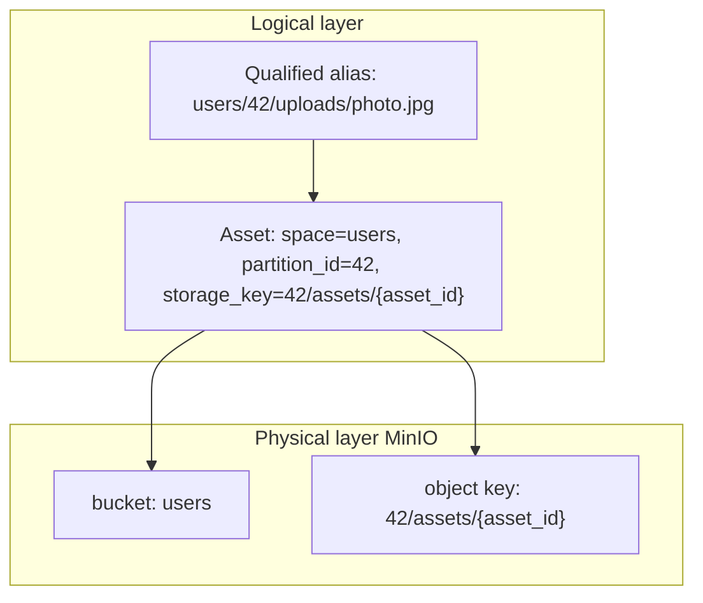

# 03 - Architecture And Decisions

> Terms and acronyms: [`00B_GLOSSARY_AND_ACRONYMS.md`](00B_GLOSSARY_AND_ACRONYMS.md)

## At a glance — storage layout

Physical bytes live in **four MinIO buckets**. Logical names are **aliases**. The registry stores both.

| Bucket (`space`) | Partition | Example alias | Writers |
|------------------|-----------|---------------|---------|
| `cache` | `{remote_mirror_id}` | `cache/gallica/bnf/ark-…/default.jpg` | fetcher, bulk-loader |
| `tmp` | `{tmpid}` | `tmp/task-abc/input.png` | fetcher, upload-api, task-api |
| `users` | `{userid}` | `users/42/uploads/{suffix}` | upload-api |
| `results` | `{userid}` | `results/42/987/attempt-1/out.zip` | worker |

**Partition notes:** `results` uses `{userid}` as `partition_id`; the task identity lives in the alias path. Anonymous tasks use the reserved value `partition_id = anon`. **Quota:** two-tier enforcement — per `(space, partition_id)` via `PartitionQuota` and per-bucket via `BucketQuota` (FR-066..068, ADR-009); **MinIO** bucket totals for ops/cost only.

**Legacy alias migration** (old docs → new):

| Old | New |
|-----|-----|
| `u-42/…` | `users/42/…` |
| `results-task-987/…` | `results/42/987/…` |
| `cache/…` (flat) | `cache/{mirror_id}/…` |

---

## Proposed Architecture

The `asset-store` module is a three-layer service composed of off-the-shelf object storage at the bottom, a thin custom Python service for asset/alias/metadata/lifecycle in the middle, and a thin custom Python service acting as a capability broker at the top. Service-to-service communication uses HTTP+JSON over TLS; data-plane payloads transit directly between caller and the object store via short-lived presigned URLs whenever possible. The two custom services share a Postgres database for metadata and audit; object payloads live exclusively in the object store.

This architecture is the "compose" finalist recommended by [`06_OSS_SURVEY.md`](06_OSS_SURVEY.md). The "adopt InvenioRDM" alternative remains documented and can be revisited if a future requirement justifies it.

## Component Responsibilities

The table below is a summary; per-component contracts are documented in [`02_REQUIREMENTS.md`](02_REQUIREMENTS.md) and [`PROJECT_ARCHITECTURE.md`](../PROJECT_ARCHITECTURE.md).

| Component | Responsibility | Inputs | Outputs |
|---|---|---|---|
| `object-store` (MinIO) | Durable storage of binary payloads; multipart; lifecycle on prefixes; checksum on PUT/GET | Payloads via signed URLs; lifecycle policy | Stored objects; STS / presigned URLs; storage metrics |
| `asset-registry` (custom Python/FastAPI) | Aliases, metadata, lifecycle, admin API; one row per asset, one row per alias | Create/commit/expire/delete RPCs from `storage-guard` and admin; SQL queries from `admin-ui` | Asset/alias state in Postgres; API responses; metrics; lifecycle audit events |
| `storage-guard` (custom Python/FastAPI) | Capability broker; authenticates service identities; mints presigned URLs and opaque tokens; emits audit log | Service credential + capability request | Capability (signed URL or token); audit log entries |
| `admin-ui` (custom static SPA or HTMX) | Operator surface for list/inspect/lifecycle/audit | Operator clicks/forms | Admin-API calls; rendered views |
| `bulk-loader` (CLI) | Bulk-ingest fixtures or real preload batches | Manifest file + payload directory | Asset creations; summary report |
| `worker-sim` (CLI) | Simulate worker read path and result write path | Task definition + capability | Reads + writes + summary report |
| `fetcher-service` (platform) | Remote URL → `cache` or `tmp` via asset-store | URL + policy | Asset reference ([`07_FETCHER_SERVICE.md`](07_FETCHER_SERVICE.md)) |

## Service identity → bucket permissions

Enforced by **FR-015**. Denied requests return `403`.

| Service identity | Read buckets | Write buckets |
|------------------|-------------|---------------|
| `fetcher` | `cache`, `tmp` | `cache`, `tmp` |
| `upload-api` | `users`, `tmp` | `users`, `tmp` |
| `bulk-loader` | `cache` | `cache` |
| `worker` | `cache`, `users`, `tmp`, `results` | `results` |
| `task-api` | `cache`, `users`, `tmp` | `tmp` |
| `admin` | all MVP buckets | all MVP buckets |
| `iiif-server` | `cache`, `users` (read-only MVP) | — |
| `iiif-image-mirror` | `cache` (read-only) | — (delegates writes to `fetcher`) |

`iiif_server_cache` is **not** provisioned or written by asset-store; IIIF server manages it separately.

`iiif-image-mirror` reads `cache` to serve cached heritage images via presigned GET. It never writes to asset-store directly; all cache-population writes go through `fetcher`. It does not access `tmp`, `users`, or `results`. It maintains its own end-user access-control layer outside the asset-store service-identity model; derived tile storage (if ever implemented) would use a dedicated bucket not managed by asset-store.

## Data Model Draft

### Asset

- `asset_id` - opaque, server-assigned (UUID v7).
- `space` - storage bucket name: `cache`, `tmp`, `users`, or `results`.
- `partition_id` - scope within bucket: mirror id, tmp id, user id, or task id.
- `storage_key` - `{partition_id}/assets/{asset_id}`; never exposed externally.
- `mime` - declared by caller; optionally sniffed on commit.
- `size_bytes` - reported by object-store on commit.
- `checksum_algo` - default `sha256`.
- `checksum` - server-side checksum reported by object-store; cross-checked against client-supplied value.
- `state` - one of `pending`, `available`, `expired`, `deleted`.
- `created_at`, `updated_at`, `expires_at` (nullable for infinite TTL).
- `eviction_policy` - enum `inherit` (default) | `exempt`. `inherit`: asset follows the per-space eviction sweep policy. `exempt`: excluded from all capacity-triggered and quota-triggered sweeps; TTL expiry still applies. Settable by the creating service at write time; admin may update at any time; every change emits `asset.eviction_policy_set`.
- `annotations` - JSONB free-form map.
- `owner_service_id` - service identity that performed the create.

### Alias

- `alias` - unique within `space`; URL-safe string.
- `asset_id` - reference to the bound asset (nullable while `pending`).
- `space` - copy of the asset's space, kept for index locality.
- `mutable` - boolean, default `false`. When `false`, the alias is bound to its `asset_id` for life (single-binding-for-life); detach permanently destroys the alias. When `true`, the alias may be rebound to a different `asset_id`; every rebind is audited as a first-class event. The flag is set at create time and is itself immutable.
- `created_at`, `updated_at`.
- `created_by_service_id`.

### PartitionQuota

One row per `(space, partition_id)`; created on first write to the partition.

- `space` - storage bucket name.
- `partition_id` - scope within bucket.
- `quota_bytes` - nullable; null = no limit configured.
- `quota_asset_count` - nullable; null = no count limit.
- `used_bytes` - current sum of `size_bytes` for `available` assets in this partition. Updated atomically via Postgres `UPDATE … RETURNING` on every commit (increment) and every `→ deleted` transition (decrement); never via read-modify-write.
- `used_asset_count` - current count of `available` assets; updated alongside `used_bytes`.
- `eviction_sweep_enabled` - boolean. When `true` and the partition crosses the 90% quota trigger, the lifecycle worker runs a quota-triggered eviction sweep. Default: `true` for `cache` and `tmp`; `false` for `users` and `results`.

### BucketQuota

One row per `space`. Tracks aggregate storage across all partitions in the space.

- `space` - storage bucket name.
- `quota_bytes` - nullable; null = no bucket-wide limit.
- `used_bytes` - sum of all `PartitionQuota.used_bytes` for this space; maintained atomically alongside per-partition updates.
- `warn_threshold` - fraction at which a warn metric fires; default `0.80`.
- `hard_ceiling` - fraction at which new commits are rejected with `413`; default `1.00`.

### Capability (issued, not persisted long-term)

- `capability_id` - opaque.
- `caller_service_id`.
- `scope` - read or write; alias-prefix string with at least one path segment.
- `mode` - `presigned_url` or `proxy_token`.
- `single_use` - boolean.
- `expires_at`.
- (Persisted in audit log only; not a routine read path.)

### Audit event

- `event_id`.
- `ts`.
- `caller_service_id`.
- `action` - one of `capability.issue`, `alias.create`, `alias.attach`, `alias.detach`, `alias.delete`, `alias.rebind`, `asset.commit`, `asset.expire`, `asset.delete`, `admin.*`.
- `target` - alias and/or `asset_id`.
- `before`, `after` - JSONB diff or state snapshot.
- `outcome` - `granted`, `denied`, `success`, `error`.
- `correlation_id` - per-request trace id.

## State Machine

```mermaid
stateDiagram-v2
    [*] --> pending: alias reserved
    pending --> available: commit (size + checksum verified)
    pending --> deleted: TTL on pending expired; or commit rolled back
    available --> expired: TTL reached or admin expire
    available --> deleted: admin delete (skip expired)
    expired --> available: admin set new TTL (un-expire)
    expired --> deleted: grace period elapsed; garbage collection
    deleted --> [*]
```

- **States:** `pending`, `available`, `expired`, `deleted`.
- **Allowed transitions:** as in the diagram above. Any transition that is not depicted is forbidden and yields a 409.
- **Terminal states:** `deleted` (registry row retained for audit retention period; payload removed from `object-store`).
- **Retry rules:** state transitions are idempotent on `Idempotency-Key`; replays return the original response.

## Per-Space Lifecycle Policy

Normative defaults; all thresholds are operator-configurable per deployment.

| Space | Default TTL | Pressure eviction | Quota eviction | `eviction_sweep_enabled` default | Grace period |
|-------|-------------|-------------------|----------------|----------------------------------|--------------|
| `cache` | Operator-configured | Yes — LFU+age sweep (FR-064) | Yes (FR-067) | `true` | 7 days |
| `tmp` | 24 h; per-partition max 7 d | Hard TTL (FR-060) | Hard TTL | `true` | 24 h |
| `users` | None (`expires_at = null`) | No — admin-only expire/delete | Admin-only | `false` | 7 days |
| `results` | Per-task TTL hint; operator max 365 d | No — alert only (FR-068, FR-069) | No — alert only | `false` | 7 days |

## ADR Log

All ADRs are accepted **provisionally**, pending the time-boxed spikes listed in [`06_OSS_SURVEY.md`](06_OSS_SURVEY.md) section 6. Each ADR records its rationale, rejected alternatives, and the spike(s) that may reverse it.

| ADR ID | Decision | Status | Rationale | Alternatives Rejected |
|---|---|---|---|---|
| ADR-001 | Use **MinIO** as the `object-store` (S3-compatible, distributed, single-binary, well-known) | Proposed (pending Spike S-001, S-004) | Best S3 coverage and Swarm operability among lean candidates; mature presigned URL and STS support; large community | **Garage** (kept as fallback if AGPL trajectory concerns), **SeaweedFS** (more ops surface), **Ceph RGW** (overkill for 1 TB / NFR-010), **Zenko** (lower momentum) |
| ADR-002 | Build the `asset-registry` and `storage-guard` as **custom Python services (FastAPI) over Postgres** ("compose path") | Proposed (pending Spike S-002, S-003) | Exact match to the spec; minimal moving parts; full control over capability and audit semantics | **InvenioRDM** (high feature overshoot - Elasticsearch, RabbitMQ, Redis, Celery; record-centric data model); **Fedora 6 + OCFL** (Java + RDF surface we do not need; adopt OCFL idea via OCFL-py library if useful); **Hyrax/DSpace/Goobi** (wrong layer or wrong language); **Nextcloud** (user-facing file sync, wrong data model) |
| ADR-003 | Capability mode = **hybrid**: default to **S3 presigned URLs**; fall back to **opaque token + `storage-guard` proxy** for single-use semantics and any capability where the bytes must transit the guard | Proposed | Best latency for the common case; uniform single-use semantics when needed; keeps audit logs centralised at the guard | "Presigned only" (no clean single-use); "always-proxy" (extra hop and bandwidth on every read) |
| ADR-004 | Identifier scheme = **opaque server-assigned `asset_id` (UUID v7) + zero-or-more aliases unique per space**; no ARK or DOI in MVP | Proposed | Time-sortable id; aliases satisfy the user-facing naming needs without requiring a national/global resolver; ARK / DOI can be layered on later as a special alias namespace | **ARK as primary id** (premature centralisation; requires a NAAN); **UUID v4** (not time-sortable); content-addressed (CAS) ids (lookups become bytes-driven, complicates updates of mutable metadata) |
| ADR-005 | Mutability = **payload write-once**, **annotations mutable**, **alias single-binding-for-life by default with explicit `mutable: true` opt-in for rebind**; per-alias TTL with grace period before garbage collection | Proposed | Matches discovery answers (Q9-Q11) and resolves the IIIF-manifest concern (Q-018) by keeping asset-store content-agnostic and pushing structural-vs-descriptive composition to a future `manifest-service`; preserves the immutability invariant that historians and citation systems rely on; the `mutable: true` flag is a tiny escape hatch for genuinely-mutating use cases without weakening the default | Full mutability (lose immutability guarantees and audit clarity); alias versioning inside asset-store (forces the registry to model document semantics it should not own); per-asset TTL only (forces alias-rename to extend life of a single payload) |
| ADR-006 | Language/runtime = **Python 3.12+ with FastAPI** for the custom services; service-to-service auth = **shared secret with rotation** for MVP; mTLS and OIDC (Keycloak) tracked as forward steps | Proposed | Team Python familiarity (Q26); FastAPI gives OpenAPI + async with minimum ceremony; shared secret is sufficient for service identities while user identity is out of scope | Go / Rust (would not leverage team skills); mTLS-from-day-1 (operationally heavier); Keycloak-from-day-1 (premature, no end-user identities in MVP) |
| ADR-007 | Physical storage = **four category buckets** (`cache`, `tmp`, `users`, `results`) + **`partition_id` prefix**; object key `{partition_id}/assets/{asset_id}`; two-tier quota tracking via `PartitionQuota` (per partition) and `BucketQuota` (per space). *Refinement (2026-05-20):* `results` `partition_id` is `{userid}` — task identity lives in the alias path; anonymous tasks use reserved `partition_id = anon`. | Proposed (refined 2026-05-20) | MinIO per-bucket ops metrics; `PartitionQuota` for per-user fairness; `BucketQuota` for infrastructure capacity. `{userid}` partition for `results` enables per-user quota without cross-partition aggregation at commit time. | Bucket-per-user (explosion); semantic object keys (`photo.jpg`); single bucket only (weak isolation); `{taskid}` as `results` partition (prevents per-user quota without expensive cross-partition sum) |
| ADR-008 | **fetcher-service** owns remote URL materialization; asset-store never performs outbound HTTP | Proposed | SSRF and fetch policy in one place; clear audit boundary | Fetch inside storage-guard; workers fetch remote URLs directly |
| ADR-009 | Per-space lifecycle and eviction policy: `eviction_policy` enum (`inherit` \| `exempt`) on every asset; per-space sweep defaults (see Per-Space Lifecycle Policy table); three-threshold model for capacity (80% warn / 90% sweep trigger / 95% hard block) and quota (80% warn / 90% sweep trigger / 105% hard block); eviction scoring = `age_days × size_bytes`; `results` excluded from all LFU sweeps — housekeeping is task-engine-driven via TTL hints and bulk-expire-by-prefix (FR-069); `PartitionQuota` and `BucketQuota` as dual enforcement entities (FR-066, FR-068) | Proposed | `exempt` is more expressive than a `pinned: bool` flag (settable at write time by creating service, clearable by admin, audited on change). Overloading `expires_at = null` as a pin proxy is ambiguous in `cache` — un-expired ≠ intentionally protected. Dual quota entities allow independent monitoring of per-user fairness (`PartitionQuota`) vs. overall infrastructure capacity (`BucketQuota`). `results` LFU exclusion prevents evicting valuable unique computation outputs that are typically downloaded only once (the normal outcome). | `pinned: bool` (coarser, no audit trail on set/clear); `expires_at = null` as pin proxy (ambiguous in `cache`); single quota entity (either loses per-user fairness or total-capacity protection); LFU sweep on `results` (wrong signal — download count of one is normal, not a sign of low value) |

## Failure Modes

- **Upload interrupted** - the `pending` alias remains; capability expires; a sweeper deletes orphan `pending` rows after grace period; partial multipart parts cleaned via object-store lifecycle.
- **Remote URL timeout / fetch failure** - owned by **fetcher-service**; returns `502`/`504` to caller; no asset-store state change on failed fetch before commit.
- **Storage provider temporary error** - operations return 5xx; clients retry with backoff; metrics emit error counter; alert if sustained.
- **Metadata write success but object write failure** - prevented by ordering: object PUT happens first via the signed URL; the registry only transitions to `available` on commit, which the caller initiates after the PUT. If the commit fails after a successful PUT, the alias stays `pending`, the object is orphaned, and the sweeper removes both (via object-store lifecycle on the `pending` prefix).
- **Object write success but commit lost** - the caller retries the commit (same idempotency key); registry sees the existing pending row and transitions; if the caller never retries, the sweeper removes both after grace period.
- **Duplicate submissions** - caller passes `Idempotency-Key`; duplicate requests with the same key within 24 h return the original response without side effects.
- **Capability replay** - capability TTL is short and audit log records each issuance; if a presigned URL is exfiltrated, blast radius is bounded by TTL and scope. Forward step: opaque tokens with single-use semantics for sensitive flows.
- **Postgres unavailable** - registry and guard return 503; clients retry; alert on sustained downtime.
- **Object-store node loss** - object-store internal redundancy absorbs single-node loss; reads continue (modulo a transient retry); checksums on read detect any corruption.

## Scalability Strategy

- **Partitioning approach** - by `space` (bucket) and `partition_id` for routing and quotas; Postgres tables partitioned by `space` only if/when volume warrants (NFR-001 does not need it at 1 TB).
- **Bottleneck assumptions** - the `storage-guard` is the hot path for both reads and writes; sizing focuses there. Postgres serves 1-10k qps on commodity hardware which is far above target load.
- **Horizontal scale points** - `asset-registry` and `storage-guard` are stateless and horizontally scaled behind a load balancer; `object-store` scales by adding nodes per its own model; Postgres scaled vertically first, with replicas for read-only admin queries when needed.
- **Cost controls** - per-`(space, partition_id)` quotas in registry; bucket-level MinIO metrics; aggressive lifecycle on `tmp`; observability per bucket and partition.

## Open architectural questions

Tracked as `Q-*` rows in [`05_BACKLOG_AND_OPEN_QUESTIONS.md`](05_BACKLOG_AND_OPEN_QUESTIONS.md):

- batch transactional semantics (`Q-001`)
- max batch size before re-issuing capability (`Q-002`)
- proxy mode vs presigned URL default in some deployment topologies (`Q-003`)
- quota enforcement model (`Q-004`) — **Resolved**: two-tier `PartitionQuota` + `BucketQuota`; see FR-066..068, ADR-009
- cache alias derivation (`Q-021`), domain allowlist (`Q-022`), fetcher phasing (`Q-023`), tmp TTL (`Q-020`) — **Resolved**: default 24 h; per-partition max 7 d
- MIME sniffing on commit vs trust declared (`Q-005`)
- grace period default (`Q-006`) — **Resolved**: 7 days for `cache`/`users`/`results`; 24 h for `tmp`
- admin override on system-managed spaces (`Q-007`)
- atomic group write semantics beyond manifest-marker pattern (`Q-008`)
- final object-store license / commercial trajectory (`Q-009`)
- audit storage: shared Postgres vs dedicated journal (`Q-010`)
- exact semantics of `mutable: true` aliases - what can change, grace period for name reuse on detach, who is allowed to set the flag (`Q-018`)
- when to scope the future `manifest-service` (composes IIIF manifests by merging immutable structural references and editable descriptive metadata) (`Q-019`)
- eviction sweep exhaustion handling (`Q-027`) — **Resolved**: alert-only for MVP
- FR-065 batch policy reset: sync vs async (`Q-028`)
- `results` partition as `{userid}` with `anon` reserved (`Q-029`) — **Resolved**
- per-write size cap on `results` via capability (`Q-030`)
