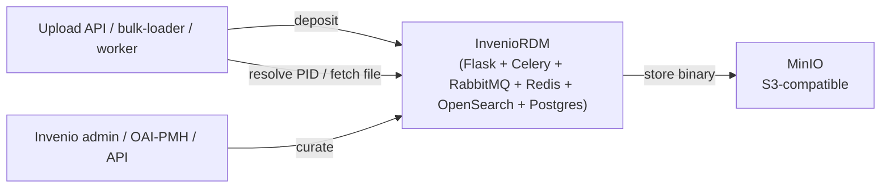
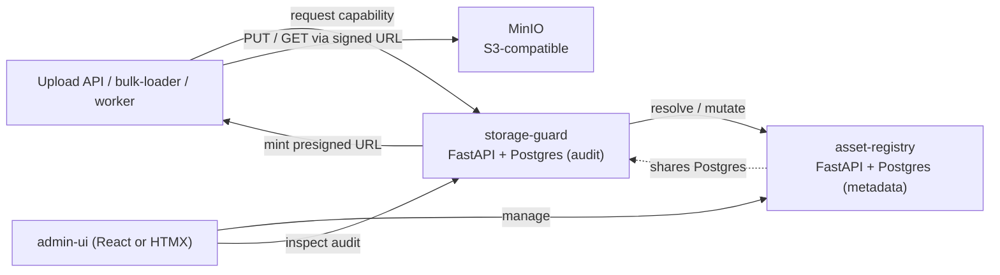

# 06 - OSS Survey

## Relation to storage buckets (ADR-007)

MinIO (and peers) provide **S3 buckets**, not nested sub-buckets. The MVP uses **four category buckets** (`cache`, `tmp`, `users`, `results`) with **prefix partitions** inside each. Per-user quota is **not** bucket-per-user; the registry aggregates `size_bytes` per `(space, partition_id)`. See [`03_ARCHITECTURE_AND_DECISIONS.md`](03_ARCHITECTURE_AND_DECISIONS.md). **Fetcher-service** is custom application code, not an OSS object-store candidate ([`07_FETCHER_SERVICE.md`](07_FETCHER_SERVICE.md)).

---

This document surveys off-the-shelf, open-source software that could implement all or part of the `asset-store` module. It feeds `ADR-001`, `ADR-002`, and `ADR-003` in `[03_ARCHITECTURE_AND_DECISIONS.md](03_ARCHITECTURE_AND_DECISIONS.md)`. It is structured as: criteria, per-layer candidates, comparison synthesis, two finalist architectures, recommendation, and time-boxed validation spikes.

Important: dates, version numbers, performance claims, and license details below are based on the project's current state of knowledge and may need re-verification at spike time. Each candidate carries a `verify:` note pointing to what should be re-checked.

## 1. Evaluation criteria

Each criterion is testable. Candidates are scored against these in the per-candidate sections.

- **C-1 S3 API completeness** - object PUT/GET/DELETE, multipart, presigned URLs, STS (Security Token Service), lifecycle policies on prefixes, versioning (optional).
- **C-2 Distribution and fault tolerance** - replication and/or erasure coding across nodes; behavior on single-node loss; single-node mode for local dev.
- **C-3 Aliasing / persistent identifiers / OCFL** - native support for multi-name lookups, OCFL layout, or PIDs (ARK, Handle, DOI). Custom solutions count if the data model permits.
- **C-4 Capability / token model** - prefix-scoped, time-bounded credentials; audit hooks; tamper evidence.
- **C-5 Metadata model and indexing** - schemaless or typed metadata, indexing on aliases, search by space/state/timestamp, full-text optional.
- **C-6 Lifecycle / TTL / quota** - expiration, scheduled garbage collection, per-space quota.
- **C-7 Multi-tenant / per-space isolation** - logical or physical isolation between spaces; cross-tenant access prevented by construction.
- **C-8 Operability on Docker Swarm** - quality of official Docker images, single-node bootstrap, ops surface (UI/CLI), upgrade story.
- **C-9 Python ecosystem fit** - official Python SDK or HTTP REST suitable for thin Python integration.
- **C-10 License** - OSI-approved permissive (Apache-2.0, MIT, BSD) or weak-copyleft (MPL-2.0, LGPL); strong copyleft (AGPL) flagged but not automatically disqualified.
- **C-11 Maintenance health** - commit cadence in the last 12 months, recent releases, CVE response history, community size.
- **C-12 Footprint** - resource usage (RAM/CPU/disk overhead) for ~1 TB / ~30 readers; aligns with NFR-010 ("dev stack under 8 GB RAM, 4 cores idle").

## 2. Layer 1 candidates - object store

Goal: provide an S3-compatible distributed blob store satisfying NFR-001 (capacity), NFR-005 (durability), and NFR-011 (Swarm deployability).

### MinIO

- **What:** widely-used S3-compatible object server; erasure-coded distributed mode; native presigned URLs; STS support.
- **C-1:** strong - one of the most complete S3 reimplementations outside AWS.
- **C-2:** strong - erasure coding in distributed mode; single-node mode for dev.
- **C-3:** none beyond keys (caller-supplied).
- **C-4:** strong - STS (assume-role) + presigned URLs + bucket / IAM policies.
- **C-5:** none (keys + metadata headers only).
- **C-6:** lifecycle rules per prefix; bucket-level versioning.
- **C-7:** buckets + IAM policies; **bucket-per-category** (`cache`/`tmp`/`users`/`results`) per ADR-007; not bucket-per-user.
- **C-8:** strong - well-known Docker image, single-binary, console UI; multi-node Swarm operability needs DNS or static hostnames - **verify:** test under Swarm overlay network.
- **C-9:** official `minio-py` SDK; standard `boto3` works.
- **C-10:** AGPL-3.0 (as of recent releases; commercial license available). **Risk:** AGPL implications for distributing the module - flagged in `[05_BACKLOG_AND_OPEN_QUESTIONS.md](05_BACKLOG_AND_OPEN_QUESTIONS.md)`. **verify:** confirm current license terms at spike time.
- **C-11:** very active.
- **C-12:** lean; runs in well under 1 GB RAM idle.

### Garage

- **What:** S3-compatible object store from Deuxfleurs; designed for self-hosted, geo-distributed clusters on commodity hardware; built in Rust.
- **C-1:** good core (PUT/GET/DELETE, multipart, presigned URLs). STS-style flows: **verify:** support for full AWS STS endpoints (likely partial / via static keys + presigned).
- **C-2:** strong; replication factor configurable; designed for asymmetric, unreliable links.
- **C-3:** none beyond keys.
- **C-4:** presigned URLs supported; native short-lived tokens **verify** - may require fronting with custom code.
- **C-5:** none (metadata headers only).
- **C-6:** lifecycle rules: **verify:** completeness vs MinIO.
- **C-7:** buckets + key access.
- **C-8:** Docker images available; lean single binary; Swarm deployment straightforward.
- **C-9:** `boto3` compatible.
- **C-10:** AGPL-3.0. Same flag as MinIO.
- **C-11:** active; smaller community than MinIO.
- **C-12:** very lean.

### SeaweedFS

- **What:** distributed file/object store; ships an S3 gateway, a filer, and a master; aims at very large object counts.
- **C-1:** S3 gateway provides PUT/GET, multipart, presigned URLs.
- **C-2:** strong; replication and EC supported.
- **C-3:** none.
- **C-4:** presigned URLs; STS support: **verify.**
- **C-5:** key-value metadata on the filer.
- **C-6:** TTL on files via filer; lifecycle: **verify.**
- **C-7:** buckets and filer paths.
- **C-8:** Docker images; multi-component architecture (master + volumes + filer + s3 gateway) increases ops surface.
- **C-9:** `boto3` against the S3 gateway.
- **C-10:** Apache-2.0.
- **C-11:** active.
- **C-12:** moderate.

### Ceph RGW

- **What:** Ceph's RADOS Gateway; S3-compatible object frontend over the Ceph cluster.
- **C-1:** very strong S3 fidelity.
- **C-2:** strongest (Ceph's reputation for durability).
- **C-3:** none.
- **C-4:** full STS implementation; bucket policies.
- **C-5:** none.
- **C-6:** lifecycle, versioning.
- **C-7:** buckets and users/tenants.
- **C-8:** **weak for the prototype scale** - Ceph is heavyweight; operating it in Docker Swarm is non-trivial.
- **C-9:** `boto3`.
- **C-10:** LGPL-2.1 (gateway components), with parts under other licenses; permissive enough.
- **C-11:** very active.
- **C-12:** heavy; not aligned with NFR-010.

### Zenko Cloudserver

- **What:** open-source S3 server from Scality; previously known as S3 Server.
- **C-1:** good; somewhat older.
- **C-2:** distributed via S3 Connector or RING.
- **C-3:** none.
- **C-4:** presigned URLs; STS coverage: **verify.**
- **C-5:** none.
- **C-6:** lifecycle: **verify.**
- **C-7:** buckets.
- **C-8:** Docker images; less active community than MinIO / Garage.
- **C-9:** `boto3`.
- **C-10:** Apache-2.0.
- **C-11:** maintenance pace lower than MinIO. **verify.**
- **C-12:** moderate.

### Per-layer synthesis (object store)

- **MinIO** is the best fit by community familiarity, S3 coverage, Swarm friendliness, and feature density. AGPL is the main concern; mitigated because the module talks to MinIO as a client, not by linking it.
- **Garage** is the strongest "lean alternative" if AGPL or MinIO's commercial trajectory becomes problematic; needs a spike to confirm STS-style features and lifecycle parity.
- **SeaweedFS** is interesting at very high object counts but adds ops surface for our scale.
- **Ceph RGW** is overkill for a 1 TB prototype and violates NFR-010.
- **Zenko** is no longer differentiated enough to prefer over MinIO/Garage.

Top picks for `ADR-001`: **MinIO** (primary), **Garage** (alternative if AGPL or operational concerns push us off MinIO).

## 3. Layer 2 candidates - asset registry

Goal: aliases + metadata + lifecycle + admin API. Two paths:

### 3a. Adopt-an-existing-platform path

#### InvenioRDM

- **What:** Python-based research data repository from CERN; powers Zenodo. Provides records (with PIDs - DOI, ARK), files, metadata, REST API, search (OpenSearch/Elasticsearch), permissions, communities.
- **C-3:** strong - PIDs built in (DOI, OAI-PMH), file API maps to S3 backends; alias-like behavior via record landing pages.
- **C-4:** record-level permissions; capability-as-token model exists; **verify** time-bounded prefix-scoped tokens at the granularity we need.
- **C-5:** rich, typed metadata; OpenSearch indexing.
- **C-6:** records can be marked draft/published/expired; lifecycle is record-centric, not alias-centric.
- **C-7:** communities + groups.
- **C-8:** Docker images; multi-component (Flask app + RabbitMQ + OpenSearch + Postgres + Redis + Celery); not trivial to put on Docker Swarm but documented.
- **C-9:** native Python (Flask/Invenio framework).
- **C-10:** MIT.
- **C-11:** very active; backed by CERN; large user base.
- **C-12:** heavy; ~4-6 services minimum.

**Fit assessment:** InvenioRDM is a record-centric digital repository. Our model is asset-centric with multi-aliasing and short-lived prefix-scoped capabilities. Mapping our requirements onto Invenio's record model is feasible (an asset = a file inside a record, aliases = PIDs and OAI-IDs) but inverts the natural Invenio idioms (records-with-metadata first, files second). A first MVP could plausibly ride on Invenio at the cost of dragging in Elasticsearch/OpenSearch, RabbitMQ, and Redis for behaviors we do not yet need. **Risk of feature overshoot** is significant.

#### Fedora Commons 6 + OCFL

- **What:** Java-based digital preservation repository; v6 standardised on the **OCFL** (Oxford Common File Layout) for on-disk preservation. Supports LDP-RS resources, multiple PIDs, fixity (checksums), versioning.
- **C-3:** strongest match for write-once + multi-name semantics; OCFL is essentially what our payload-write-once model requires.
- **C-4:** token-based access; less granular than a custom capability broker; **verify** integration with external policy engines.
- **C-5:** RDF metadata (LDP / Linked Data Platform); steep learning curve for teams unfamiliar with RDF.
- **C-6:** versioning, fixity, lifecycle hooks.
- **C-7:** path-based isolation; multi-tenant story relies on convention.
- **C-8:** Java service; Docker images available; heavier than the lean Python stack.
- **C-9:** REST API (HTTP); Python clients exist as community libs.
- **C-10:** Apache-2.0.
- **C-11:** active in the heritage / digital preservation community; not Python-native.
- **C-12:** heavy (JVM, optional triplestore).

**Fit assessment:** OCFL is conceptually the closest match in this list, but the Fedora stack introduces RDF / LDP semantics that we do not need and a Java runtime that the team is less fluent with. The right play is probably **borrow the OCFL idea, not Fedora itself**: use [OCFL-py](https://github.com/zimeon/ocfl-py) (Apache-2.0) inside our own `asset-registry` to enforce on-disk write-once layout, if we go the compose path.

#### DSpace 7 / Hyrax (Samvera) / Goobi / Kitodo

- **DSpace 7** is a heritage / institutional-repository platform; record-centric, Java backend + Angular frontend. Same overshoot risk as Invenio; tighter to academic institutional repositories.
- **Hyrax (Samvera)** is a Ruby on Rails repository framework; rich features for curated collections but adds a Ruby runtime to the stack.
- **Goobi / Kitodo** are heritage digitization *workflow* systems (scan -> OCR -> ingest -> publish). They are a layer above ours; they would be **clients** of `asset-store`, not implementations of it.

None of these is a strong fit for the MVP. They are more relevant once a downstream "presentation" layer is in scope.

#### Nextcloud

- **What:** widely-known self-hosted file-sharing platform; provides WebDAV, REST, per-user spaces, sharing links with TTL.
- **C-3:** path-as-alias (files are addressed by path); no PIDs.
- **C-4:** per-user accounts + share tokens with TTL; coarser than prefix-scoped capabilities.
- **C-5:** file metadata, tags.
- **C-6:** trash bin, versioning.
- **C-7:** strong user/group isolation.
- **C-8:** Docker images; PHP/MariaDB/Redis stack.
- **C-9:** REST + WebDAV; clients in every language.
- **C-10:** AGPL-3.0.
- **C-11:** very active.
- **C-12:** moderate-to-heavy.

**Fit assessment:** Nextcloud is a *user-facing* file sync product; the data model (folders/files/users) is too coarse for asset-id + alias + capability semantics, and bending it would fight the platform. Out.

### 3b. Compose-your-own path

Custom `asset-registry` written in Python (FastAPI) over Postgres for the metadata, integrating with the chosen `object-store` via the S3 API. Optional library use:

- **OCFL-py** (Apache-2.0) - to enforce write-once on-disk layout for assets, if we want to align with OCFL even without Fedora.
- **SQLAlchemy** + Alembic for schema and migrations.
- **Pydantic** for request/response schemas.
- **OpenAPI** generation via FastAPI; consumed by `admin-ui`.
- **OpenTelemetry** Python instrumentation (FastAPI auto-instrumentation, asyncpg/psycopg).

This path is small (~one service of a few thousand lines) but we own metadata indexing, lifecycle, and admin endpoints. It is, however, an excellent fit for the requirements; nothing in `FR-`* requires features beyond what a focused Python service over Postgres can do.

### Per-layer synthesis (asset registry)

- **InvenioRDM** is the most feature-complete adopt-path candidate but introduces Elasticsearch/OpenSearch + Celery + RabbitMQ + Redis to satisfy needs we do not yet have. High overshoot.
- **Fedora 6 + OCFL** matches the data semantics best of all but adds Java + RDF. Adopt the OCFL *idea* via OCFL-py rather than Fedora itself.
- **DSpace, Hyrax, Goobi/Kitodo** are not fits at this layer.
- **Nextcloud** is not a fit at this layer.
- **Compose path (FastAPI + Postgres + OCFL-py optional)** is the leanest match for the spec and the most controllable. Risk: we own more code.

Top picks for `ADR-002`: **Compose path** (primary), with **InvenioRDM** retained as a spike to compare against if the compose path balloons.

## 4. Layer 3 candidates - storage guard

Goal: a capability broker that authenticates service identities, mints time-bounded prefix-scoped credentials, and emits an audit log.

### MinIO STS (or equivalent on the chosen object store) + native presigned URLs

- **What:** delegate scope enforcement to the object store; the storage-guard mints a temporary access key (STS `AssumeRole`) tied to a bucket policy and TTL, or directly returns a presigned URL.
- **Pros:** least new code; enforcement happens where the bytes are; the object store already has battle-tested ACLs.
- **Cons:** capability is "S3-shaped" - readers must speak S3; harder to plug in policy engines like OPA on the data path; per-prefix policy expansion can be verbose. STS support varies across object-store candidates (`verify` for Garage, SeaweedFS, Zenko).

### Custom token broker (server-side proxy mode)

- **What:** the storage-guard issues opaque short-lived tokens; readers/writers hit a proxy endpoint that validates the token and streams the payload through to the object store.
- **Pros:** uniform across object stores; we control the audit log; we can apply per-token rate limits and download-once semantics easily.
- **Cons:** the storage-guard sits in the data path; bandwidth and latency cost; an extra hop to harden.

### Hybrid (default presigned + proxy fallback)

- **What:** capabilities are presigned URLs by default; for special cases (single-use semantics, payload rewriting, fine policy decisions) callers receive an opaque token instead and hit the proxy.
- **Pros:** best of both; opt-in proxy cost only when needed.
- **Cons:** two code paths to maintain.

### Policy engine: Open Policy Agent (OPA)

- **What:** decoupled policy decision point evaluating Rego policies; called by the storage-guard before issuing capabilities.
- **Use:** when the policy starts to encode non-trivial rules (e.g. quota by tier, time-of-day restrictions, conditions on metadata). Not needed for MVP; tracked as a forward option.

### Service identity: Keycloak (or static credentials)

- **MVP:** static, per-service credentials issued out-of-band; rotation via configuration reload.
- **Later:** Keycloak (Apache-2.0) as an OIDC provider for service identities and, when in scope, for end-user identities at the upstream APIs.

### Per-layer synthesis (storage guard)

- **MVP picks** - custom Python service ("storage-guard") that authenticates calls via shared secret or mTLS, decides scope using its own rules, and issues **presigned URLs** by default with an **optional proxy mode** for single-use semantics (hybrid). Audit log in Postgres (append-only table) with optional file-based mirror.
- **OPA** and **Keycloak** are deliberate "ready to be plugged in" extension points, not MVP dependencies.

## 5. Two finalist architectures

### Architecture A - Adopt InvenioRDM on top of MinIO

- **Pros:** PIDs and OAI-PMH built in; metadata indexing and search out of the box; large community; mature permission model; IIIF integrations exist for the future.
- **Cons:** brings 4-6 auxiliary services we do not need for MVP requirements; capability model is record-centric, not alias-prefix-centric; bending it to the asset-id + multi-alias + short-lived-prefix-scoped capability model is non-trivial; team is Python but framework-locked into Invenio's framework idioms; Swarm operability of the full Invenio stack to be confirmed (verify).
- **Estimated effort to MVP:** medium (a lot of platform learning, less custom code).
- **Risk:** high coupling to platform; future requirements that do not fit Invenio's record model would force a rewrite.

### Architecture B - Compose: MinIO + custom `asset-registry` + `storage-guard` over Postgres

- **Pros:** exact match to the spec; lean (3 services + MinIO + Postgres + observability stack); fast to ship; full control over the capability model, the alias semantics, and the audit log; trivial to swap MinIO for Garage later.
- **Cons:** we own the code for metadata indexing, lifecycle, admin endpoints, and the audit pipeline.
- **Estimated effort to MVP:** medium-low (well-scoped service work; predictable).
- **Risk:** lower; downside is custom code we maintain.

## 6. Recommendation

**Recommend Architecture B (compose path).** The MVP requirements fit a focused service; the adopt-path platforms either overshoot (Invenio, DSpace, Hyrax) or under-match the data model (Nextcloud, Fedora's RDF surface). The custom `asset-registry` and `storage-guard` can be built quickly, audited closely, and remain consistent with the layered design.

To remain honest about this recommendation, **before locking it as `ADR-002 = compose`**, run the following time-boxed spikes:

- **Spike S-001 (1-2 days):** stand up MinIO single-node in Docker Compose, exercise PUT/GET, multipart, presigned URLs, lifecycle. Confirm AGPL implications acceptable (or pivot to Garage and re-run the spike there).
- **Spike S-002 (2-3 days):** prototype a minimal `asset-registry` (FastAPI + Postgres) with `POST /assets`, `GET /resolve`, alias-uniqueness constraints, and a state machine. Run SCN-001 end-to-end with the `bulk-loader` at 1 000 small assets.
- **Spike S-003 (1-2 days):** stand up InvenioRDM from its Docker recipe; deposit 1 000 small assets; observe required services and how alias-prefix capabilities would be expressed. Compare lines of code, ops surface, and feature overshoot with Spike S-002.
- **Spike S-004 (1-2 days):** stand up Garage as an alternative to MinIO; rerun S-001 against it; confirm presigned URLs and lifecycle work as needed.

Total spike budget: about 1.5 to 2 working weeks for a single contributor, 1 week with two.

`ADR-001` (object store), `ADR-002` (asset registry approach), and `ADR-003` (capability mode) are accepted once the spikes report. The currently-recommended ADR outcomes are:

- **ADR-001 = MinIO** (with Garage as documented fallback).
- **ADR-002 = compose** (custom Python `asset-registry`).
- **ADR-003 = hybrid capability mode** (presigned by default; opaque token + proxy for single-use semantics).

## 7. Re-verification notes

Items flagged `verify:` above should be confirmed at spike time and recorded as `Q-`* rows in `[05_BACKLOG_AND_OPEN_QUESTIONS.md](05_BACKLOG_AND_OPEN_QUESTIONS.md)` until resolved. Re-survey this document if any of the following change:

- MinIO's license terms or commercial trajectory.
- Garage's coverage of S3 STS / lifecycle reaches parity with MinIO.
- We need cross-region or geo-distributed replication (revisits the object-store choice toward Garage or Ceph).
- A new requirement appears that fundamentally needs typed metadata search or PID-as-first-class semantics (revisits the adopt path toward InvenioRDM or Fedora).

