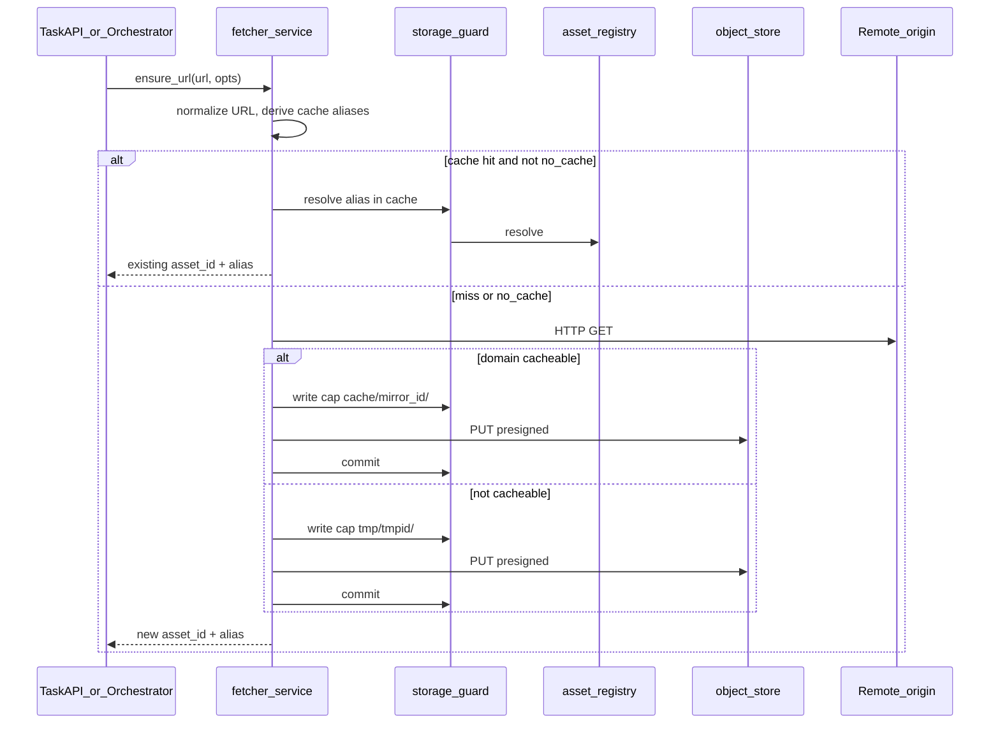

# 07 - Fetcher Service

> Terms and acronyms: [`00B_GLOSSARY_AND_ACRONYMS.md`](00B_GLOSSARY_AND_ACRONYMS.md)

## At a glance

The **fetcher-service** materializes remote URLs into `asset-store`. It performs outbound HTTP, decides **cache hit vs miss**, and writes bytes to the correct MinIO bucket (`cache` or `tmp`). **asset-store never fetches remote URLs** ([`01_SCOPE.md`](01_SCOPE.md), [`ADR-008`](03_ARCHITECTURE_AND_DECISIONS.md)).

| Step | What happens |
|------|----------------|
| 1. Cache lookup | Normalize URL → derive cache alias candidates → resolve via storage-guard |
| 2. On hit | Return existing `asset_id` + alias (unless caller sets `no_cache`) |
| 3. On miss | HTTP GET remote origin |
| 4. Store | Cacheable domain → `cache/{remote_mirror_id}/…`; else → `tmp/{tmpid}/…` |
| 5. Return | `{ asset_id, qualified_alias, cache_hit, bucket, partition_id }` |

**Callers:** task-api, task orchestrator, and (indirectly) workers that receive aliases in task definitions. **Not** asset-store, **not** workers talking to heritage sites directly.

---

## Scope

### In scope (fetcher module)

- `ensure_url` API (name provisional) for idempotent URL materialization.
- URL normalization and cache-alias derivation (see [`Q-021`](05_BACKLOG_AND_OPEN_QUESTIONS.md)).
- Domain allowlist policy: which origins may be written to `cache` ([`Q-022`](05_BACKLOG_AND_OPEN_QUESTIONS.md)).
- HTTP client: timeouts, max body size, redirect limit, SSRF controls.
- Integration with asset-store only: reserve → PUT → commit via storage-guard.
- Observability: cache hit rate, fetch errors, bytes ingested.

### Out of scope

- Image processing, IIIF tile generation, manifest editing.
- User authentication (delegated to upstream APIs).
- Virus scanning (caller's responsibility before or after fetch; contract in [`01_SCOPE.md`](01_SCOPE.md)).
- **`iiif_server_cache`** bucket — managed directly by the IIIF server, not via this service ([`03_ARCHITECTURE_AND_DECISIONS.md`](03_ARCHITECTURE_AND_DECISIONS.md)).

---

## API (draft)

### `POST /v1/ensure-url`

**Request (JSON)**

| Field | Required | Description |
|-------|----------|-------------|
| `url` | yes | Remote URL to materialize |
| `mirror_id` | yes for cache path | Partition under `cache` (e.g. `gallica`, `bnf`) |
| `no_cache` | no | If `true`, skip cache lookup and force refetch |
| `tmp_id` | no | Partition under `tmp` when not cacheable; server may assign |
| `preferred_alias_suffix` | no | Hint for alias tail under partition |
| `ttl_seconds` | no | Hint for asset TTL (esp. `tmp`) |

**Response (JSON)**

| Field | Description |
|-------|-------------|
| `asset_id` | Opaque id from asset-store |
| `qualified_alias` | e.g. `cache/gallica/bnf/ark-…/default.jpg` |
| `cache_hit` | `true` if served from existing cache alias |
| `bucket` | `cache` or `tmp` |
| `partition_id` | Mirror id or tmp id |

**Errors:** `400` invalid URL; `403` policy denied; `502` upstream fetch failed; `504` upstream timeout.

---

## Cache vs tmp decision

| Condition | Bucket | Partition | Typical TTL |
|-----------|--------|-----------|-------------|
| Origin domain ∈ cache allowlist | `cache` | `{remote_mirror_id}` | Long / infinite |
| Otherwise | `tmp` | `{tmpid}` | Short ([`Q-020`](05_BACKLOG_AND_OPEN_QUESTIONS.md)) |
| Caller `no_cache: true` | Same as policy after fetch | — | — |

Examples of **tmp** use ([`01_SCOPE.md`](01_SCOPE.md)):

- Task input URL on a non-cacheable domain.
- One-shot remote resource not promoted to cache.
- Inline/base64-equivalent payloads staged by task-api (may skip HTTP; still uses `tmp` bucket).

---

## Service identity and asset-store permissions

Fetcher authenticates to storage-guard as `fetcher`. See service matrix in [`03_ARCHITECTURE_AND_DECISIONS.md`](03_ARCHITECTURE_AND_DECISIONS.md).

| Operation | Allowed buckets |
|-----------|-----------------|
| Read (resolve) | `cache`, `tmp` |
| Write (reserve/commit) | `cache`, `tmp` |

Fetcher must **not** write `users` or `results`.

---

## Relationship to archived “IIIF proxy”

Discovery and [`_archive/00A_USE_CASES_AND_SCENARIOS.md`](_archive/00A_USE_CASES_AND_SCENARIOS.md) described an “IIIF proxy” that prefetches remote images. **Fetcher-service** is the generalization: any task URL, not only IIIF. The IIIF **server** remains a separate reader of `cache` / `users`; it does not replace fetcher.

---

## Scenario

See **SCN-007** in [`00A_SCENARIOS.md`](00A_SCENARIOS.md).

---

## Open questions

| ID | Topic |
|----|--------|
| Q-021 | Cache alias derivation: single canonical alias vs multiple per mirror |
| Q-022 | Domain allowlist storage and ownership |
| Q-023 | Fetcher MVP phase relative to asset-store Phase 2 |
| Q-020 | Default `tmp` TTL and GC ([`05_BACKLOG_AND_OPEN_QUESTIONS.md`](05_BACKLOG_AND_OPEN_QUESTIONS.md)) |

---

## Requirements trace (informal)

Fetcher implements platform behavior referenced by task flows; asset-store requirements **FR-010**–**FR-015**, **FR-020**–**FR-022** apply to the guard/registry calls fetcher makes. Dedicated `FR-F*` rows may be added when fetcher is implemented in its own repo.
