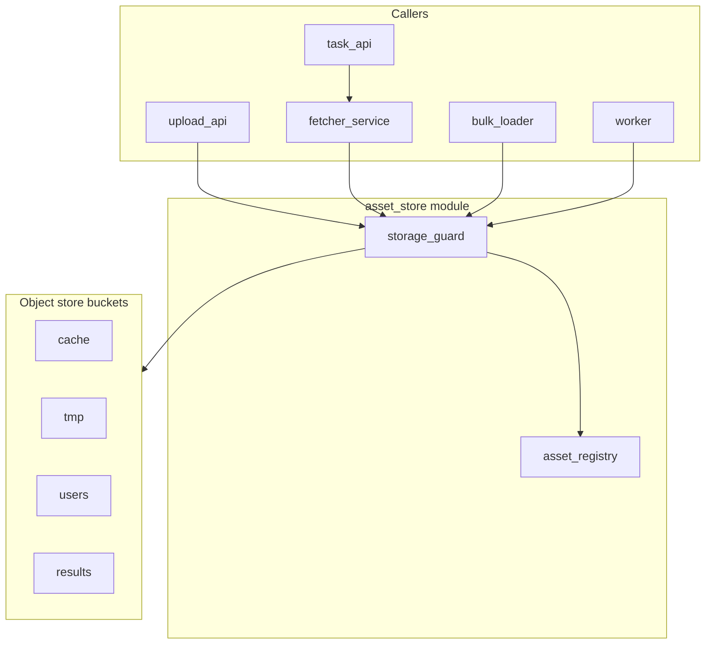

# Specification

## Platform map (human summary)

Binary content flows through **asset-store** (storage + aliases + capabilities) and, for remote URLs, **fetcher-service** (HTTP + cache policy). Workers always use **aliases**, never raw object keys.

| Bucket (object store) | Partition prefix | Who writes | Purpose |
|--------------|------------------|------------|---------|
| `cache` | `{remote_mirror_id}/` | fetcher, bulk-loader | Durable remote mirrors |
| `tmp` | `{tmpid}/` | fetcher, upload-api, task-api | Ephemeral / non-cacheable inputs |
| `users` | `{userid}/` | upload-api | End-user uploads |
| `results` | `{taskid}/` | worker | Task output artifacts |

**Alias** (logical name, e.g. `users/42/uploads/photo.jpg`) is what APIs expose. **Object key** inside the object store stays opaque: `{partition_id}/assets/{asset_id}`.

Per-user **quota** is enforced from **registry** sums, not the object store alone ([`Q-004`](05_BACKLOG_AND_OPEN_QUESTIONS.md)).

**New to this spec?** See the [glossary and acronyms](#glossary-and-acronyms) at the end of this file for domain terms, acronyms (S3, IIIF, TTL, …), and what `FR-*` / `ADR-*` / `SCN-*` mean.

---

This folder is the source of truth for the `asset-store` module (formerly named `prototype_cache`). The **fetcher-service** contract lives in [`../services/fetcher-service.md`](../services/fetcher-service.md) (adjacent platform module).

## Module identity

`asset-store` is a multi-tenant content/asset repository deployed as **one service** with three **conceptual** layers (internal modules, not separate deployables — [`ADR-002`](03_ARCHITECTURE.md)):

- **`object-store`** - layer 1, a **pluggable S3-compatible backend** behind an adapter seam: OVH S3 as the first hosted target and **Garage** as the self-hosted backend to certify ([`ADR-001`](03_ARCHITECTURE.md)); MinIO is disqualified on licensing. It stores opaque durable bytes only; the asset layer is authoritative on lifecycle and deletion ([`ADR-011`](03_ARCHITECTURE.md)).
- **`asset-registry`** - layer 2 (module), maps each `asset_id` to one or more **aliases** (logical names — the core access primitive, [`ADR-010`](03_ARCHITECTURE.md)) with a `pending -> available -> expired -> deleted` lifecycle.
- **`storage-guard`** - layer 3 (module), a capability broker that mints short-lived, prefix-scoped tokens or signed URLs for upload services and workers, and emits an audit log.

It is **not** an image cache in isolation. The `cache` **bucket** holds durable mirrors of remote content (via fetcher or bulk-loader); `users` and `results` serve uploads and worker artifacts.

## Reading order

1. [`01_SCOPE.md`](01_SCOPE.md) - scope, success criteria, and concrete MVP scenarios (SCN-*).
2. [`02_REQUIREMENTS.md`](02_REQUIREMENTS.md) - `FR-*`, `NFR-*` with measurable targets and acceptance criteria.
3. [`03_ARCHITECTURE.md`](03_ARCHITECTURE.md) - architecture principles, `ADR-*` log, storage layout, data model, state machine, data flows.
4. [`04_OPERATIONS.md`](04_OPERATIONS.md) - SLI/SLO, metrics, alerts, testing strategy.
5. [`05_BACKLOG_AND_OPEN_QUESTIONS.md`](05_BACKLOG_AND_OPEN_QUESTIONS.md) - `Q-*`, `R-*`, `B-*`.
6. [`A_OSS_SURVEY.md`](A_OSS_SURVEY.md) - background: off-the-shelf candidates and finalist architectures.
7. Adjacent module contract: [`../services/fetcher-service.md`](../services/fetcher-service.md) - remote URL materialization (not part of asset-store code).

Glossary and acronyms are at the [end of this file](#glossary-and-acronyms).

Discovery-stage inputs are archived in [`_archive/`](_archive/) and must not be edited.

## Writing rules

- Prefer measurable requirements over vague statements (no "fast", "robust", "secure" without a number or a method).
- Capture decisions with rationale and alternatives in the ADR log.
- Mark unknowns explicitly as `Q-*` rows in [`05_BACKLOG_AND_OPEN_QUESTIONS.md`](05_BACKLOG_AND_OPEN_QUESTIONS.md); do not hide assumptions in prose.
- Keep one source of truth per topic. Cross-link rather than duplicate.

---

## Glossary and acronyms

Brief reference for readers new to this spec set. Domain concepts used throughout this README and the numbered spec files.

### How this spec set is organized

| Prefix | Meaning | Where |
|--------|---------|--------|
| **FR-** | Functional requirement (must/should behaviour) | [`02_REQUIREMENTS.md`](02_REQUIREMENTS.md) |
| **NFR-** | Non-functional requirement (performance, security, …) | [`02_REQUIREMENTS.md`](02_REQUIREMENTS.md) |
| **ADR-** | Architecture decision record (choice + rationale) | [`03_ARCHITECTURE.md`](03_ARCHITECTURE.md) |
| **SCN-** | End-to-end scenario (who does what) | [`01_SCOPE.md`](01_SCOPE.md) |
| **S-** | Success criterion (measurable MVP goal) | [`01_SCOPE.md`](01_SCOPE.md) |
| **Q-** | Open question (not decided yet) | [`05_BACKLOG_AND_OPEN_QUESTIONS.md`](05_BACKLOG_AND_OPEN_QUESTIONS.md) |
| **R-** | Risk | [`05_BACKLOG_AND_OPEN_QUESTIONS.md`](05_BACKLOG_AND_OPEN_QUESTIONS.md) |
| **B-** | Backlog work item | [`05_BACKLOG_AND_OPEN_QUESTIONS.md`](05_BACKLOG_AND_OPEN_QUESTIONS.md) |

MoSCoW priority on requirements: **M** = must, **S** = should, **C** = could, **W** = won't (this iteration).

### Core domain terms

| Term | Plain language |
|------|----------------|
| **Asset** | One stored file (any format): image, PDF, JSON, etc. Identified by opaque **`asset_id`**. Bytes are write-once. |
| **Alias** | Stable name workers and APIs use instead of internal ids (e.g. `users/42/uploads/photo.jpg`). The core access primitive ([`ADR-010`](03_ARCHITECTURE.md)). |
| **Qualified alias** | Full path: `{space}/{rest…}` — what appears in APIs and capabilities. |
| **Space** | Registry name for a **storage bucket**: `cache`, `tmp`, `users`, or `results`. |
| **Partition id** | Scope inside a bucket: user id, task id, mirror id, or tmp session id. |
| **Storage bucket** | S3 top-level container (not a sub-folder). Four in MVP. |
| **Object key** | Physical path in the object store, e.g. `42/assets/{asset_id}`. Workers never see it. |
| **Capability** | Short-lived permission to read or write a prefix of aliases (often a presigned URL). |
| **Presigned URL** | Time-limited URL that lets a client PUT/GET directly on the object store without holding long-term credentials. |
| **Storage-guard** | Module that checks who is calling, issues capabilities, writes audit entries. |
| **Asset-registry** | Module that stores metadata, aliases, and lifecycle state (`pending` → `available` → …). |
| **Object-store** | Pluggable S3-compatible backend (OVH S3 / Garage) where bytes live ([`ADR-001`](03_ARCHITECTURE.md)). |
| **Fetcher-service** | Separate module that downloads remote URLs and stores results in `cache` or `tmp`. |
| **IIIF server** | Separate future module; serves stored assets via IIIF Image API; reads `cache` and `users` from asset-store; owns and writes only to `iiif_server_cache`; does not relay or mirror heritage repositories. |
| **IIIF image mirror** | Future separate module (`iiif-image-mirror`); serves heritage images via IIIF Image API; end-user facing with its own access-control layer; uses fetcher-service + asset-store `cache` as its cache backend; does not relay or rewrite IIIF Presentation manifests. |
| **Lifecycle state** | `pending` (reserved, no bytes yet), `available`, `expired`, `deleted`. |
| **Audit log** | Append-only record of who did what (capabilities, alias changes, admin actions). |
| **Mutable alias** | Rare opt-in: alias may be rebound to another asset after an audited detach. |

### Acronyms and technical terms

| Acronym | Expansion | In this project |
|---------|-----------|-----------------|
| **API** | Application Programming Interface | HTTP+JSON service surface of `asset-store` (and fetcher). |
| **S3** | Amazon Simple Storage Service | De facto object-storage API; the backend implements it. |
| **MinIO** | (product name) | S3-compatible object store; **disqualified on licensing / commercial trajectory** — not a target backend ([`ADR-001`](03_ARCHITECTURE.md), [`Q-009`](05_BACKLOG_AND_OPEN_QUESTIONS.md)). Garage is the self-hosted backend; OVH S3 the hosted one. |
| **OSS** | Open-source software | Surveyed candidates in [`A_OSS_SURVEY.md`](A_OSS_SURVEY.md). |
| **STS** | Security Token Service | AWS pattern for temporary credentials; used with presigned URLs / roles. |
| **IAM** | Identity and Access Management | Policies on buckets and keys (S3-style IAM). |
| **PUT / GET** | HTTP methods | Upload and download objects in S3. |
| **MIME** | Multipurpose Internet Mail Extensions | Content type label (e.g. `image/jpeg`); often declared by caller. |
| **TTL** | Time to live | How long an asset or capability stays valid before expiry. |
| **GC** | Garbage collection | Background job removing expired/deleted payloads. |
| **UUID** | Universally unique identifier | Format for `asset_id` (prefer UUID v7 when available). |
| **IIIF** | International Image Interoperability Framework | Standard for image APIs/manifests; served by a future IIIF server, not asset-store. |
| **ARK** | Archival Resource Key | Persistent id scheme (`ark:/…`); possible future alias style ([`Q-011`](05_BACKLOG_AND_OPEN_QUESTIONS.md)). |
| **OCFL** | Oxford Common File Layout | Preservation-oriented on-disk layout; influences immutability thinking. |
| **DOI** | Digital Object Identifier | Another PID scheme; out of scope for MVP primary ids. |
| **SSRF** | Server-side request forgery | Risk when a server fetches user-supplied URLs; mitigated by isolating fetch in fetcher-service. |
| **mTLS** | Mutual TLS | Both client and server present certificates; future hardening ([`ADR-006`](03_ARCHITECTURE.md)). |
| **OIDC** | OpenID Connect | Identity layer on top of OAuth; future user auth integration. |
| **PII** | Personally identifiable information | Must not appear in alias names per spec policy. |
| **GDPR** | EU data protection regulation | Tracked as compliance question, not fully solved in MVP. |
| **SLI** | Service level indicator | Measurable signal (e.g. read error rate). |
| **SLO** | Service level objective | Target for an SLI (e.g. 99.9% availability). |
| **SEV-1 / SEV-2** | Severity levels | Alert urgency (1 = page on-call). |
| **OTLP** | OpenTelemetry Protocol | How traces are exported ([`04_OPERATIONS.md`](04_OPERATIONS.md)). |
| **PITR** | Point-in-time recovery | Postgres backup feature ([`R-004`](05_BACKLOG_AND_OPEN_QUESTIONS.md)). |
| **Compose / Swarm** | Docker Compose / Docker Swarm | Local dev vs target orchestration ([`NFR-011`](02_REQUIREMENTS.md)). |
| **FastAPI** | Python web framework | Used for the custom service ([`ADR-006`](03_ARCHITECTURE.md)). |
| **Postgres** | PostgreSQL | Database for registry metadata and audit. |
| **RFC 7807** | Problem Details for HTTP APIs | Standard JSON error format in API requirements. |
| **MoSCoW** | Must, Should, Could, Won't | Priority tagging on requirements. |
| **STRIDE** | Spoofing, Tampering, … | Threat-modeling mnemonic ([`B-018`](05_BACKLOG_AND_OPEN_QUESTIONS.md)). |
| **AGPL** | GNU Affero GPL | License of MinIO and Garage. The module uses an object store purely as an S3 client (no linking). MinIO is nonetheless disqualified on licensing/commercial-trajectory grounds; Garage is acceptable. See OSS survey. |

### Jargon we avoid or use carefully

| Phrase | Prefer instead |
|--------|----------------|
| “Sub-bucket” | **Prefix** inside a bucket (S3 has no nested buckets). |
| “Space `u-42`” (legacy) | **`users/42/…`** qualified alias ([`03_ARCHITECTURE.md`](03_ARCHITECTURE.md)). |
| “IIIF proxy” (legacy) | Either **IIIF server** (serves platform assets via IIIF Image API) or **IIIF image mirror** (serves heritage images via IIIF Image API with its own end-user access control) — distinct modules with different responsibilities. See [`../services/fetcher-service.md`](../services/fetcher-service.md). |
| “Object key” in user APIs | **Alias** — keys are internal only. |
