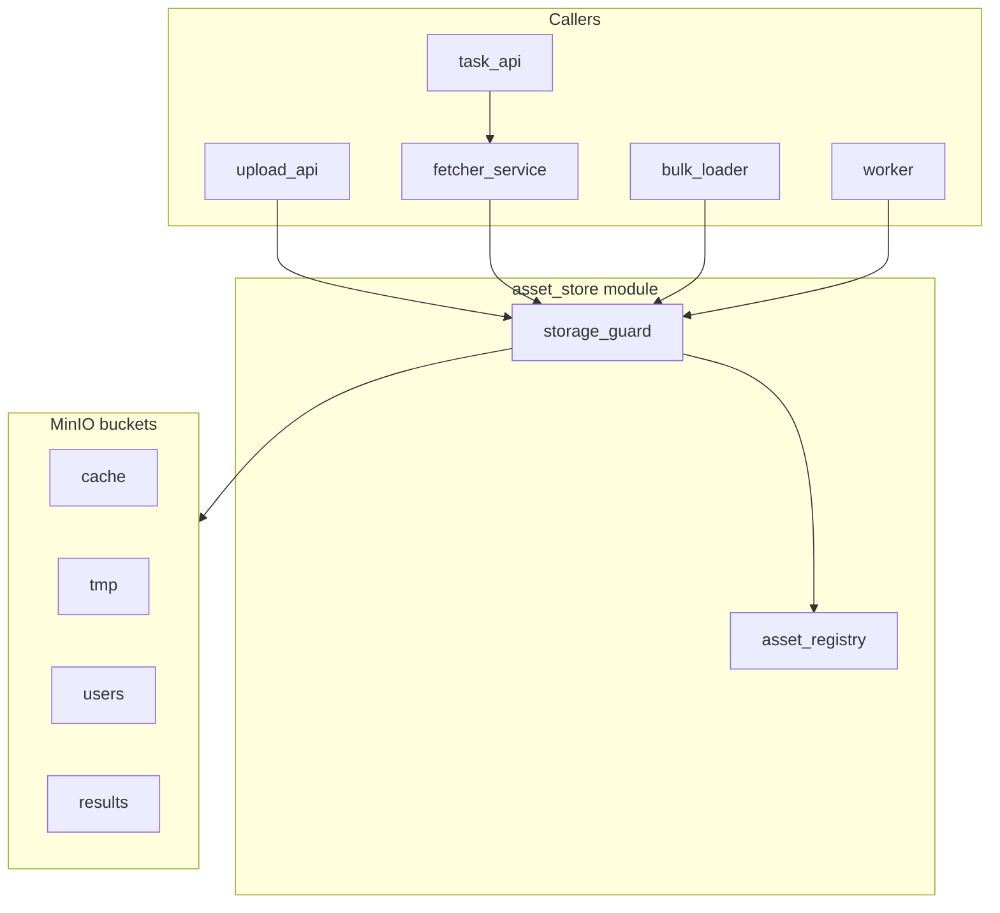

# Specification

## Platform map (human summary)

Binary content flows through **asset-store** (storage + aliases + capabilities) and, for remote URLs, **fetcher-service** (HTTP + cache policy). Workers always use **aliases**, never raw object keys.

| MinIO bucket | Partition prefix | Who writes | Purpose |
|--------------|------------------|------------|---------|
| `cache` | `{remote_mirror_id}/` | fetcher, bulk-loader | Durable remote mirrors |
| `tmp` | `{tmpid}/` | fetcher, upload-api, task-api | Ephemeral / non-cacheable inputs |
| `users` | `{userid}/` | upload-api | End-user uploads |
| `results` | `{taskid}/` | worker | Task output artifacts |

**Alias** (logical name, e.g. `users/42/uploads/photo.jpg`) is what APIs expose. **Object key** inside MinIO stays opaque: `{partition_id}/assets/{asset_id}`.

Per-user **quota** is enforced from **registry** sums, not MinIO alone ([`Q-004`](05_BACKLOG_AND_OPEN_QUESTIONS.md)).

**New to this spec?** See **[`00B_GLOSSARY_AND_ACRONYMS.md`](00B_GLOSSARY_AND_ACRONYMS.md)** for domain terms, acronyms (S3, IIIF, TTL, …), and what `FR-*` / `ADR-*` / `SCN-*` mean.

---

This folder is the source of truth for the `asset-store` module (formerly named `prototype_cache`). The **fetcher-service** contract lives in [`07_FETCHER_SERVICE.md`](07_FETCHER_SERVICE.md) (adjacent platform module).

## Module identity

`asset-store` is a multi-tenant content/asset repository with three internal layers:

- **`object-store`** - layer 1, S3-compatible distributed blob store (vendored OSS, e.g. MinIO).
- **`asset-registry`** - layer 2, the asset/metadata/lifecycle service mapping each `asset_id` to one or more **aliases** (logical names) with a `pending -> available -> expired -> deleted` lifecycle.
- **`storage-guard`** - layer 3, a capability broker that mints short-lived, prefix-scoped tokens or signed URLs for upload services and workers, and emits an audit log.

It is **not** an image cache in isolation. The `cache` **bucket** holds durable mirrors of remote content (via fetcher or bulk-loader); `users` and `results` serve uploads and worker artifacts.

## Reading order

1. [`00B_GLOSSARY_AND_ACRONYMS.md`](00B_GLOSSARY_AND_ACRONYMS.md) - terms, acronyms, and spec ID prefixes (optional first read).
2. [`01_SCOPE.md`](01_SCOPE.md) - what is in/out of scope and success criteria.
3. [`07_FETCHER_SERVICE.md`](07_FETCHER_SERVICE.md) - remote URL materialization (platform module; not part of asset-store code).
4. [`00A_SCENARIOS.md`](00A_SCENARIOS.md) - concrete MVP scenarios (SCN-001..007).
5. [`02_REQUIREMENTS.md`](02_REQUIREMENTS.md) - `FR-*`, `NFR-*` with measurable targets and acceptance criteria.
6. [`06_OSS_SURVEY.md`](06_OSS_SURVEY.md) - off-the-shelf candidates and finalist architectures.
7. [`03_ARCHITECTURE_AND_DECISIONS.md`](03_ARCHITECTURE_AND_DECISIONS.md) - `ADR-*` log, storage layout, data model, state machine.
8. [`04_OPERATIONS_AND_READINESS.md`](04_OPERATIONS_AND_READINESS.md) - SLI/SLO, metrics, alerts, testing strategy.
9. [`05_BACKLOG_AND_OPEN_QUESTIONS.md`](05_BACKLOG_AND_OPEN_QUESTIONS.md) - `Q-*`, `R-*`, `B-*`.

Discovery-stage inputs are archived in [`_archive/`](_archive/) and must not be edited.

## Glossary

Full definitions, acronyms, and jargon notes: **[`00B_GLOSSARY_AND_ACRONYMS.md`](00B_GLOSSARY_AND_ACRONYMS.md)**.

## Writing rules

- Prefer measurable requirements over vague statements (no "fast", "robust", "secure" without a number or a method).
- Capture decisions with rationale and alternatives in the ADR log.
- Mark unknowns explicitly as `Q-*` rows in [`05_BACKLOG_AND_OPEN_QUESTIONS.md`](05_BACKLOG_AND_OPEN_QUESTIONS.md); do not hide assumptions in prose.
- Keep one source of truth per topic. Cross-link rather than duplicate.
